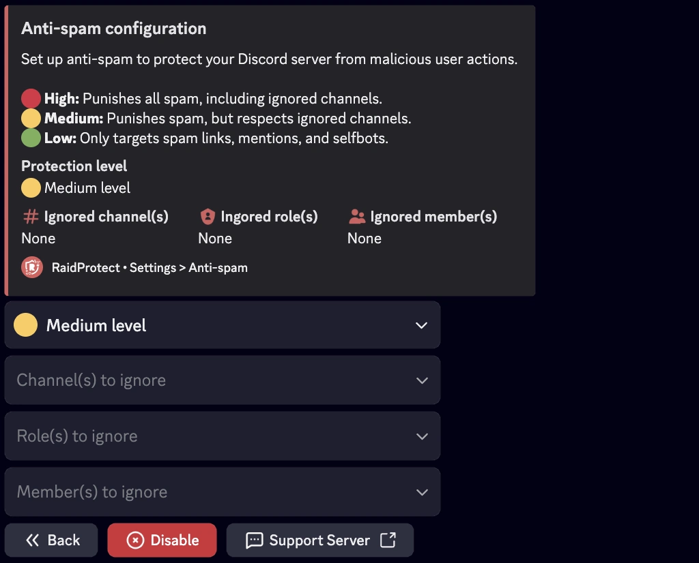
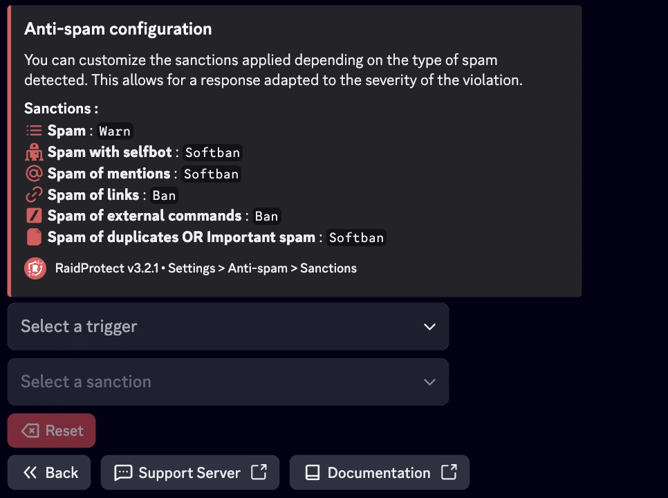

import AntiSpamMockup from '@site/src/components/DiscordMessage/mockups/anti-spam';

<AntiSpamMockup />

import SeparatedBox from '@site/src/components/SeparatedBox';
import Tabs from '@theme/Tabs';
import TabItem from '@theme/TabItem';

RaidProtect's Anti-spam is a powerful tool to prevent spam on your Discord server. Thanks to its automatic detection system, it handles problems on its own, without requiring your intervention.

## ❓ How anti-spam works {#working}

RaidProtect's anti-spam automatically detects and blocks suspicious behavior. It distinguishes between two types of spam.
- **Heavy spam:** Messages containing invite links, mass mentions, or images. This kind of spam is often used during raids.
- **Light spam:** Messages sent frequently but less intrusive.

RaidProtect's anti-spam acts in two ways.
- **Sanctions:** Automatic kick or ban of spammers.
- **Notifications:** Messages sent to the logs channel to report blocked spam, with a preview of the detected actions.

## 🛡️ Anti-spam configuration {#config}

RaidProtect offers three security levels to meet your server's needs.
- 🔴 **High:** Sanctions all spam, and even heavy spam in ignored channels.
- 🟠 **Medium:** Sanctions all spam, but respects ignored channels.
- 🟢 **Low:** Sanctions only heavy spam.

### Change the security level {#level}

1. Run the [`/settings` command](../setup.md#settings).
2. Click the "**Anti-spam**" button.
3. Select the desired anti-spam level in the first selector.

### Manage ignored roles, users, and channels {#ignore}

You can exclude certain channels, roles, or even users from anti-spam monitoring for more flexibility. 😉
1. Run the [`/settings` command](../setup.md#settings).
2. Click the "**Anti-spam**" button.
3. Select the different options to ignore in the various selectors:
- Channel(s) to ignore
- Role(s) to ignore
- Member(s) to ignore

:::info
Channels containing "**spam**" in their name are automatically ignored. Users with the administrator permission are completely ignored.
:::

### Configure sanctions by trigger {#triggers}

You can customize the sanctions applied based on the type of spam detected. This allows a response adapted to the severity of the offense.

1. Run the [`/settings` command](../setup.md#settings).
2. Click the "**Anti-spam**" button.
3. Go to the "**Sanctions**" tab.
4. For each trigger, select a specific sanction. You can modify these values using the dropdown menus:
- **Select a trigger**: choose the type of spam to configure.
- **Select a sanction**: choose the corresponding sanction.

#### Sanction types and triggers {#sanctions}

Here are the different **available sanctions**:

- **Warn**: Sends a warning to the member.
- **Timeout**: Mutes the member for a defined duration.
- **Mute**: Assigns the [Mute role](./sanctions.mdx#mute) configured on your server.
- **Jail**: Assigns the [Jail role](./sanctions.mdx#jail) configured on your server.
- **Kick**: Kicks the member from the server.
- **Softban**: Bans then immediately unbans the member, thereby deleting their messages.
- **Ban**: Permanently bans the member.
- **Disable**: Turns the trigger off completely, no sanction will be applied.

:::note
For the "Duplicate spam or heavy spam" and "Multi-channel spam" triggers, the mildest selectable sanction is **Timeout** (no Warn): this is serious spam that warrants a firm response.
:::

And here are the **triggers** that RaidProtect can detect, with the sanction applied by default:

| Trigger                                | Description                                              | Default sanction    |
|----------------------------------------|----------------------------------------------------------|---------------------|
| Spam                                   | Repeated message sending                                 | Warn                |
| Selfbot spam                           | Using selfbots to spam                                   | Softban             |
| Mention spam                           | Repeated mass mentions                                   | Softban             |
| Link spam                              | Mass link sending                                        | Ban                 |
| External command spam                  | Using external commands to spam                          | Ban                 |
| Attachment spam                        | Mass sending of files or images                          | Disabled            |
| Duplicate spam or heavy spam           | Copy-pasted messages or excessive spam                   | Softban             |
| Scam images (Crypto Scam)              | Scam images detected by [ScamLens](/blog/threat-weather-june-2026) | Timeout             |
| Multi-channel spam                     | Spam spread across several channels                      | Jail                |

:::info
The **Multi-channel spam** trigger is special: its sanction replaces the one from the original trigger when the spam hits several channels, but only if it is more severe.
:::

#### Sanctions duration {#duration}

When the sanctions applied by the anti-spam support a duration (mute, timeout, jail), you can set a **single duration** applied to all of these sanctions (1 hour by default).

1. Run the [`/settings` command](../setup.md#settings).
2. Click the "**Anti-spam**" button.
3. Go to the "**Sanctions**" tab.
4. Pick a predefined duration in the "**Sanctions duration**" selector, or click "**Custom duration**" to enter the value of your choice (e.g. `30m`, `2h`, `7d`).

:::info
The duration is ignored for sanctions that do not support one (kick, softban, ban, warn).
:::

## 📑 Anti-spam logs {#logs}

Detailed logs are generated with all the messages deleted by the anti-spam. You can simply download or expand the content.

<SeparatedBox>
<Tabs>
  <TabItem value="animator" label="Collapsed" default>

  </TabItem>
  <TabItem value="moderator" label="Expanded">

  </TabItem>
</Tabs>
</SeparatedBox>