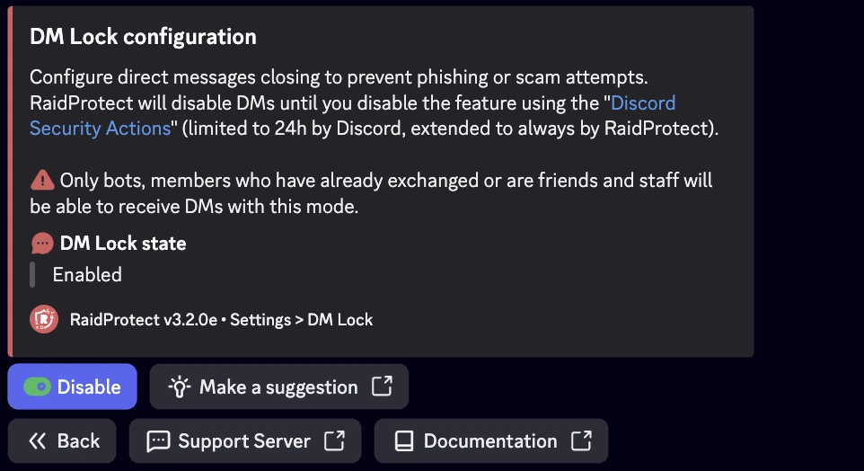

The DM Lock feature of RaidProtect allows for permanently closing access to direct messages (DMs) sent from the server, thus surpassing Discord's native limitation, which only allows this block for 24 hours through the interface.

## ❓ How DM Lock Works {#working}

The RaidProtect bot regularly checks the status of the server DM blocking setting and, if needed, automatically reactivates it to prevent any vulnerability window between manual renewals. This task is carried out seamlessly for both server admins and members.

## 🚦 Use Cases and Recommendations {#recommendations}

- **Servers exposed to spam or harassment:** DM Lock is especially recommended for public or high-traffic communities where the risk of DM abuse is higher.
- **Temporary events or sensitive periods:** During launches, major announcements, or times of high traffic (e.g., contests, promotions), enabling DM Lock helps prevent phishing or scam attempts.
- **Communities with a young audience:** For servers with a large number of minors, limiting DMs can enhance safety and prevent inappropriate behavior.
- **Continuous protection:** Thanks to automation, there is no vulnerability window due to forgetting to manually renew the setting.

## 🚩 Configuring DM Lock {#config}

:::warning
Discord’s Community features are essential for DM Lock to function properly. [Follow our guide to verify that Community is enabled on your server.](../guides/community.md)
:::

1. Run the [`/settings` command](../setup.md#settings).
2. Click the “**DM Lock**” button.
3. Enable or disable the automatic blocking of direct messages.

