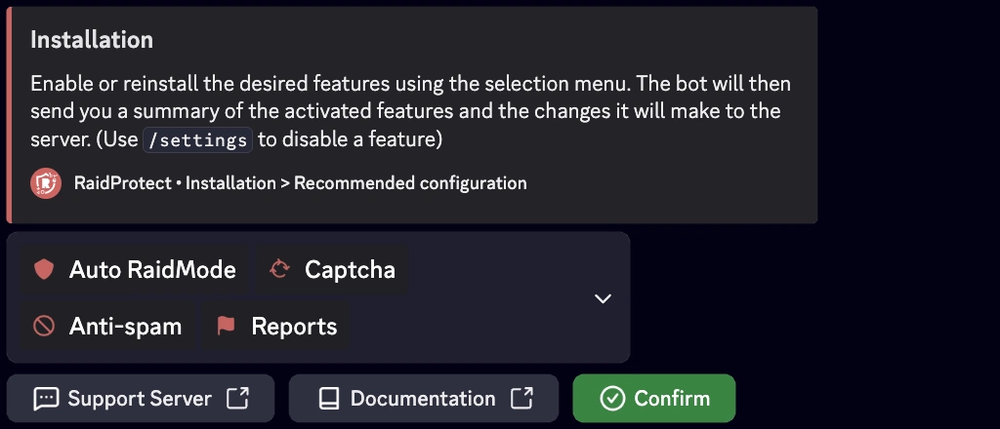

import Head from '@docusaurus/Head';

<Head>
  
</Head>

RaidProtect simplifies server management with two powerful tools: the [`/setup`](#install) command for a step-by-step guided setup and the [`/settings`](#settings) command to adjust your settings at any time through a centralized menu. This installation guide explains how to use them effectively.

## Where to start {#etapes}

For a server starting from scratch, here is the recommended order:

1. **Enable Discord's Community mode** (Server Settings, then "Enable Community"). It is a prerequisite for the [captcha](./features/captcha) and [raid mode](./features/raid-mode).
2. **Run [`/setup`](#install)**: this is where you choose which features to enable, via the recommended configuration. RaidProtect automatically creates the logs channel and applies the changes after a summary.
3. **Set up the [anti-spam](./features/anti-spam)**: its sanctions are customized per type of spam.
4. **Adjust anything at any time with [`/settings`](#settings).**

## Guided Installation {#install}

The `/setup` command is designed to help you configure RaidProtect quickly or through a detailed approach, depending on your needs.
<!--
It offers two configuration modes: [recommended](#recommended) or [advanced](#advanced).
-->

### 🔧 Recommended Configuration {#recommended}

Allows you to enable or disable core features at a glance using an interactive selection menu.

1. Use the `/setup` command.
2. Select the "**Recommended Configuration**" button.
3. Enable or disable the desired features using the selection menu.

The bot will then send you a summary of the activated features and the changes it will make to the server.

<!--
### 🛠️ Advanced Configuration {#advanced}

If you want to configure the bot more thoroughly, opt for the advanced configuration. The bot guides you step by step with clear explanations.

1. Use the `/setup` command.
2. Select the "**Advanced Configuration**" button.
3. Each step introduces a feature, its purpose, and a recommended minimum configuration.
4. Use the "**Previous**" and "**Next**" buttons to move forward or go back.

At the end, a summary of the settings is displayed to confirm your choices.
-->
## Modifying the Configuration {#settings}

The `/settings` command is the go-to command for managing your settings after installation. It allows you to view, adjust, or customize RaidProtect's features at any time, in a simple and fast way.

### 🔍 Settings Menu {#menu}

1. Type `/settings` in a channel where the bot is active.
2. Easily navigate between different sections to find the settings you want to modify.
3. Adjust the options: Each category presents a list of customizable options in the form of buttons or dropdown menus.

import SettingsMockup from '@site/src/components/DiscordMessage/mockups/settings';

<SettingsMockup />

### 🔄 Resetting a Setting {#reset}

1. Navigate to the desired setting.
2. Click on "**Reset**".

The bot will confirm the reset before applying the changes.

## Which setup for your server? {#quelle-config}

The recommended configuration in `/setup` already guides you through these choices. If you are starting from scratch, or preparing your installation with an AI, spot what matches your server: each need points to the feature that answers it.

- **Raids, waves of accounts arriving all at once**: [raid mode](./features/raid-mode) closes off arrivals and locks the channels for the duration of the attack.
- **Spam, advertising, scam links**: the [anti-spam](./features/anti-spam) sanctions automatically, and the [HoneyPot](./features/honeypot) traps spam accounts.
- **Bots signing up en masse**: the [captcha](./features/captcha) makes every newcomer prove they are human.
- **Image scams** (fake giveaways, phishing): [ScamLens](./features/scam-images) detects and removes them.
- **A nuke risk or hacked staff accounts**: apply [least privilege](/en/learn/least-privilege) and the [Authentication Manager](./features/authentication-manager).
- **A community that can help you moderate**: enable [reports](./features/reports).

Then adjust the [sanctions](./features/sanctions) (kick, timeout, ban, jail) to fit your server.

:::info Configuration Issue?
If you encounter a problem, check the [Malfunctions](./guides/malfunctions) section or join our [support server](https://raidprotect.bot/discord) for assistance.
:::
