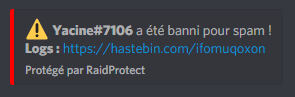

Easily and effectively protect your Discord server with RaidProtect's anti-spam feature.

## ❓ How the Anti-Spam Works {#working}

**RaidProtect’s anti-spam system automatically bans spammers and raiders from your server without any intervention on your part.** It detects both heavy and light spam and can act quickly to stop it, depending on your server's configuration. 🤚 

:::warning
**Heavy spam typically involves raid-like behavior, including invitation links, mentions, or images.** RaidProtect distinguishes heavy spam from light spam and applies different sanctions accordingly.
:::

**If spam is detected, RaidProtect kicks the spammer** and informs you via the logs channel. You can view details of the blocked spam by clicking on the provided link.

## 📈 Anti-Spam Security Levels {#level}

RaidProtect's anti-spam system offers multiple security levels, allowing you to **adjust its behavior, particularly in ignored channels.** 👮 

### Available Security Levels {#level-list}

🔴 **High (`high`):** Detects both light and heavy spam. In ignored channels, only heavy spam is blocked.

🔶 **Medium (`medium`):** Detects both light and heavy spam. In ignored channels, all types of spam are allowed.

💚 **Low (`low`):** Only blocks heavy spam. In ignored channels, all types of spam are allowed.

### Changing the Security Level {#level-change}

To change the anti-spam security level, use the following command: `?settings spamlevel [high/medium/low]`.

## 💤 Ignoring a Channel {#ignore-channel}

For various reasons, you might want the anti-spam system to ignore certain channels on your server. Fortunately, it’s easy to exclude channels of your choice. 😝 

The anti-spam system’s behavior in ignored channels depends on the configured security level.

To ignore a channel, simply run the command: `?settings allowspam #channel` (replace `#channel` with the channel you want to ignore). To include the channel again, use the command: `?settings allowspam #channel remove`.

Channels with `spam` in their name are automatically ignored.
