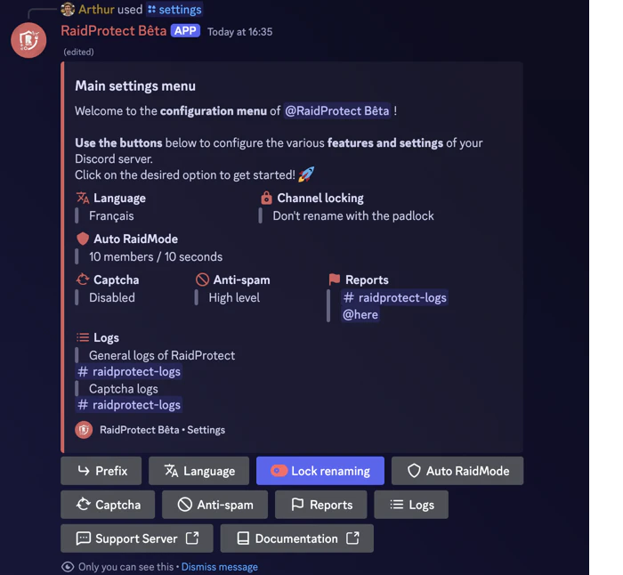

RaidProtect simplifies server management with two powerful tools: the [`/setup`](#install) command for a step-by-step guided setup and the [`/settings`](#settings) command to adjust your settings at any time through a centralized menu. This installation guide explains how to use them effectively.

## Guided Installation {#install}

The `/setup` command is designed to help you configure RaidProtect quickly or through a detailed approach, depending on your needs. It offers two configuration modes: [recommended](#recommended) or [advanced](#advanced).

### 🔧 Recommended Configuration {#recommended}

Allows you to enable or disable core features at a glance using an interactive selection menu.

1. Use the `/setup` command.
2. Select the “**Recommended Configuration**” button.
3. Enable or disable the desired features using the selection menu.

The bot will then send you a summary of the activated features and the changes it will make to the server.

### 🛠️ Advanced Configuration {#advanced}

If you want to configure the bot more thoroughly, opt for the advanced configuration. The bot guides you step by step with clear explanations.

1. Use the `/setup` command.
2. Select the “**Advanced Configuration**” button.
3. Each step introduces a feature, its purpose, and a recommended minimum configuration.
4. Use the “**Previous**” and “**Next**” buttons to move forward or go back.

At the end, a summary of the settings is displayed to confirm your choices.

## Modifying the Configuration {#settings}

The `/settings` command is the go-to command for managing your settings after installation. It allows you to view, adjust, or customize RaidProtect's features at any time, in a simple and fast way.

### 🔍 Settings Menu {#menu}

1. Type `/settings` in a channel where the bot is active.
2. Easily navigate between different sections to find the settings you want to modify.
3. Adjust the options: Each category presents a list of customizable options in the form of buttons or dropdown menus.

### 🔄 Resetting a Setting {#reset}

1. Navigate to the desired setting.
2. Click on “**Reset**”.

The bot will confirm the reset before applying the changes.

:::info Configuration Issue?
If you encounter a problem, check the [Malfunctions](./guides/malfunctions) section or join our [support server](https://raidprotect.bot/discord) for assistance.
:::