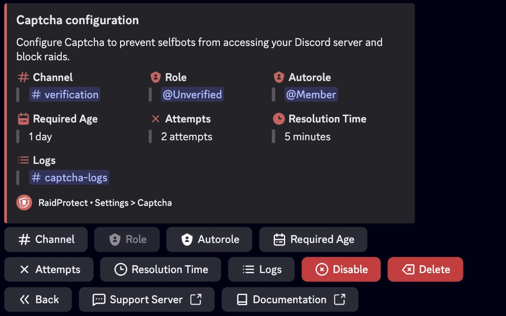

Prevent selfbots from accessing your Discord server and block raids with RaidProtect's captcha system.

Captcha is one of RaidProtect's most popular features, though it remains entirely optional. It allows you to require each new user to complete a challenge by entering a code to verify that they are not a bot (selfbot).

## ❓ How Captcha Works {#working}

Captcha relies on a **@Unverified** role and a **#verification** channel. When a user joins your server:
- The bot automatically assigns the **@Unverified** role to this user, limiting their access only to the **#verification** channel.
- In this channel, the bot sends an image containing 6 uppercase letters. The user must transcribe the letters in the channel to prove they are human.
- If the response is correct, the **@Unverified** role is removed, and the user gains normal access to the server. Otherwise, they are automatically kicked.
- When captcha is enabled, RaidProtect automatically posts a message in the logs channel, indicating the account creation date of each new user.
- RaidProtect automatically detects permission issues (channel and role) as well as the default visibility of the channel during Discord's onboarding process.

:::info
**Time Limit and Attempts:** Users have **1 to 10 minutes** to complete captcha (**5 minutes by default**) and **1 to 3 attempts** (**2 attempts by default**). If they exceed these limits, they are automatically kicked from the server.
:::
:::warning
**Permission Management:** The permissions for the **@Unverified** role are automatically configured by RaidProtect. You can rename the role and the channel, but do not delete them.
:::

## 🚪 Captcha Configuration {#config}

Setting up captcha is quick and easy.

1. Run the [`/settings` command](../setup.md#settings).
2. Click the "**Captcha**" button.
3. Choose the channel where captchas will be conducted or use the "**Create one for me**" button.
4. The **@Unverified** role is automatically created and configured.
5. Configure the allowed number of attempts (between **1 and 3**) and the maximum resolution time (between **1 and 10 minutes**).

## ✨ Additional Features {#additional-features}

To adapt to your server's needs, RaidProtect's captcha offers customizable options.

### Separate Logs {#logs}

If your server is popular, captcha-related logs may clutter your main logs channel. You can move them to another channel.

1. Run the [`/settings` command](../setup.md#settings).
2. Click the "**Logs**" button.
3. Select "**Captcha**".
4. Choose the channel where captcha logs will be stored or use the "**Create one for me**" button.

### Auto Role {#autorole}

If you use an automatic role (autorole) system other than RaidProtect, it may interfere with captcha. Replace your existing autorole with RaidProtect's.

1. Run the [`/settings` command](../setup.md#settings).
2. Click the "**Captcha**" button.
3. Select "**Auto Role**".
4. Choose the role that will be assigned to members who successfully complete captcha.