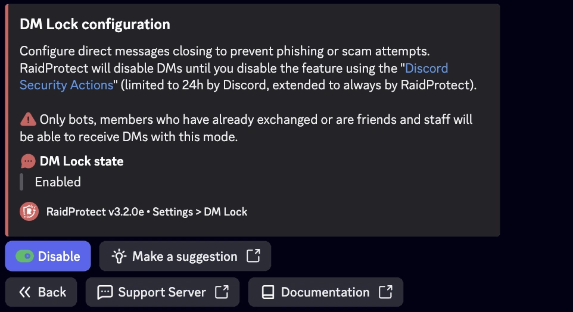

The **DM Lock** feature of RaidProtect permanently closes access to server-originated direct messages (DMs), surpassing Discord’s native limitation, which only allows this block for 24 hours via the "Pause DMs" security action.

## 🚦 Use cases and recommendations {#recommendations}

- **Servers exposed to spam or harassment:** DM Lock is especially recommended for public or high-traffic communities where the risk of DM abuse is higher.
- **Temporary events or sensitive periods:** During launches, major announcements, or periods of heavy activity (e.g. contests, promotions), enabling DM Lock helps prevent phishing or scam attempts.
- **Communities with a young audience:** For servers with many minors, restricting DMs can enhance safety and help prevent inappropriate behavior.
- **Continuous protection:** Thanks to automation, there’s no vulnerability window from forgetting to renew the block manually.

## ❓ How DM Lock works {#working}

The RaidProtect bot regularly checks the server’s DM blocking setting and, if needed, automatically re-enables it to prevent any vulnerability window between manual renewals. This task runs transparently for server admins and members.

:::info
It remains possible to send and receive messages with:
- friends
- bots
- staff
:::
:::warning
Discord’s community features are essential for DM Lock to function properly. [Follow our guide to check if Community is enabled on your server.](../guides/community.md)
:::

## 🚩 Configuring DM Lock {#config}

1. Run the [ `/settings` command](../setup.md#settings).
2. Click on the “**DM Lock**” button.
3. Enable or disable automatic closing of direct messages.

