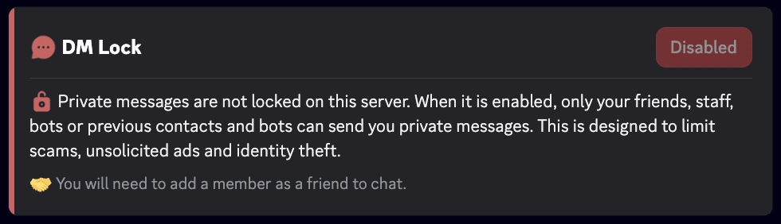

import SeparatedBox from '@site/src/components/SeparatedBox';
import Tabs from '@theme/Tabs';
import TabItem from '@theme/TabItem';

RaidProtect's **DM Lock** feature allows you to permanently close access to direct messages (DMs) sent from the server, thus surpassing Discord's native limitation which only allows this blocking for 24 hours via the safety action "Pause DMs".

## 🚦 Use cases and recommendations {#recommendations}

- **Servers exposed to spam or harassment:** DM Lock is particularly recommended for public communities or those with large audiences, where the risk of DM abuse is higher.
- **Temporary events or sensitive periods:** During launches, important announcements, or periods of high traffic (e.g., contests, promotions), enabling DM Lock helps prevent phishing or scam attempts.
- **Communities with a young audience:** For servers with a large number of minors, restricting DMs can enhance security and prevent inappropriate behavior.
- **Continuous protection:** Thanks to automation, there is no vulnerability window related to forgetting manual renewal.

## ❓ How DM Lock works {#working}

The RaidProtect bot regularly checks the status of the server DM blocking setting and, if necessary, automatically reactivates it to avoid any vulnerability period between two manual renewals. This task runs transparently for administrators and server members.

:::info
It remains possible to send and receive messages with:
- friends
- bots
- staff
:::
:::warning
Discord's community features are essential for DM Lock to work properly. [Follow our guide to verify that community is enabled on your server.](../guides/community.md)
:::

## 🚩 DM Lock configuration {#config}

1. Run the [`/settings` command](../setup.md#settings).
2. Click the "**DM Lock**" button.
3. Enable or disable the automatic closure of direct messages.

## ℹ️ /dmlock-info command {#info}

The `/dmlock-info` command allows you to inform members about the current status of **DM Lock** on the server. It displays a clear message indicating whether the restriction is **enabled** or **disabled**, accompanied by an educational explanation of its purpose.

**Objective:**
- Explain why DMs are restricted (fighting spam, scams, phishing).
- Reduce confusion and recurring questions from new members.
- Remind members of the conditions for continuing to exchange via DMs (friends, staff, bots, previous contacts).

**Display example**
<SeparatedBox>
<Tabs>
  <TabItem value="enable" label="Enabled" default>

  </TabItem>
  <TabItem value="disable" label="Disabled">

  </TabItem>
</Tabs>
</SeparatedBox>

### ⚙️ Best practices

- Encourage active members to use `/dmlock-info` to answer new members' questions.
- Display it regularly or pin it in your welcome channels.
- Combine it with your rules or announcements to remind members of the server's anti-spam policy.
