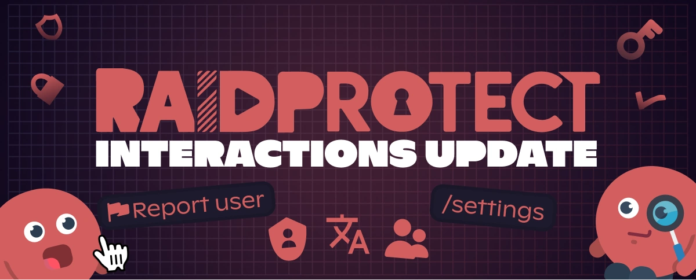
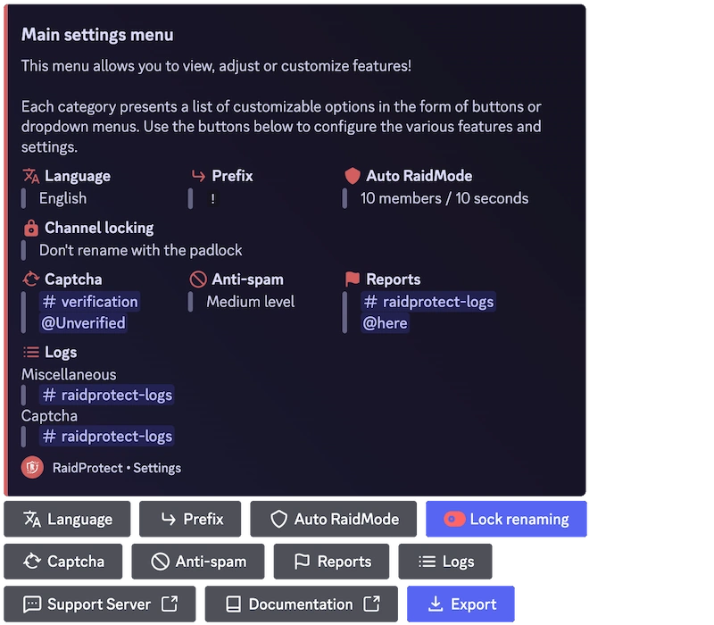

Ha pasado un tiempo desde nuestra última actualización importante de RaidProtect, y nos disculpamos sinceramente por la larga espera. Durante los últimos meses, hemos trabajado intensamente para modernizar y mejorar la experiencia del bot. ¡Hoy, estamos emocionados de presentar la **Actualización de Interacciones**!

<!--truncate-->

## ✨ Qué cambia (y es mucho) {#new}

Esta actualización marca un punto de inflexión en la forma en que funciona RaidProtect, enfocándose en la **interacción y la facilidad de uso**, especialmente con la introducción de los **comandos slash** y un **sistema de configuración renovado**.

Además, hemos escuchado <a href="https://suggestions.raidprotect.bot" target="_blank">sus comentarios e ideas</a>, ¡y esta actualización incluye muchas funciones que solicitaron! También pueden [consultar el registro de cambios](/docs/changelog) para ver qué sugerencias se han implementado.

### Comandos Slash {#slash-commands}

Sí, los estuvieron esperando por mucho tiempo... Nosotros también. ¡Digan adiós a los comandos de texto obsoletos y hola a los comandos slash! Más simples, más rápidos, y haciendo que RaidProtect por fin esté a la altura de 2021 (sí, sabemos que ya estamos en 2025).

No se preocupen los usuarios de siempre: los comandos de texto siguen disponibles, ¡y ahora incluso pueden configurar su propio prefijo personalizado!

### Internacionalización (RP se vuelve bilingüe) {#internationalization}

Hemos sentado las bases de un [**sistema multilingüe**](/docs/language) ¡y hemos añadido el inglés como segundo idioma oficial! Se agregarán más idiomas en el futuro.

### Un comando de reportes {#report}

Una función muy solicitada: [**un sistema de reportes**](/docs/features/reports) que permite a tu comunidad reportar fácilmente incidentes en tu servidor.

### Nuevos comandos de configuración {#configuration}

Sabemos que configurar un bot puede volverse un dolor de cabeza rápidamente, así que lo hemos simplificado mucho:
- **Un panel interactivo con [`/settings`](/docs/setup#settings)** para gestionar RaidProtect de un vistazo.
- **Un nuevo [`/setup`](/docs/setup#install)** para guiarte desde el proceso de instalación.
- **Opciones más flexibles** para una configuración más detallada.

### Una mejor experiencia de usuario {#ux}

Junto con estas nuevas funciones, hemos mejorado la usabilidad general:
- Un captcha más inteligente y mejor integrado.
- Detección automática de errores de permisos.
- Mensajes más claros y consistentes.

### Actualización del sitio web y la documentación {#web}

Además de las mejoras del bot, también hemos actualizado **el sitio web y la documentación** para que la información sea más accesible y esté mejor estructurada. ¡No duden en echarle un vistazo!

## 🔎 ¿Qué sigue? {#next}

Esta actualización es solo el primer paso hacia una versión aún más avanzada de RaidProtect. Ya estamos trabajando en más mejoras, ¡y no podemos esperar para compartirlas con ustedes!

Para ver lo que viene, <a href="https://suggestions.raidprotect.bot/roadmap" target="_blank">consulten nuestra hoja de ruta</a>.

:::tip ¡Únete a la conversación!
¿Quieres seguir el desarrollo de RaidProtect en tiempo real, compartir tu opinión sobre futuras funciones o simplemente charlar con la comunidad? <a href="https://raidprotect.bot/discord" target="_blank">¡Únete a nuestro servidor de Discord!</a>
:::

---

## ❤️ Gracias por su paciencia (en serio) {#thanks}

Lo sabemos, esta actualización tardó un buen rato. Un enorme agradecimiento a todos los que nos apoyaron y esperaron pacientemente (o no 😆).

Un agradecimiento especial a todos los que compartieron sus <a href="https://suggestions.raidprotect.bot" target="_blank">ideas y sugerencias</a>, ¡sus aportes fueron invaluables para dar forma a esta actualización! Sigan enviándonos sus comentarios, y prometemos ser más rápidos la próxima vez (bueno, lo intentaremos).
