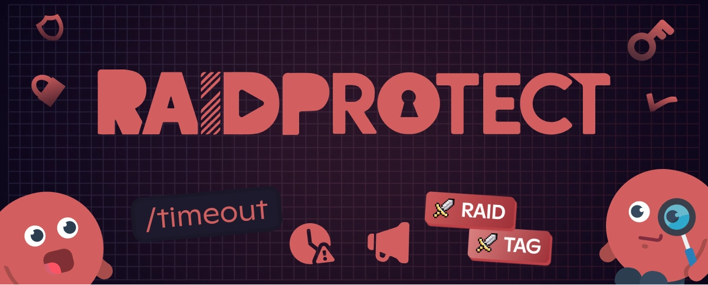

¿Quieres asignar automáticamente un **rol de etiqueta de Discord** a tus miembros? ¿Quieres otorgar un rol cuando alguien lleva la **etiqueta de tu servidor de Discord**? Buenas noticias: RaidProtect 3.1.1 introduce la función **Tag Role**.

<!--truncate-->

## 🎉 Novedad: Un rol automático de etiqueta de Discord {#new}

Gracias a esta actualización, ahora puedes **asignar un rol en cuanto un miembro añade la etiqueta de tu servidor** a su perfil de Discord. Y si la etiqueta se elimina, el rol se retira automáticamente. Práctico, eficiente y 100% automatizado.

Esta función te permite:
- **Recompensar** a los miembros que representan activamente a tu comunidad.
- **Fortalecer la cohesión** y el reconocimiento interno en el servidor.
- **Identificar fácilmente** a tus embajadores y miembros comprometidos.

💡 **Cómo funciona:**
En cuanto un usuario añade la **etiqueta del servidor** a su perfil, el bot RaidProtect le asigna automáticamente el rol que hayas configurado. Y a la inversa, si la etiqueta se elimina, el rol también.
➡️ Más detalles en [nuestra documentación](/docs/features/tag-role).

---

## 🛠️ Otras novedades de la versión 3.1.1 {#changelog}

Además del **rol de etiqueta del servidor de Discord**, esta versión trae otras mejoras importantes:

- **Nuevo comando de moderación [`/timeout`](/docs/features/moderation#timeout)**
  Permite excluir temporalmente a un miembro sin banearlo, ideal para gestionar comportamientos inapropiados a corto plazo. El comando te permite elegir una duración más precisa y más larga (hasta 28 días) que las opciones predeterminadas de Discord.

- **Seguimiento automático de actualizaciones**
  Recibe alertas directamente en tu canal de registros (actualizaciones, incidentes, correcciones). Más capacidad de respuesta, más claridad.

- **Diversas optimizaciones y correcciones**
  Numerosas mejoras internas garantizan un mejor rendimiento y estabilidad.
  ➕ Consulta el [registro de cambios completo](/docs/changelog#3-1-1) para todos los detalles.

---

## ❓ FAQ: Rol automático vinculado a las etiquetas de Discord {#faq}

### ¿Qué bot puede automatizar roles basados en etiquetas de Discord? {#which-bot}

Con RaidProtect, simplemente configura un **rol basado en la etiqueta de Discord**. En cuanto un miembro añade la etiqueta a su perfil de Discord, el rol se asigna automáticamente. Si la etiqueta se elimina, el rol también desaparece.

### ¿Cómo agrego un rol con una etiqueta de Discord? {#how-to}

1. Instala RaidProtect en tu servidor.
2. Ve a la configuración de roles basados en etiquetas.
3. Define el rol a asignar cuando un usuario tiene la etiqueta del servidor.
4. Guarda tus cambios.

A partir de ese momento, la gestión es completamente automática.

:::tip 📚 Recursos útiles
- 🔗 [Añade RaidProtect a tu servidor](https://raidprotect.bot/invite)
- 📘 [Lee la documentación completa](https://docs.raidprotect.bot/)
- 💡 [Envía comentarios o sugerencias](https://suggestions.raidprotect.bot/)
- 📣 [Sigue los anuncios y únete a la comunidad](https://raidprotect.bot/discord)
:::
