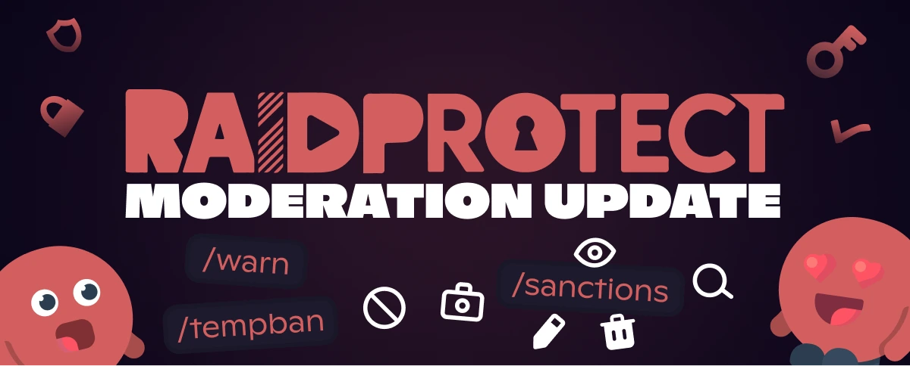

La versión 3.3.0 renueva la forma en que se gestionan las sanciones en tu servidor de Discord con la introducción del Historial de Sanciones, un sistema completo para rastrear, gestionar y analizar todas las acciones de moderación.

<!--truncate-->

## 📋 Un registro completo para cada sanción {#new}

Lleva el control de cada acción de moderación con el nuevo [Historial de Sanciones](/docs/features/sanctions). Nunca más te preguntarás quién fue sancionado, cuándo o por qué:

- **Centralización automática**: Baneos, expulsiones, timeouts y sanciones del automod se registran automáticamente.
- **Búsqueda avanzada** con [`/sanctions search`](/docs/features/sanctions#search): Recupera al instante el historial de un miembro.
- **Detalles completos** con [`/sanctions info`](/docs/features/sanctions#info): Consulta toda la información de una sanción específica.
- **Edición flexible** con [`/sanctions edit`](/docs/features/sanctions#edit): Corrige un motivo o ajusta una sanción existente.
- **Eliminación o reversión** con [`/sanctions delete`](/docs/features/sanctions#delete): Revierte una sanción o elimínala del historial si es necesario.
- **[Gestión inteligente del estado de las sanciones](/docs/features/sanctions#status)**

Cada sanción genera ahora una confirmación indicando si el miembro recibió la notificación por MD.

---

## ⚡ Nuevas herramientas de moderación {#moderation}

Esta actualización también amplía tu kit de herramientas de moderación con tres nuevos comandos esenciales:

- **[`/tempban`](/docs/features/moderation#tempban)**: Banea temporalmente a un miembro durante un periodo determinado.
- **[`/warn`](/docs/features/moderation#warn)**: Advierte a un miembro con trazabilidad completa en el historial.
- **[`/untimeout`](/docs/features/moderation#untimeout)**: Elimina un timeout antes de que expire.

---

## 🛡️ RaidMode y JoinLock mejorados {#raid}

El sistema anti-raid es ahora más inteligente y flexible:

- **Desactivación automática**: [RaidMode](/docs/features/raid-mode#raid-mode) y [Auto RaidMode](/docs/features/raid-mode#duration) se desactivan automáticamente después de un tiempo establecido, ¡no más configuraciones olvidadas!
- **Configuración de duración**: Establece la duración directamente al activar con [`/raidmode`](/docs/features/raid-mode#raid-mode).
- **Nuevo comando [`/joinlock`](/docs/features/join-lock)**: Cierra las invitaciones indefinidamente para un control total sobre los nuevos ingresos.
- **Confirmación de [Antigüedad mínima](/docs/features/raid-mode#minage)**: Recibe confirmación de que el miembro recibió el mensaje explicativo.

---

## ✨ Otras novedades de la 3.3.0 {#changelog}

- **Registros de sanciones dedicados**: Configura un canal para centralizar todos los registros de sanciones.
- **[`/channel duplicate`](/docs/features/utilities#channel-duplicate)**: Duplica un canal exactamente con todas sus configuraciones.
- **Comando `/changelog`**: Consulta el registro de cambios directamente en Discord, también accesible desde `/settings` y `/about`.

---

Para la lista completa de novedades, correcciones y detalles técnicos, consulta el [registro de cambios](/docs/changelog#3-3-0).

:::tip 📚 Recursos útiles
- 🔗 [Añade RaidProtect a tu servidor](https://raidprotect.bot/invite)
- 📘 [Lee la documentación completa](https://docs.raidprotect.bot/)
- 💡 [Envía una sugerencia o comentario](https://suggestions.raidprotect.bot/)
- 📣 [Sigue los anuncios y únete a la comunidad](https://raidprotect.bot/discord)
:::
