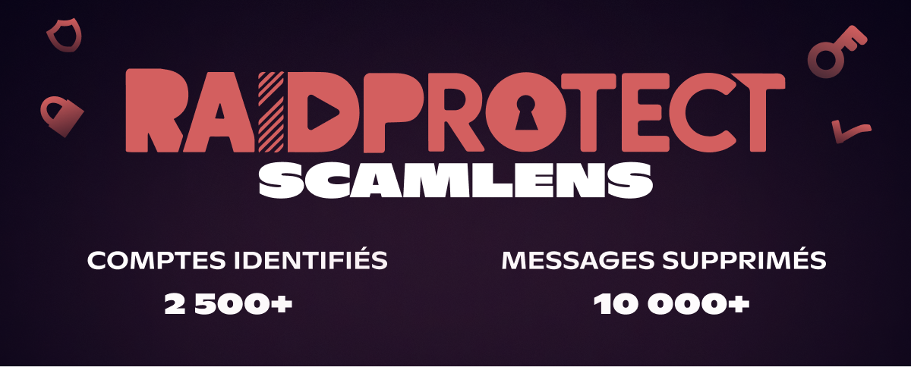
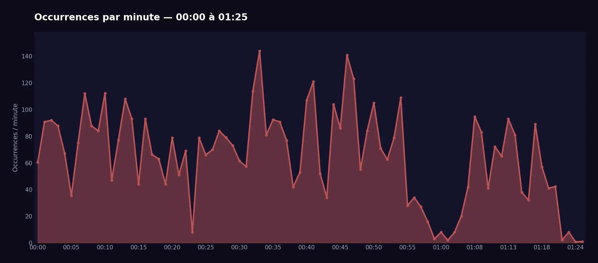
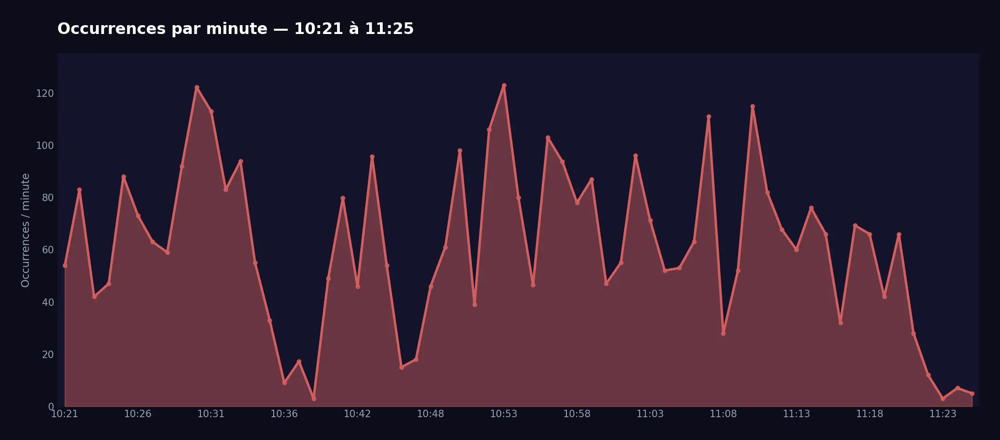

import Timestamp from '@site/src/components/Timestamp';

Una importante oleada de spam vinculada a la **estafa de las "imágenes crypto"** nos ha llevado a activar de forma anticipada el modo `Deletion` de **RaidProtect ScamLens**, nuestro módulo de análisis de imágenes anti-estafa.

{/* truncate */}

## 🛡️ Detalles del spam {#threat}

Dos oleadas masivas de spam tuvieron lugar el <Timestamp value={1771023600} format="D" />, entre las <Timestamp value={1771023600} format="T" /> y las <Timestamp value={1771068391} format="T" />. Más de **2 500 cuentas comprometidas** fueron utilizadas para enviar más de **10 000 mensajes** con este tipo de imagen. Estas cifras solo representan lo observado en los 340 000 servidores protegidos por RaidProtect — dado que Discord cuenta con varios millones de servidores activos, la magnitud real de este ataque puede estimarse en **varios cientos de miles de mensajes** en toda la plataforma.

La estafa, conocida como "imágenes crypto", consiste en el envío masivo de **4 imágenes** que incitan a los usuarios a comprar criptomonedas fraudulentas, en el mayor número de canales posible.

#### Oleada 1 {#wave-1}

#### Oleada 2 {#wave-2}

Ante el alto volumen de mensajes fraudulentos, activamos de forma anticipada el modo `Deletion` de **ScamLens** — introducido en modo `Aprendizaje` en la [actualización 3.3.1](/blog/3.3.1-jail-and-mute#changelog).
Este módulo analiza las imágenes enviadas en tus servidores y ahora elimina automáticamente las identificadas como fraudulentas (no requiere configuración).

### ¿Qué sigue? {#next}

El modo `Sanción` se activará próximamente: además de eliminar las imágenes fraudulentas, ScamLens aplicará automáticamente un **timeout de un día** al remitente. Hemos decidido no banear estas cuentas, ya que se trata casi exclusivamente de **cuentas hackeadas** — un baneo perjudicaría al verdadero propietario de la cuenta. El timeout neutraliza la amenaza de inmediato, dando tiempo al propietario para recuperar el control de su cuenta.

:::info 🔒 Funcionamiento deliberadamente opaco
Por razones de seguridad, no comunicamos ni comunicaremos los métodos de detección utilizados por ScamLens. Este enfoque de "caja negra" busca impedir que los estafadores adapten sus técnicas para eludir nuestras protecciones.
:::

---

## ❓ FAQ {#faq}

#### ¿Cómo bloquear el spam de imágenes en Discord? {#antispam-images}
[Añade RaidProtect](https://raidprotect.bot/invite) a tu servidor. ScamLens está activado por defecto y eliminará todas las imágenes detectadas como fraudulentas — no se necesita configuración adicional.

#### ¿Cómo protegerse de la estafa de imágenes crypto en Discord? {#arnaque-images-crypto}
Basta con [añadir RaidProtect](https://raidprotect.bot/invite). ScamLens detectará y eliminará automáticamente las imágenes fraudulentas.

#### ¿Cómo evitar los bots de spam en mi servidor de Discord? {#anti-spam-bots}
Además de ScamLens, activa el [captcha](/features/captcha) de RaidProtect para impedir que cuentas automatizadas se unan a tu servidor.

---

:::tip 📚 Recursos útiles
- 🔗 [Añadir RaidProtect a tu servidor](https://raidprotect.bot/invite)
- 📘 [Consultar la documentación completa](https://docs.raidprotect.bot/)
- 💡 [Enviar una sugerencia o comentario](https://suggestions.raidprotect.bot/)
- 📣 [Seguir los anuncios y unirse a la comunidad](https://raidprotect.bot/discord)
:::
