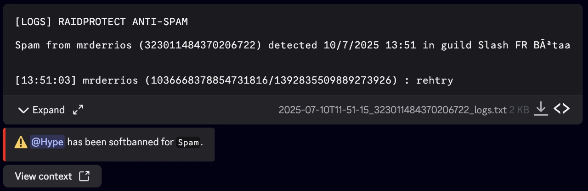
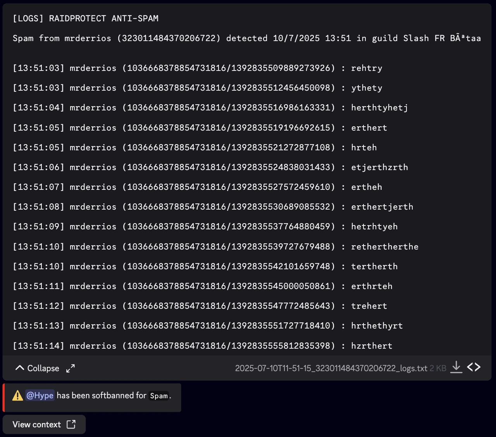

import { AntiSpamSettingsMockup, AntiSpamSanctionsSettingsMockup } from '@site/src/components/DiscordMessage/mockups/settings-menus';

import AntiSpamMockup from '@site/src/components/DiscordMessage/mockups/anti-spam';

<AntiSpamMockup />

import SeparatedBox from '@site/src/components/SeparatedBox';
import Tabs from '@theme/Tabs';
import TabItem from '@theme/TabItem';

El anti-spam de RaidProtect es una herramienta potente para impedir el spam en tu servidor de Discord. Gracias a su sistema de deteccion automatica, se encarga de los problemas por si solo, sin que tengas que intervenir.

## ❓ Como funciona el anti-spam {#working}

El anti-spam de RaidProtect detecta y bloquea automaticamente los comportamientos sospechosos. Distingue entre dos tipos de spam.
- **Spam pesado:** Mensajes que contienen enlaces de invitacion, menciones masivas o imagenes. Estos spams se usan a menudo durante los raids.
- **Spam ligero:** Mensajes enviados con frecuencia pero menos intrusivos.

El anti-spam de RaidProtect actua de dos maneras.
- **Sanciones:** Expulsion o baneo automatico de los spammers.
- **Notificaciones:** Envio de mensajes al canal de registros para senalar el spam bloqueado con una vista previa de las acciones detectadas.

## 🛡️ Configuracion del anti-spam {#config}

RaidProtect ofrece tres niveles de seguridad para responder a las necesidades de tu servidor.
- 🔴 **Alto:** Sanciona todo el spam e incluso el spam pesado en los canales ignorados.
- 🟠 **Medio:** Sanciona todo el spam, pero respeta los canales ignorados.
- 🟢 **Bajo:** Sanciona unicamente el spam pesado.

<AntiSpamSettingsMockup />

### Cambiar el nivel de seguridad {#level}

1. Ejecuta el [comando `/settings`](../setup.md#settings).
2. Haz clic en el boton "**Anti-spam**".
3. Selecciona el nivel de anti-spam deseado en el primer selector.

### Gestionar los roles, usuarios y canales ignorados {#ignore}

Puedes excluir ciertos canales, roles o incluso usuarios del monitoreo del anti-spam para mayor flexibilidad. 😉
1. Ejecuta el [comando `/settings`](../setup.md#settings).
2. Haz clic en el boton "**Anti-spam**".
3. Selecciona las distintas opciones a ignorar en los diferentes selectores:
- Canal(es) a ignorar
- Rol(es) a ignorar
- Miembro(s) a ignorar

:::info
Los canales que contienen "**spam**" en su nombre se ignoran automaticamente. Las personas con el permiso de administrador se ignoran por completo.
:::

### Configurar las sanciones por disparador {#triggers}

Puedes personalizar las sanciones aplicadas segun el tipo de spam detectado. Esto permite una respuesta adaptada a la gravedad de la infraccion.

1. Ejecuta el [comando `/settings`](../setup.md#settings).
2. Haz clic en el boton "**Anti-spam**".
3. Ve a la pestana "**Sanciones**".
4. Para cada disparador, selecciona una sancion especifica. Puedes modificar estos valores mediante los menus desplegables:
- **Seleccionar un disparador**: elige el tipo de spam a configurar.
- **Seleccionar una sancion**: elige la sancion correspondiente.

#### Tipos de sanciones y disparadores {#sanctions}

Estas son las diferentes **sanciones disponibles**:

- **Advertencia**: Envia una advertencia al miembro.
- **Timeout**: Silencia al miembro durante una duracion definida.
- **Silencio**: Asigna el [rol de Silencio](./sanctions.mdx#mute) configurado en tu servidor.
- **Jail**: Asigna el [rol Jail](./sanctions.mdx#jail) configurado en tu servidor.
- **Expulsion**: Expulsa al miembro del servidor.
- **Softban**: Banea y luego desbanea inmediatamente al miembro, eliminando asi sus mensajes.
- **Baneo**: Banea de forma permanente al miembro.
- **Desactivar**: Desactiva por completo el disparador, no se aplicara ninguna sancion.

:::note
Para los disparadores "Spam de duplicados o spam importante" y "Spam multicanal", la sancion mas suave que se puede seleccionar es el **Timeout** (sin Advertencia): se trata de spam grave que justifica una respuesta firme.
:::

Y los **disparadores** que RaidProtect puede detectar, con la sancion aplicada por defecto:

| Disparador (Trigger)                   | Descripcion                                              | Sancion por defecto |
|----------------------------------------|----------------------------------------------------------|---------------------|
| Spam                                   | Envio repetido de mensajes                               | Advertencia         |
| Spam con selfbot                       | Uso de selfbots para hacer spam                          | Softban             |
| Spam de menciones                      | Menciones masivas repetidas                              | Softban             |
| Spam de enlaces                        | Envio masivo de enlaces                                  | Baneo               |
| Spam de comandos externos              | Uso de comandos externos para hacer spam                 | Baneo               |
| Spam de adjuntos                       | Envio masivo de archivos o imagenes                      | Desactivado         |
| Spam de duplicados o spam importante   | Mensajes copiados y pegados o spam excesivo              | Softban             |
| Imagenes de estafa (Crypto Scam)       | Imagenes de estafa detectadas por [ScamLens](./scam-images.md) | Timeout             |
| Spam multicanal                        | Spam repartido en varios canales                         | Jail                |

:::info
El disparador **Spam multicanal** es particular: su sancion reemplaza a la del disparador de origen cuando el spam afecta a varios canales, unicamente si es mas severa.
:::

<AntiSpamSanctionsSettingsMockup />

:::info Premium: moderación discreta
Por defecto, cada sanción del anti-spam se anuncia con un **mensaje público** en el canal. Los servidores **Premium** pueden ocultar este mensaje para una moderación más discreta.
:::

#### Duracion de las sanciones {#duration}

Cuando las sanciones aplicadas por el anti-spam admiten una duracion (mute, timeout, jail), puedes definir una **duracion unica** aplicada a todas estas sanciones (1 hora por defecto).

1. Ejecuta el [comando `/settings`](../setup.md#settings).
2. Haz clic en el boton "**Anti-spam**".
3. Ve a la pestana "**Sanciones**".
4. Selecciona una duracion predefinida en el selector "**Duracion de las sanciones**", o haz clic en "**Duracion personalizada**" para introducir el valor de tu eleccion (por ejemplo `30m`, `2h`, `7d`).

:::info
La duracion se ignora para las sanciones que no la admiten (kick, softban, ban, warn).
:::

## 📑 Registros del anti-spam {#logs}

Se generan registros detallados con el conjunto de los mensajes eliminados por el anti-spam. Puedes simplemente descargar o desplegar el contenido.

<SeparatedBox>
<Tabs>
  <TabItem value="animator" label="Contraido" default>

  </TabItem>
  <TabItem value="moderator" label="Desplegados">

  </TabItem>
</Tabs>
</SeparatedBox>
