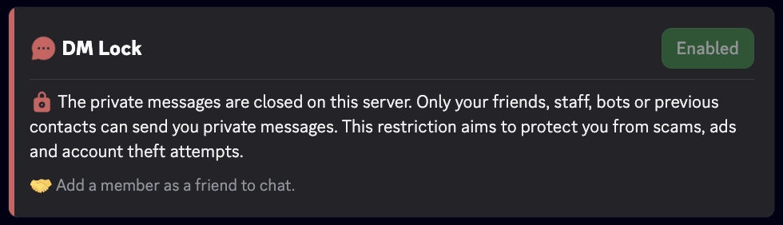
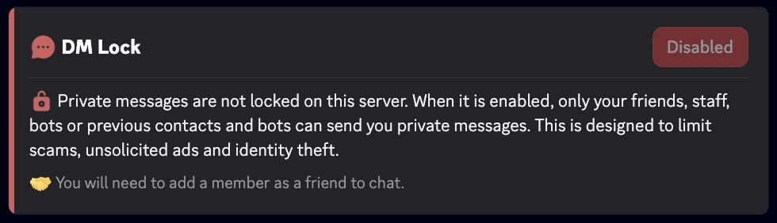

import { DmLockSettingsMockup } from '@site/src/components/DiscordMessage/mockups/settings-menus';

import DmLockMockup from '@site/src/components/DiscordMessage/mockups/dm-lock';

<DmLockMockup />

import SeparatedBox from '@site/src/components/SeparatedBox';
import Tabs from '@theme/Tabs';
import TabItem from '@theme/TabItem';

La función **Bloqueo de MD** de RaidProtect permite cerrar de forma permanente el acceso a los mensajes directos (MD) enviados desde el servidor, superando así la limitación nativa de Discord que solo permite este bloqueo durante 24 horas mediante la acción de ciberseguridad "Pausar los MD".

## 🚦 Casos de uso y recomendaciones {#recommendations}

- **Servidores expuestos al spam o al acoso:** El Bloqueo de MD es especialmente recomendable para las comunidades públicas o con gran audiencia, donde los riesgos de abuso por MD son mayores.
- **Eventos temporales o periodos sensibles:** Durante lanzamientos, anuncios importantes o periodos de mucha afluencia (por ejemplo: concursos, promociones), activar el Bloqueo de MD ayuda a prevenir los intentos de phishing o de estafa.
- **Comunidades con público joven:** Para los servidores con un gran número de menores, limitar los MD puede reforzar la seguridad y prevenir comportamientos inapropiados.
- **Protección continua:** Gracias a la automatización, no hay ventana de vulnerabilidad ligada al olvido de la renovación manual.

## ❓ Funcionamiento del Bloqueo de MD {#working}

El bot RaidProtect verifica regularmente el estado del parámetro de bloqueo de los MD del servidor y, si es necesario, lo reactiva automáticamente para evitar cualquier periodo de vulnerabilidad entre dos renovaciones manuales. Esta tarea se ejecuta de manera transparente para los administradores y los miembros del servidor.

:::info
Sigue siendo posible enviar y recibir mensajes con:
- tus amigos
- los bots
- el staff
:::
:::warning
Las funciones de comunidad de Discord son indispensables para el buen funcionamiento del Bloqueo de MD. [Sigue nuestra guía para verificar la activación de la comunidad en tu servidor.](../guides/community.md)
:::

## 🚩 Configuración del Bloqueo de MD {#config}

1. Ejecuta el [comando `/settings`](../setup.md#settings).
2. Haz clic en el botón "**Bloqueo de MD**".
3. Activa o desactiva el cierre automático de los mensajes directos.

<DmLockSettingsMockup />

## ℹ️ Comando /dmlock-info {#info}

El comando `/dmlock-info` permite informar a los miembros sobre el estado actual del **Bloqueo de MD** en el servidor. Muestra un mensaje claro que indica si la restricción está **activada** o **desactivada**, acompañado de una explicación pedagógica sobre su utilidad.

**Objetivo:**
- Explicar por qué los MD están limitados (lucha contra el spam, las estafas, el phishing).
- Reducir la confusión y las preguntas recurrentes de los nuevos miembros.
- Recordar las condiciones para seguir comunicándose por MD (amigos, staff, bots, contactos previos).

**Ejemplo de visualización**
<SeparatedBox>
<Tabs>
  <TabItem value="enable" label="Activado" default>

  </TabItem>
  <TabItem value="disable" label="Desactivado">

  </TabItem>
</Tabs>
</SeparatedBox>

### ⚙️ Buenas prácticas

- Invita a los miembros activos a usar `/dmlock-info` para responder a las preguntas de los nuevos miembros.
- Muéstralo regularmente o fíjalo en tus canales de bienvenida.
- Combínalo con tus reglas o anuncios para recordar la política anti-spam del servidor.
