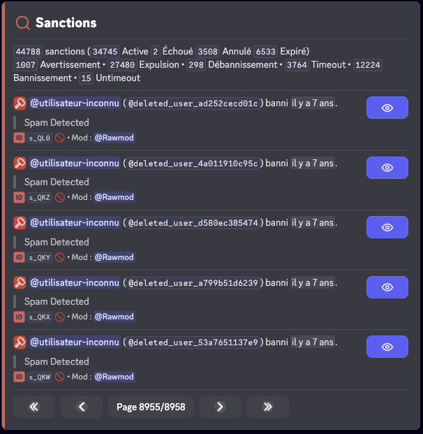
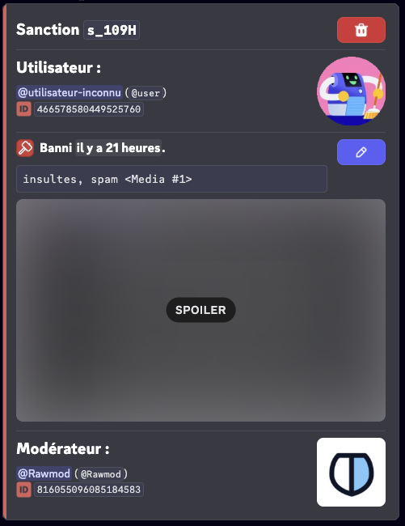
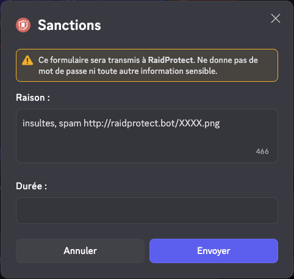
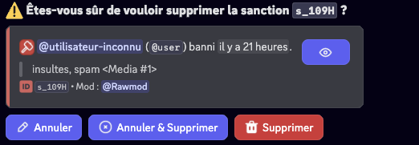
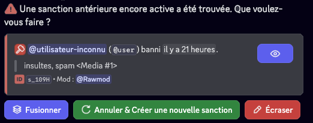
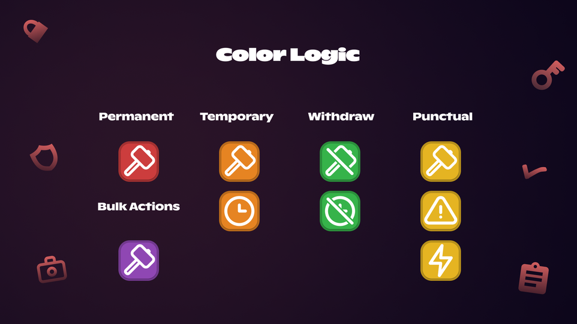

import { SanctionLogsSettingsMockup } from '@site/src/components/DiscordMessage/mockups/settings-menus';

import SanctionsMockup from '@site/src/components/DiscordMessage/mockups/sanctions';

{/* <SanctionsMockup /> masqué temporairement : mockup à améliorer */}

import Icon from "@site/src/components/Icon";

El historial de sanciones de RaidProtect te permite rastrear y gestionar todas las sanciones aplicadas en tu servidor. Este sistema centraliza todas las acciones de moderación en una base de datos consultable y modificable, facilitando así el trabajo de tu equipo de moderación.

## ❓ Funcionamiento del historial {#working}

El historial de sanciones registra automáticamente todas las acciones de moderación realizadas en tu servidor:

- **Sanciones manuales**: Todos los comandos de moderación (`/ban`, `/tempban`, `/kick`, `/timeout`, `/warn`) se registran automáticamente en el historial.
- **Sanciones automáticas**: Las sanciones aplicadas por el anti-spam también se agregan al historial de sanciones.
- **Baneos, expulsiones y timeouts**: Las sanciones aplicadas sin usar RaidProtect se agregan al historial.
- **Automod de Discord**: Las sanciones aplicadas por el automod de Discord también se agregan.
- **Notificaciones de sanciones**: Los miembros sancionados reciben un mensaje privado que les informa de la sanción y de su razón. El bot también envía un acuse de recibo detallado que confirma el estado del envío: **recibido**, **MD cerrados**, **expirado** o **silencioso** (cuando se usa la opción `[silent]`). Para los kicks, softbans y bans temporales, este mensaje contiene además un **botón con una invitación al servidor** para que el miembro pueda volver una vez terminada la sanción.

:::info
Todas las sanciones registradas contienen: el usuario sancionado, el moderador responsable, la razón (hasta 512 caracteres), la fecha y la hora, así como el tipo de sanción y si el usuario fue notificado.
:::

## 🔍 Buscar sanciones {#search}

El comando `/sanctions search` te permite buscar sanciones en el historial según diferentes criterios.

Usa el comando: ```/sanctions search [usuario] [moderador] [type] [date] [status] [tipo_moderador]```

- `[usuario]`: Buscar todas las sanciones de un usuario específico.
- `[moderador]`: Buscar todas las sanciones aplicadas por un moderador específico.
- `[type]`: Filtrar por tipo de sanción (Ban, Softban, Unban, Kick, Timeout, Untimeout, Warn, Jail, Unjail, Mute, Unmute).
- `[date]`: Filtrar por fecha de la sanción.
- `[status]`: Filtrar por estado de la sanción (Activa, Expirada, Cancelada, Fallida).
- `[tipo_moderador]`: Filtrar por tipo de moderador (Acciones humanas, Acciones automatizadas, RaidProtect, Discord, Antispam, etc.).



:::tip
Puedes combinar varios criterios para refinar tu búsqueda. Por ejemplo, buscar todos los baneos realizados por un moderador específico.
:::

## ℹ️ Consultar una sanción {#info}

El comando `/sanctions info` te permite obtener información detallada sobre una sanción específica.

Usa el comando: ```/sanctions info (id)```

Reemplaza `(id)` con el identificador de la sanción que deseas consultar.



## ✏️ Modificar una sanción {#edit}

El comando `/sanctions edit` te permite modificar la razón de una sanción existente, útil para corregir un error o agregar detalles.

Usa el comando: ```/sanctions edit (id) (nueva_razón)```

Reemplaza `(id)` con el identificador de la sanción a modificar y `(nueva_razón)` con la nueva razón (máximo 512 caracteres).



:::warning
Modificar una sanción actualiza el registro en el historial pero no cambia la sanción aplicada en Discord (por ejemplo, un usuario baneado seguirá baneado).
:::

## 🗑️ Eliminar una sanción {#delete}

El comando `/sanctions delete` te permite eliminar una sanción del historial. Esta acción es irreversible.

Usa el comando: ```/sanctions delete (id) [razón]```

Reemplaza `(id)` con el identificador de la sanción a eliminar. El parámetro `[razón]` permite **justificar la eliminación**, que se registrará en los logs.



## Estados de las sanciones {#status}

Las sanciones pueden tener diferentes estados:

| **Estado**    | **Emojis**                                                                                                                  | **Significados**                                          |
| ------------- | ----------------------------------------------------------------------------------------------------------------------------| --------------------------------------------------------- |
| `Activa`      | <Icon src="/img/icons/SanctionStatusACTIVE.svg" alt="icon SanctionStatusACTIVE" title=":iconSanctionStatusACTIVE:"/>        | La sanción está en curso.                                 |
| `Expirada`    | <Icon src="/img/icons/SanctionStatusEXPIRED.svg" alt="icon SanctionStatusEXPIRED" title=":iconSanctionStatusEXPIRED:"/>     | La sanción ha expirado.                                   |
| `Cancelada`   | <Icon src="/img/icons/SanctionStatusCANCELED.svg" alt="icon SanctionStatusCANCELED" title=":iconSanctionStatusCANCELED:"/>  | La sanción ha sido cancelada por un moderador.            |
| `Fallida`     | <Icon src="/img/icons/SanctionStatusFAILED.svg" alt="icon SanctionStatusFAILED" title=":iconSanctionStatusFAILED:"/>        | La sanción ha fallado (falta de permisos).               |

### Gestión de duplicados {#duplicates}

Cuando se encuentra una sanción activa y anterior, puedes:

- **Fusionar** las dos sanciones: las duraciones se sumarán si es posible y las razones se concatenarán.
- **Cancelar** la sanción activa y crear una nueva sanción.
- **Sobrescribir** la sanción activa con la información de la sanción introducida.



## ⚙️ Configuración de sanciones {#config}

### Desactivar las sanciones {#disable}

Puedes **desactivar por completo el sistema de sanciones** en tu servidor. Cuando las sanciones están desactivadas, RaidProtect ya no registra ninguna sanción en el historial y los comandos relacionados quedan indisponibles.

1. Ejecuta el [comando `/settings`](../setup.md#settings).
2. Haz clic en el botón "**Sanciones**".
3. Haz clic en "**Sistema de sanciones**" para activar o desactivar todo el módulo.

### Jail {#jail}

Configura la **Jail** para activar una sanción de moderación basada en roles, más restrictiva que un silencio normal. Una vez configurado, este rol permite aislar a un miembro con permisos severamente limitados y desbloquea el uso de los comandos [`/jail`](./moderation.mdx#jail) y [`/tempjail`](./moderation.mdx#tempjail).

1. Ejecuta el [comando `/settings`](../setup.md#settings).
2. Haz clic en el botón "**Sanciones**".
3. Selecciona "**Jail**".
4. Elige un rol existente mediante el selector o haz clic en "**Crear uno para mí**".

Al crear el rol, también puedes configurar el **canal de información del Jail**:

- **Seleccionar un canal existente** para mostrar en él la información destinada a los miembros en Jail.
- **Crear un nuevo canal** indicando un nombre (por defecto `acceso-restringido`).

Este canal corresponde al espacio reservado en los [paneles de información](./display.mdx), gestionado automáticamente por la configuración del Jail.

:::info
Si ya hay un rol de Jail configurado, puedes modificar el canal de información mediante el botón dedicado del submenú Jail.
:::

#### Roles durante el Jail {#jail-roles}

En el submenú Jail, el botón **Gestión de roles al hacer jail** controla lo que RaidProtect hace con los roles del miembro cuando está encarcelado. Dos modos:

- **Añadir el rol de jail** *(por defecto)*: el rol de Jail simplemente se añade además de los roles existentes del miembro.
- **Reemplazar por el rol de jail**: RaidProtect **retira todos los roles del miembro** durante el encarcelamiento y se los restaura al liberarlo. Más estricto, evita que un rol con permisos explícitos eluda las restricciones del rol de Jail.

Haz clic en el botón para alternar entre los dos modos.

### Rol de Silencio {#mute}

Configura el **rol de Silencio** para usar una sanción basada en roles en lugar del timeout de Discord para las duraciones prolongadas. Cuando la duración del silencio supera el umbral definido, el bot asignará automáticamente el rol de Silencio al miembro en cuestión en lugar de aplicar un timeout de Discord.

1. Ejecuta el [comando `/settings`](../setup.md#settings).
2. Haz clic en el botón "**Sanciones**".
3. Selecciona "**Rol de Silencio**".
4. Elige un rol existente mediante el selector o haz clic en "**Crear uno para mí**".

#### Umbral de Silencio {#mute-threshold}

Configura el **umbral del rol de Silencio** para definir a partir de qué duración el bot usará un silencio basado en roles en lugar del timeout de Discord. Cuando la duración de un silencio supera este umbral, el rol de Silencio se aplica automáticamente. Un valor de 0 desactiva por completo el uso del timeout.

1. Ejecuta el [comando `/settings`](../setup.md#settings).
2. Haz clic en el botón "**Sanciones**".
3. Selecciona "**Umbral de Silencio**".
4. Elige un valor en el selector o introduce un valor personalizado.

:::info
El límite de 28 días para el timeout es impuesto por Discord. Más allá de esa duración, el rol de Silencio se utilizará siempre si está configurado.
:::
:::info
Los **timeouts aplicados por el AutoMod de Discord** se convierten automáticamente en silencio por rol si su duración supera el umbral configurado, para asegurar la coherencia con tus sanciones manuales. La duración sigue limitada a 28 días (límite de Discord).

Esta funcionalidad está actualmente en **beta pública para los servidores [Premium](/es/premium)**.
:::

### Privacidad de Sanciones {#sanctions-privacy}

Configura el nivel de privacidad de las sanciones para controlar la información a la que los miembros pueden acceder respecto a **sus propias sanciones**, mediante el comando [`/mis-sanciones`](./utilities.mdx#my-sanctions) o el botón **Consultar mis sanciones**.

1. Ejecuta el [comando `/settings`](../setup.md#settings).
2. Haz clic en el botón "**Sanciones**".
3. Selecciona "**Privacidad de Sanciones**".
4. Elige el nivel de acceso deseado:

| **Nivel**                            | **Descripción**                                                                                     |
| ------------------------------------ | --------------------------------------------------------------------------------------------------- |
| Desactivado                          | Los miembros no pueden consultar sus sanciones personales.                                          |
| Solo sanciones                       | Los miembros solo pueden consultar sus sanciones y el tiempo restante, si aplica.                   |
| Con las razones                      | Los miembros pueden consultar sus sanciones acompañadas de las razones, sin la identidad del moderador. |
| Con las razones y los moderadores    | Los miembros pueden consultar toda la información: sanciones, razones y moderadores.                 |

:::note
Independientemente del nivel seleccionado, **los moderadores conservan acceso completo** al historial de sanciones mediante las herramientas de moderación.
:::

### Mostrar medios {#show-medias}

Configura la visualización de medios en las razones de sanciones. Cuando esta opción está desactivada, los enlaces que contienen las siguientes extensiones se eliminan automáticamente de las razones de sanciones al mostrarse a los miembros (mediante [`/mis-sanciones`](./utilities.mdx#my-sanctions) o las notificaciones de sanciones):

`png`, `jpg`, `jpeg`, `gif`, `webp`, `webm`, `mp4`

1. Ejecuta el [comando `/settings`](../setup.md#settings).
2. Haz clic en el botón "**Sanciones**".
3. Haz clic en el botón "**Mostrar medios**" para activar o desactivar la opción.

## ✨ Nombres de sanciones (Premium) {#custom-names}

Con la versión premium, puedes personalizar el nombre de cada tipo de sanción para adaptarlo al vocabulario de tu servidor. Para cada tipo, puedes configurar:

- **Nombre**: Reemplaza el nombre predeterminado por el de tu elección, hasta 32 caracteres (ej.: "Warn" → "Tarjeta Amarilla").
- **Verbo**: Define el verbo utilizado en los mensajes, hasta 32 caracteres (ej.: "advertido"). Si se deja vacío, se usa el nombre.
- **Modo MD**: Elige la formulación del mensaje privado enviado al miembro sancionado:
  - "Has sido [verbo]" (por defecto)
  - "Has recibido un [nombre]"

Los tipos de sanciones personalizables son: Ban, Unban, Kick, Jail, Unjail, Timeout, Untimeout, Mute, Unmute y Warn.

1. Ejecuta el [comando `/settings`](../setup.md#settings).
2. Haz clic en el botón "**Sanciones**".
3. Selecciona "**Nombres de sanciones**".
4. Elige el tipo de sanción a personalizar e introduce el nombre, el verbo y el modo MD deseados.

:::tip
Deja los campos vacíos para restablecer un tipo de sanción a su nombre predeterminado. También puedes usar el botón "Restablecer todo" para poner todos los nombres a cero.
:::

## 📊 Logs de sanciones {#logs}

Para una mejor organización, puedes configurar un canal de logs dedicado específicamente a las sanciones, separado de tus logs generales.


### Configurar el canal de logs de sanciones {#config-logs}

<SanctionLogsSettingsMockup />

1. Ejecuta el [comando `/settings`](../setup.md#settings).
2. Haz clic en el botón "**Logs**".
3. Selecciona "**Moderación**".
4. Elige el canal en el que se enviarán los logs de sanciones o usa el botón "**Crear uno para mí**".

:::note
También puedes elegir si RaidProtect registra las acciones realizadas por usuarios sin pasar por el bot.
:::

### Lógica de colores {#logs-color}



## 📦 Importar / Exportar sanciones {#import-export}

RaidProtect te permite importar o exportar el historial de sanciones de tu servidor. Para ello, visita nuestro [servidor de soporte](https://raidprotect.bot/discord) y envía un mensaje privado al bot de soporte (en la parte superior de la lista de miembros), que te acompañará en el proceso.
