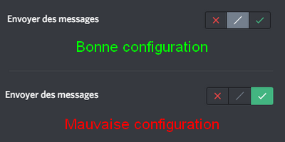

Tienes un problema con RaidProtect? La solucion probablemente esta aqui.

A veces, las cosas no funcionan como se espera. Aqui estan los **problemas mas comunes** que puedes encontrar y como resolverlos.

Si esta pagina no proporciona una respuesta a un problema que estas experimentando, [**no dudes en contactar a nuestro equipo de soporte**](https://raidprotect.bot/discord) que estara encantado de ayudarte.

## El bot muestra un error cuando ejecuto un comando {#commands}

Si el comando no se ejecuta correctamente, **RaidProtect puede mostrar un error** en lugar del resultado esperado. En la mayoria de los casos, se da una indicacion en el mensaje, pero puede ser un mensaje mas generico. Aqui te explicamos como resolver este problema en la mayoria de los casos.

- **Haz lo que se indica.** Algunos errores explican claramente el problema. Si el bot te pide hacer algo, hazlo.

- **Verifica los parametros del comando.** El comando puede estar simplemente mal escrito; revisa la ayuda para ver como usarlo. No olvides que los corchetes ([]) no deben incluirse.

- **Verifica los permisos del bot.** Debe tener el permiso de **Administrador** y estar al nivel de administrador en la jerarquia de roles.

- **Reintenta el comando.** A veces, el problema se resuelve solo sin razon aparente.

Si sigues obteniendo un error a pesar de seguir estos consejos, [contacta a nuestro soporte](https://raidprotect.bot/discord) para que podamos ayudarte.

## El canal de registros del bot no se creo automaticamente {#logs}

Para notificarte sobre las acciones que realiza, RaidProtect necesita un canal de registros. Este canal se crea automaticamente cuando el bot se une por primera vez, pero a veces no se crea ningun canal. Aqui te explicamos como solucionar este problema.

- **Asegurate de que el bot tenga permisos de Administrador.** Para que el bot funcione correctamente, necesitas darle el permiso de Administrador. Si no lo has hecho, ve a la configuracion de roles y otorga este permiso al rol de RaidProtect. Luego solo necesitas inicializar manualmente el bot para que todo funcione (ver abajo).

- **Verifica que el bot este correctamente inicializado.** Esto normalmente se hace automaticamente, pero puedes forzar esta inicializacion con el [comando `/setup`](../setup.md#install). El canal de registros deberia crearse automaticamente.

- **Establece un canal manualmente.** Si nada funciona, no te preocupes, puedes elegir manualmente el canal que el bot usara para los registros. Una vez que hayas creado un canal dedicado, ejecuta el [comando `/settings`](../setup.md#settings) y luego selecciona Registros.

## Un usuario hizo spam, pero el bot no lo sanciono {#anti-spam}

El [anti-spam](../features/anti-spam.mdx) es una de las funciones principales de RaidProtect, y puede ser frustrante si no funciona. Pero tranquilo, la mayoria de las veces no es nada grave.

- **Si el anti-spam pide que dejen de hacer spam**, pero no sanciona, esto probablemente se debe a la falta de permisos. Recuerda, el bot debe tener el permiso de Administrador y estar al nivel de administrador en la jerarquia de roles.

- **Verifica la configuracion del anti-spam.** Suena tonto, pero algunas personas olvidan que han ignorado un canal.

- **Verifica los permisos del spammer.** Los administradores son ignorados, por lo que si estas probando el anti-spam en tu propio servidor, puede que no te detecte.

- **El spam es lo suficientemente largo?** El bot generalmente solo detecta spam a partir de mas de 5 mensajes. No seas muy impaciente.

Si a pesar de todo esto, el spam sigue sin ser detectado, [contactanos en nuestro servidor de soporte](https://raidprotect.bot/discord) con una **captura de pantalla del problema**.

## Los usuarios tienen acceso al servidor sin pasar el captcha {#captcha}

Este problema es relativamente comun, pero depende de **la configuracion de tu servidor**. Veamos como solucionarlo.

- **Tienes un rol automatico?** Si has configurado un bot (diferente a RaidProtect) para asignar un rol a los nuevos miembros de tu servidor, esto puede interferir con el captcha. Reemplazalo con el [autorole de RaidProtect](../features/captcha.md#autorole).

- **Has activado el captcha?** Esta es una funcion completamente opcional que requiere ejecutar un comando para activarla. Consulta la [pagina de documentacion dedicada al captcha](../features/captcha.md#config) para mas informacion.

## Los usuarios pueden seguir hablando cuando bloqueo un canal {#lock}

El comando de bloqueo parece magico, pero tambien tiene sus debilidades. Como [se indica en esta documentacion](../features/channel-lock.md#lock), el comando **solo actua sobre el rol @everyone**. Esto significa que si un rol en el canal que deseas bloquear tiene explicitamente permiso para hablar, podra seguir haciendolo. Como una imagen vale mas que mil palabras, aqui te mostramos como se ve en la practica.

