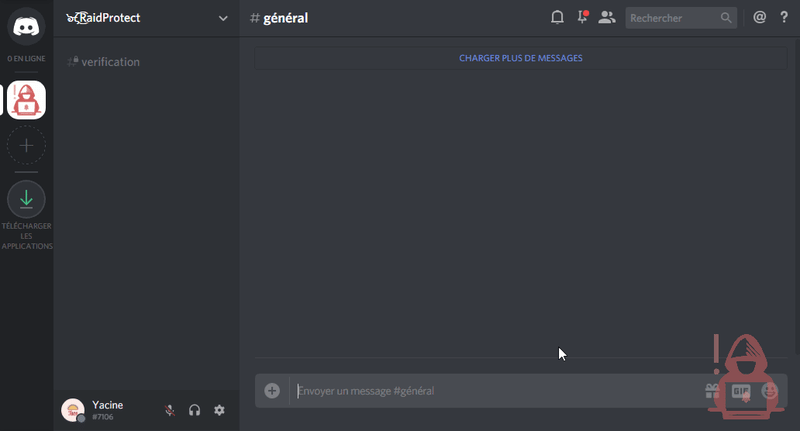
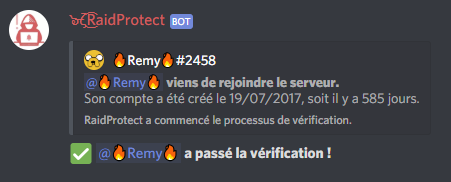

Evita que los selfbots accedan a tu servidor de Discord y bloquea los raids con el sistema de verificación captcha de RaidProtect.

El captcha es una de las funciones más populares de RaidProtect, aunque es **completamente opcional**. Si lo necesitas, el captcha te permite exigir a cada usuario que complete un desafío ingresando un código para confirmar que no es un bot (_selfbot_).

Si bien esto mejora la seguridad de tu servidor, **algunos usuarios podrían no entender el proceso**, lo que podría resultar en la pérdida de algunos miembros. ¡Depende de ti decidir si vale la pena implementarlo! 😉

## ❓ Cómo funciona el Captcha {#working}

**El captcha utiliza un rol "No verificado" y un canal #verificación.** Cuando un usuario se une, el bot le asigna el rol "No verificado", restringiendo su acceso únicamente al canal #verificación. En este canal, **el bot envía una imagen que contiene seis letras**, y el usuario debe escribir lo que ve para demostrar que no es un bot. Si la respuesta es correcta (permitiendo una letra incorrecta), el bot elimina el rol "No verificado", otorgando al usuario acceso normal al servidor. 👾

Los usuarios tienen cinco minutos para completar el captcha. Después de este tiempo, son expulsados del servidor para evitar acumular mensajes huérfanos en el canal de verificación.

:::warning
**Los permisos del rol "No verificado" son gestionados automáticamente por RaidProtect.** Aunque puedes renombrar el rol y el canal, no deben ser eliminados.
:::

Cuando un usuario se une a tu servidor con el captcha activado, RaidProtect publica automáticamente **un mensaje con la fecha de creación de la cuenta** del nuevo usuario en el canal de logs.

## ⛽ Configuración del Captcha {#setup}

**¡Configurar el captcha es muy sencillo!** Simplemente usa el comando `?captcha enable`, y todo se configurará automáticamente. 🎩

Para desactivarlo, usa el comando `?captcha disable`. El rol y el canal del captcha serán eliminados sin intervención adicional.

## ✨ Funciones adicionales {#additional-features}

Para hacer el sistema de captcha más flexible, hemos añadido **varias opciones adicionales.** 🦸‍♂️

### Logs separados {#logs}

Por defecto, los logs del captcha se publican en el canal de logs de RaidProtect. Si tu servidor es popular, estos mensajes podrían saturar los demás logs. **¡Puedes moverlos a otro canal!**

Después de crear un nuevo canal de logs, usa el comando `?captcha logs #canal-de-logs`. Todos los logs del captcha aparecerán ahora en el nuevo canal.

### Asignación automática de rol {#autorole}

:::warning
Si usas un sistema de asignación automática de rol (_autorole_) diferente al de RaidProtect, **el captcha podría dejar de funcionar.** Reemplázalo con la función de autorole de RaidProtect para resolver este problema. 👷
:::

Por defecto, los usuarios no reciben ningún rol después de pasar el captcha. Sin embargo, puedes **asignar un rol automáticamente**. Para hacerlo, ejecuta el comando:
`?captcha autorole @rol`.

El rol puede ser una mención o el nombre exacto de un rol.

### Edad mínima de cuenta {#minage}

Puedes establecer un **requisito de edad mínima de cuenta para acceder a tu servidor.** Cualquier usuario con una cuenta más nueva que este límite será expulsado automáticamente. 👶

Para activar esta función, usa el comando: `?captcha min-age [edad mínima]`. La edad mínima debe especificarse en días.
