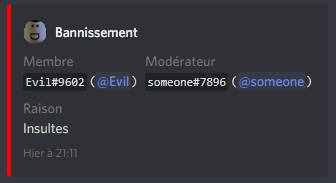

Explora todas las funciones secundarias de RaidProtect: moderación, bloqueo de canales, información de usuarios y más.

Además de las funciones principales presentadas anteriormente, RaidProtect ofrece **algunas funciones menores adicionales**. ¡Son simples pero útiles! 😯

## 🤬 Comandos de moderación {#moderation}

Para facilitar la vida a tus moderadores, RaidProtect incluye comandos para interactuar con las funciones de moderación nativas de Discord: **banear y expulsar usuarios**. Además de banear o expulsar a un usuario (como es de esperar), estos comandos envían un mensaje privado al usuario explicando la razón de su sanción y registran la acción en el canal de logs de RaidProtect. 🗣️

Usar estos comandos es **muy sencillo**. Para banear, simplemente ejecuta: `?ban @usuario razón`. El comando `?kick` sigue el mismo formato. Por ejemplo, para expulsar al usuario "Evil" por "insultos", ejecuta: `?kick @Evil Insultos`. ¡Así de rápido!

Para usuarios avanzados, ten en cuenta que puedes banear a un usuario incluso **si no está en tu servidor** usando su ID de usuario. Conveniente.

Ejemplo de un mensaje de log después de banear a un usuario.

## 🔒 Bloqueo de canales {#lock}

A veces, puedes necesitar, por cualquier razón, bloquear un canal para **evitar que los miembros hablen en él.** El comando de bloqueo te permite hacerlo rápidamente: ejecuta `?lock`, ¡y el canal estará bloqueado! Para revertir la acción, simplemente usa el comando `?unlock`.

Este comando **elimina el permiso de hablar** del rol @everyone en el canal. Para que funcione correctamente, asegúrate de que ningún otro rol tenga permiso explícito para hablar en el canal; de lo contrario, los usuarios con esos roles seguirán pudiendo hablar.

## 👤 Información de usuario {#userinfo}

La última función adicional es el comando `?userinfo`. Este comando te permite principalmente ver **la fecha de creación de la cuenta de cualquier usuario** y, si es miembro del servidor, la fecha en que se unió a tu servidor. El comando debe ir seguido de una mención, un nombre de usuario con etiqueta o un ID de usuario. 👀

