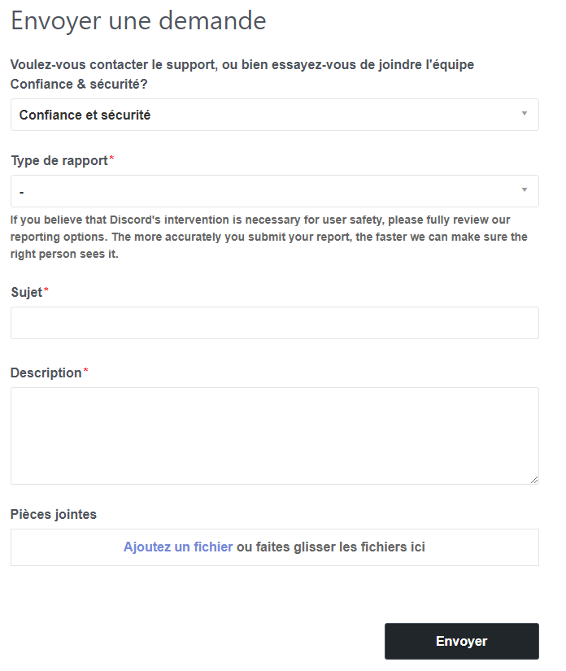

¿Has encontrado un usuario malicioso en Discord? Repórtalo para asegurarte de que se tomen las medidas apropiadas.

En Discord, algunos usuarios pueden no tener las mejores intenciones. Si su comportamiento es particularmente perjudicial para la comunidad, se recomienda **reportarlos al equipo de Trust & Safety de Discord**. Si la infracción se confirma, el usuario puede enfrentar sanciones que van desde advertencias hasta la eliminación de su cuenta. 😖

## 🧐 ¿Qué tipos de infracciones deben reportarse? {#types-of-violations}

Por supuesto, no todos los tipos de infracciones ameritan la eliminación de la cuenta. Los comportamientos sancionables están detallados en las **[Normas de la comunidad](https://discord.com/guidelines) de Discord** (así como en los [Términos de servicio](https://discord.com/terms), aunque estos últimos son más jerga legal que instrucciones claras). La lista de categorías de reportes en la página de envío es un excelente resumen para quienes no quieran leer todo.

En general, los comportamientos que son **perjudiciales para la comunidad** (spam, promoción de contenido ilegal, etc.) o que causan **daño grave a un usuario** (doxxing, acoso) deben ser reportados.

Para comportamientos menos graves, considera usar **baneos** (en un servidor) o [bloqueos](https://support.discord.com/hc/en-us/articles/217916488-Blocking-Privacy-Settings) (en toda la plataforma). Si no eres moderador en el servidor donde ocurren los incidentes, reporta el comportamiento al equipo de moderación del servidor, ya que están obligados a tomar medidas.

## 🕵️ Recopilar evidencia {#recover-evidences}

Para hacer un reporte, necesitarás proporcionar evidencia. Ten en cuenta que **las capturas de pantalla no son pruebas válidas** ya que pueden falsificarse fácilmente. Debes proporcionar un enlace (o varios enlaces) a los mensajes infractores.

**Estos enlaces son fáciles de obtener.** En un mensaje que corresponda a la infracción que deseas reportar, haz clic derecho > Copiar enlace del mensaje (en escritorio) o mantén presionado > Compartir > Copiar al portapapeles (en móvil).

## 📪 Reportar la infracción al equipo de Trust & Safety {#report-to-tns}

El reporte es rápido y sencillo, y toma solo unos minutos. Primero, ve al **formulario dedicado** visitando **[https://dis.gd/report](https://dis.gd/report)**.

### Enviar el reporte al equipo de Trust & Safety {#form}

Dependiendo del tipo de reporte, **se requerirán diferentes detalles**. Pega el enlace o enlaces de los mensajes que obtuviste anteriormente en el campo correspondiente (y añade otros en la descripción si es necesario). Asegúrate de ser **lo más detallado posible** y mantener una comunicación cortés. 😇

### 📨 Respuesta de Discord {#discord-response}

Unos días después de enviar tu reporte, generalmente en el plazo de una semana, deberías recibir **una respuesta por correo electrónico** de Discord. Ten en cuenta que no serás informado sobre las sanciones específicas (si las hay) impuestas al usuario reportado. 😒

