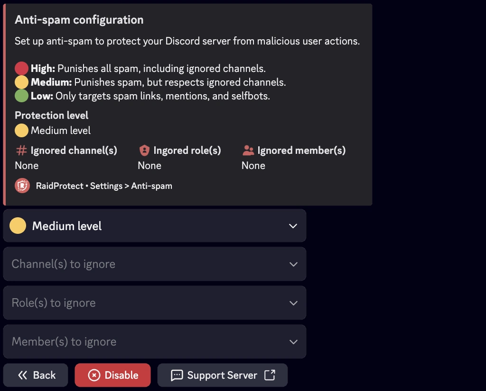

El Antispam de RaidProtect es una herramienta poderosa para prevenir el spam en tu servidor de Discord. Gracias a su sistema de deteccion automatica, se encarga de los problemas por si solo sin requerir tu intervencion.

## ❓ Como Funciona el Antispam {#working}

El antispam de RaidProtect detecta y bloquea automaticamente comportamientos sospechosos. Distingue entre dos tipos de spam.
- **Spam pesado:** Mensajes que contienen enlaces de invitacion, menciones masivas o imagenes. Este tipo de spam se usa frecuentemente durante raids.
- **Spam ligero:** Mensajes enviados frecuentemente pero menos intrusivos.

El antispam de RaidProtect actua de dos maneras.
- **Sanciones:** Expulsion o baneo automatico de spammers.
- **Notificaciones:** Envia mensajes al canal de registros para reportar el spam bloqueado con un resumen de las acciones detectadas.

## 🛡️ Configurar el Antispam {#config}

RaidProtect ofrece tres niveles de seguridad para adaptarse a las necesidades de tu servidor.
- 🔴 **Alto:** Sanciona todo el spam, incluyendo spam pesado en canales ignorados.
- 🟠 **Medio:** Sanciona todo el spam pero respeta los canales ignorados.
- 🟢 **Bajo:** Sanciona unicamente el spam pesado.

### Cambiar el Nivel de Seguridad {#level}

1. Usa el [comando `/settings`](../setup.md#settings).
2. Haz clic en el boton "**Antispam**".
3. Selecciona el nivel de antispam deseado en el primer menu desplegable.

### Gestionar Roles, Usuarios y Canales Ignorados {#ignore}

Puedes excluir ciertos canales, roles o incluso usuarios del monitoreo del antispam para mayor flexibilidad. 😉
1. Usa el [comando `/settings`](../setup.md#settings).
2. Haz clic en el boton "**Antispam**".
3. Selecciona las diferentes opciones a ignorar en los menus desplegables:
- Canal(es) a ignorar
- Rol(es) a ignorar
- Miembro(s) a ignorar

:::info
Los canales que contienen "**spam**" en su nombre son ignorados automaticamente. Los usuarios con permisos de administrador son completamente ignorados.
:::
