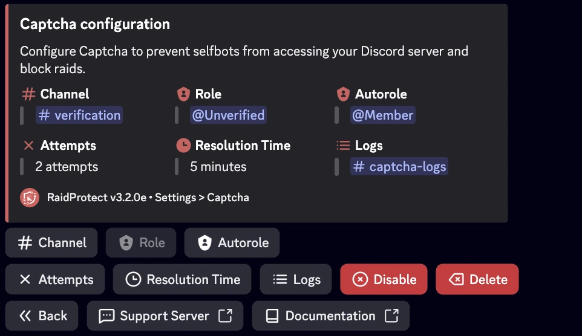

Evita que selfbots accedan a tu servidor de Discord y bloquea raids con el sistema de captcha de RaidProtect.

Captcha es una de las funciones mas populares de RaidProtect, aunque sigue siendo completamente opcional. Te permite exigir a cada nuevo usuario que complete un desafio ingresando un codigo para verificar que no es un bot (selfbot).

## ❓ Como funciona el Captcha {#working}

El captcha se basa en un rol **@Unverified** y un canal **#verification**. Cuando un usuario se une a tu servidor:
- El bot asigna automaticamente el rol **@Unverified** a este usuario, limitando su acceso unicamente al canal **#verification**.
- En este canal, el bot envia una imagen con 6 letras mayusculas. El usuario debe transcribir las letras en el canal para demostrar que es humano.
- Si la respuesta es correcta, el rol **@Unverified** se elimina y el usuario obtiene acceso normal al servidor. De lo contrario, es expulsado automaticamente.
- Cuando el captcha esta activado, RaidProtect publica automaticamente un mensaje en el canal de registros, indicando la fecha de creacion de la cuenta de cada nuevo usuario.
- RaidProtect detecta automaticamente problemas de permisos (canal y rol) asi como la visibilidad predeterminada del canal durante el proceso de incorporacion de Discord.

:::info
**Limite de tiempo e intentos:** Los usuarios tienen de **1 a 10 minutos** para completar el captcha (**5 minutos por defecto**) y de **1 a 3 intentos** (**2 intentos por defecto**). Si superan estos limites, son expulsados automaticamente del servidor.
:::
:::warning
**Gestion de permisos:** Los permisos del rol **@Unverified** son configurados automaticamente por RaidProtect. Puedes renombrar el rol y el canal, pero no los elimines.
:::

## 🚪 Configuracion del Captcha {#config}

Configurar el captcha es rapido y facil.

1. Ejecuta el [comando `/settings`](../setup.md#settings).
2. Haz clic en el boton "**Captcha**".
3. Elige el canal donde se realizaran los captchas o usa el boton "**Create one for me**".
4. El rol **@Unverified** se crea y configura automaticamente.
5. Configura el numero de intentos permitidos (entre **1 y 3**) y el tiempo maximo de resolucion (entre **1 y 10 minutos**).

## ✨ Funciones adicionales {#additional-features}

Para adaptarse a las necesidades de tu servidor, el captcha de RaidProtect ofrece opciones personalizables.

### Registros separados {#logs}

Si tu servidor es popular, los registros relacionados con el captcha pueden saturar tu canal de registros principal. Puedes moverlos a otro canal.

1. Ejecuta el [comando `/settings`](../setup.md#settings).
2. Haz clic en el boton "**Logs**".
3. Selecciona "**Captcha**".
4. Elige el canal donde se almacenaran los registros del captcha o usa el boton "**Create one for me**".

### Rol automatico {#autorole}

Si usas un sistema de rol automatico (autorole) diferente al de RaidProtect, puede interferir con el captcha. Reemplaza tu autorole existente por el de RaidProtect.

1. Ejecuta el [comando `/settings`](../setup.md#settings).
2. Haz clic en el boton "**Captcha**".
3. Selecciona "**Auto Role**".
4. Elige el rol que se asignara a los miembros que completen exitosamente el captcha.
