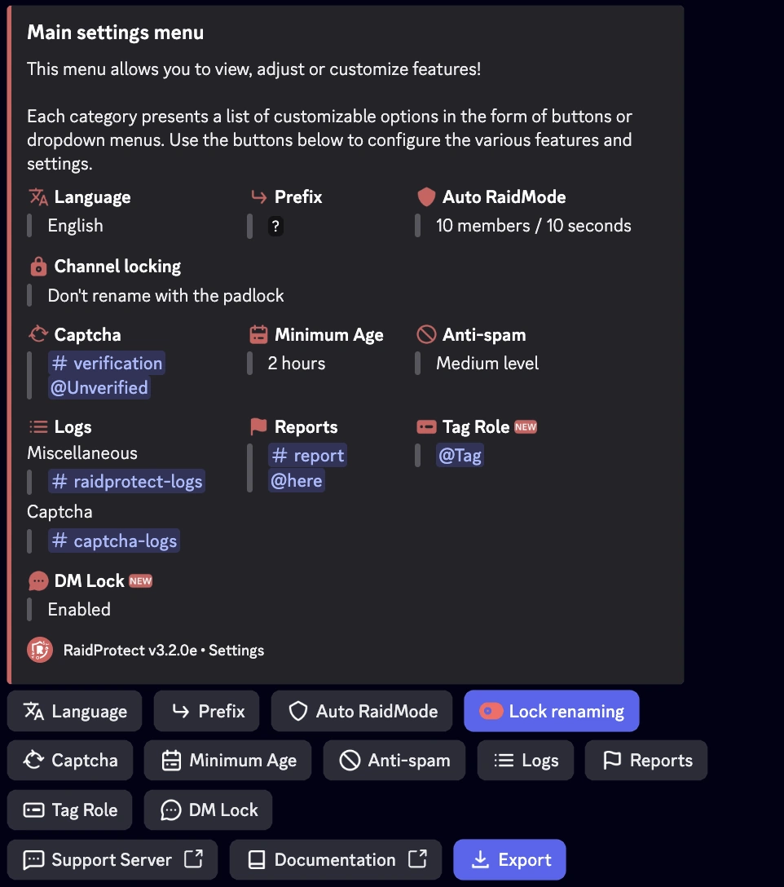

RaidProtect simplifica la gestion del servidor con dos herramientas poderosas: el comando [`/setup`](#install) para una configuracion guiada paso a paso y el comando [`/settings`](#settings) para ajustar tu configuracion en cualquier momento a traves de un menu centralizado. Esta guia de instalacion explica como usarlos de manera efectiva.

## Instalacion guiada {#install}

El comando `/setup` esta disenado para ayudarte a configurar RaidProtect de forma rapida o mediante un enfoque detallado, segun tus necesidades. Ofrece dos modos de configuracion: [recomendada](#recommended) o [avanzada](#advanced).

### 🔧 Configuracion recomendada {#recommended}

Te permite activar o desactivar las funciones principales de un vistazo usando un menu de seleccion interactivo.

1. Usa el comando `/setup`.
2. Selecciona el boton "**Recommended Configuration**".
3. Activa o desactiva las funciones deseadas usando el menu de seleccion.

El bot te enviara un resumen de las funciones activadas y los cambios que realizara en el servidor.

<!--
### 🛠️ Configuracion avanzada {#advanced}

Si deseas configurar el bot de manera mas exhaustiva, opta por la configuracion avanzada. El bot te guia paso a paso con explicaciones claras.

1. Usa el comando `/setup`.
2. Selecciona el boton "**Advanced Configuration**".
3. Cada paso presenta una funcion, su proposito y una configuracion minima recomendada.
4. Usa los botones "**Previous**" y "**Next**" para avanzar o retroceder.

Al final, se muestra un resumen de la configuracion para confirmar tus elecciones.
-->
## Modificar la configuracion {#settings}

El comando `/settings` es el comando ideal para gestionar tu configuracion despues de la instalacion. Te permite ver, ajustar o personalizar las funciones de RaidProtect en cualquier momento, de forma simple y rapida.

### 🔍 Menu de configuracion {#menu}

1. Escribe `/settings` en un canal donde el bot este activo.
2. Navega facilmente entre las diferentes secciones para encontrar la configuracion que deseas modificar.
3. Ajusta las opciones: Cada categoria presenta una lista de opciones personalizables en forma de botones o menus desplegables.

### 🔄 Restablecer una configuracion {#reset}

1. Navega hasta la configuracion deseada.
2. Haz clic en "**Reset**".

El bot confirmara el restablecimiento antes de aplicar los cambios.

:::info Problema de configuracion?
Si encuentras un problema, consulta la seccion [Problemas frecuentes](./guides/malfunctions) o unete a nuestro [servidor de soporte](https://raidprotect.bot/discord) para obtener ayuda.
:::
