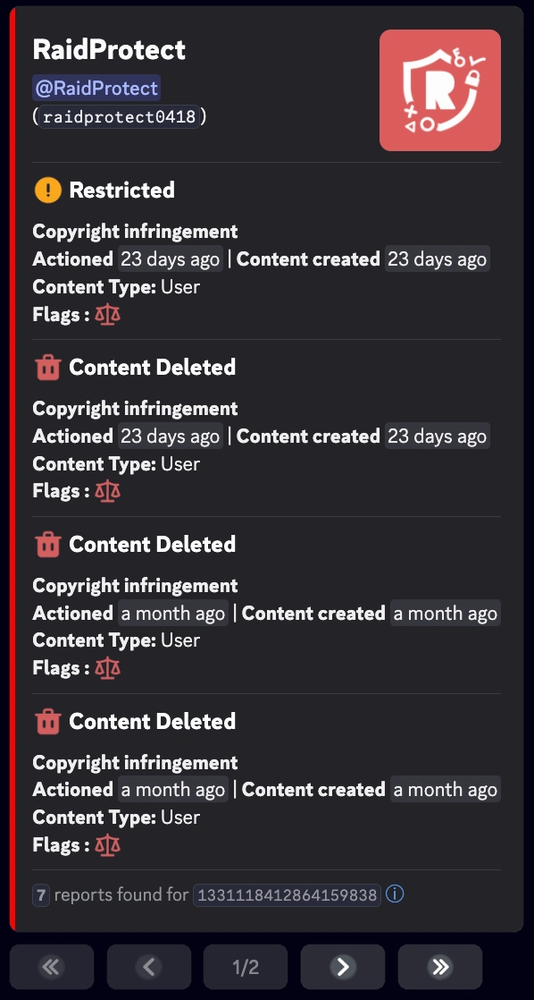
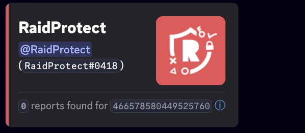

import SeparatedBox from '@site/src/components/SeparatedBox';
import Tabs from '@theme/Tabs';
import TabItem from '@theme/TabItem';
import Icon from "@site/src/components/Icon";

Funciones adicionales para simplificar la gestión de tu servidor. 🔧

Además de las funciones principales como el sistema de captcha y la protección anti-raid, RaidProtect ofrece varias herramientas secundarias que pueden hacer la gestión de tu servidor aún más fluida.

:::info
Los comandos de utilidades son [utilizables con prefijo](../guides/prefix.md).
:::

## 👤 Información del usuario {#userinfo}

El comando `/userinfo` te permite obtener información detallada sobre un usuario.

Usa el comando: ```/userinfo [user]```

Reemplaza `[user]` con la mención o ID deseada.

### 📋 Información mostrada {#displayed-userinfo}

- **Fecha de creación de la cuenta de Discord**
- **Foto de perfil** del usuario
- **Banner del perfil**
- **Insignias del perfil**
  - Las insignias de Nitro, Booster, Quest y Originally Name no se muestran.


### 🎭 Información sobre un miembro del servidor {#displayed-memberinfo}

Si el objetivo es un miembro del servidor, se incluye información adicional:

- **Fecha de ingreso al servidor**
- **Apodo en el servidor**
- **Número de roles** y **lista de los primeros 6 roles**
- **Categoría de permisos** (visible solo para moderadores):

<SeparatedBox>
<Tabs>
  <TabItem value="animator" label="Animador" default>

    La categoría **Animador** se muestra si el miembro tiene **al menos uno** de los siguientes permisos:

    - `MANAGE_EXPRESSIONS`
    - `CREATE_GUILD_EXPRESSIONS`
    - `MANAGE_EVENTS`

  </TabItem>
  <TabItem value="moderator" label="Moderador">

    La categoría **Moderador** se muestra si el miembro tiene **al menos uno** de los siguientes permisos:

    - `KICK_MEMBERS`
    - `BAN_MEMBERS`
    - `MODERATE_MEMBERS`
    - `MANAGE_MESSAGES`
    - `MUTE_MEMBERS`
    - `DEAFEN_MEMBERS`
    - `MOVE_MEMBERS`
    - `MANAGE_THREADS`

  </TabItem>
  <TabItem value="manager" label="Gestor">

    La categoría **Gestor** se muestra si el miembro tiene **al menos uno** de los siguientes permisos:

    - `MANAGE_GUILD`
    - `MANAGE_ROLES`
    - `MANAGE_CHANNELS`
    - `VIEW_AUDIT_LOG`
    - `MANAGE_WEBHOOKS`
    - `MANAGE_SERVER_EXPRESSIONS`

  </TabItem>
  <TabItem value="admin" label="Administrador">

    La categoría **Administrador** se muestra en **dos casos posibles**:

    1️⃣ Tiene el permiso:
    - `ADMINISTRATOR`

    2️⃣ Tiene **los tres** permisos siguientes al mismo tiempo:
    - `MANAGE_GUILD`
    - `MANAGE_ROLES`
    - `MANAGE_CHANNELS`

  </TabItem>
  <TabItem value="owner" label="Propietario">

    **Condición**: El miembro es el **propietario del servidor**.

  </TabItem>
</Tabs>
</SeparatedBox>

- **Flags del miembro** (visibles solo para moderadores):

| **Flags**                                | **Emojis**                                                                                                             | **Significados**                                                      |
| ---------------------------------------- | ---------------------------------------------------------------------------------------------------------------------- | --------------------------------------------------------------------- |
| `DID_REJOIN`                             | <Icon src="/img/icons/MemberDidRejoin.svg" alt="icon MemberDidRejoin" title=":MemberDidRejoin:"/>                      | El usuario salió y volvió a unirse al servidor.                       |
| `IS_GUEST`                               | <Icon src="/img/icons/MemberIsGuest.svg" alt="icon MemberIsGuest" title=":MemberIsGuest:"/>                            | Miembro invitado (invitación temporal o acceso de invitado).          |
| `COMPLETED_ONBOARDING`                   | <Icon src="/img/icons/OnboardingCompleted.svg" alt="icon OnboardingCompleted" title=":OnboardingCompleted:"/>          | Completó el proceso de incorporación del servidor.                    |
| `STARTED_ONBOARDING`                     | <Icon src="/img/icons/OnboardingStarted.svg" alt="icon OnboardingStarted" title=":OnboardingStarted:"/>                | Inició el proceso de incorporación.                                   |
| `COMPLETED_SERVER_GUIDE`                 | <Icon src="/img/icons/ServerGuideCompleted.svg" alt="icon ServerGuideCompleted" title=":ServerGuideCompleted:"/>       | Completó la guía del servidor si está habilitada.                     |
| `STARTED_SERVER_GUIDE`                   | <Icon src="/img/icons/ServerGuideStarted.svg" alt="icon ServerGuideStarted" title=":ServerGuideStarted:"/>             | Inició la guía del servidor.                                          |
| `AUTOMOD_QUARANTINED_NAME`               | <Icon src="/img/icons/MemberQuarantined.svg" alt="icon MemberQuarantined" title=":MemberQuarantined:"/>                | Puesto en cuarentena por automoderación debido al nombre de usuario.  |
| `AUTOMOD_QUARANTINED_GUILD_TAG`          | <Icon src="/img/icons/MemberQuarantined.svg" alt="icon MemberQuarantined" title=":MemberQuarantined:"/>                | Puesto en cuarentena por automoderación debido al tag o apodo.        |
| `BYPASSES_VERIFICATION`                  | <Icon src="/img/icons/BypassVerification.svg" alt="icon BypassVerification" title=":BypassVerification:"/>             | El usuario puede omitir la verificación del servidor.                 |
| `SPAMMER`                                | <Icon src="/img/icons/UnusualAccountActivity.svg" alt="icon UnusualAccountActivity" title=":UnusualAccountActivity:"/> | Cuenta marcada como spammer o actividad inusual detectada.            |

## ⚖️ Sanciones de Discord {#discord-sanctions}

El comando `/ds` te permite ver las **sanciones emitidas por Discord** contra un usuario, de acuerdo con las [regulaciones europeas](https://transparency.dsa.ec.europa.eu/).

Usa el comando: ```/ds (user)```

Reemplaza `(user)` con la mención o ID deseada.

### 📋 Información mostrada {#displayed-sanctions}

- **Tipo de sanción**:

| **Sanciones**                            | **Emojis**                                                                                                             | **Significados**                                                      |
| ---------------------------------------- | ---------------------------------------------------------------------------------------------------------------------- | --------------------------------------------------------------------- |
| `CONTENT_DELETED`                        | <Icon src="/img/icons/ContentDeleted.svg" alt="icon ContentDeleted" title=":iconTrash:"/>                              | El contenido publicado por el usuario ha sido eliminado.              |
| `RESTRICTED`                             | <Icon src="/img/icons/AccountRestricted.svg" alt="icon AccountRestricted" title=":iconRestricted:"/>                   | La cuenta del usuario ha sido restringida.                            |
| `ACCOUNT_SUSPENDED`                      | <Icon src="/img/icons/AccountSuspended.svg" alt="icon AccountSuspended" title=":iconSuspended:"/>                      | La cuenta del usuario ha sido suspendida.                             |
| `ACCOUNT_TERMINATED`                     | <Icon src="/img/icons/AccountTerminated.svg" alt="icon AccountTerminated" title=":iconTerminated:"/>                   | La cuenta del usuario ha sido eliminada.                              |

- **Fecha de emisión**
- **Tipo de contenido**
- **Flags de la sanción**:

| **Flags**                                | **Emojis**                                                                                                             | **Significados**                                                      |
| ---------------------------------------- | ---------------------------------------------------------------------------------------------------------------------- | --------------------------------------------------------------------- |
| `ILLEGAL_CONTENT`                        | <Icon src="/img/icons/IllegalContent.svg" alt="icon IllegalContent" title=":iconIllegal:"/>                            | Sanción aplicada por contenido ilegal.                                |
| `AUTOMATED_DETECTION`                    | <Icon src="/img/icons/AutomatedDetection.svg" alt="icon AutomatedDetection" title=":iconBots:"/>                       | Sanción aplicada mediante detección automatizada.                     |

<SeparatedBox>
<Tabs>
  <TabItem value="reports-found" label="Reportes encontrados" default>



  </TabItem>
  <TabItem value="reports-not-found" label="Sin reportes encontrados">



  </TabItem>
</Tabs>
</SeparatedBox>

:::note
El comando permite ver los reportes emitidos entre el 22 de agosto de 2024 y el 14 de agosto de 2025. Esta información es proporcionada directamente por Discord y **no puede ser modificada** por RaidProtect.
:::
