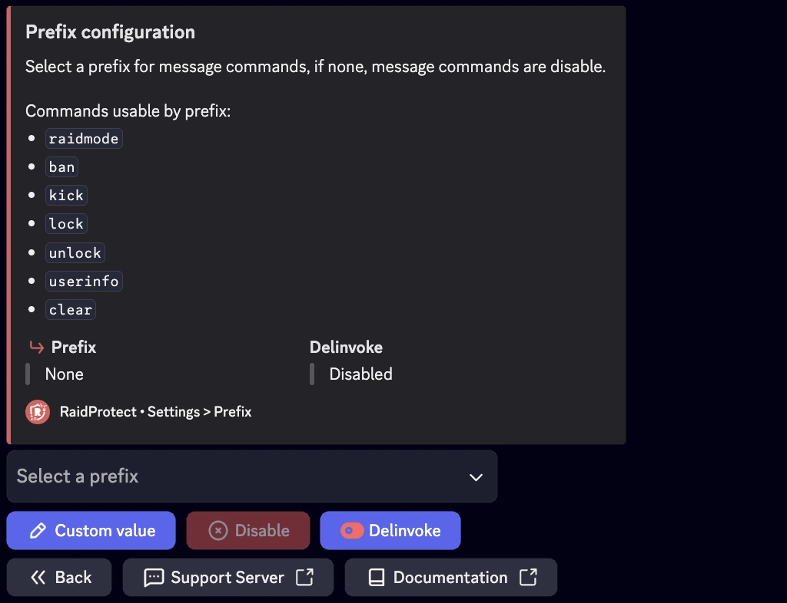

## Prefijo desactivado (por defecto) {#disabled}

Por defecto, RaidProtect usa unicamente comandos Slash (`/`) para interactuar con el bot. Esto asegura un uso intuitivo y consistente con los estandares de Discord.

## Prefijo activado (opcional) {#activated}

Si prefieres usar ciertos comandos con un prefijo personalizado, puedes activar esta opcion. El prefijo predeterminado cuando se activa es `?`, pero puede modificarse segun tus necesidades. Una vez activado, estos comandos pueden usarse con el prefijo configurado:
- [`?raidmode`](../features/raid-mode.md)
- [`?ban`](../features/moderation.mdx#ban)
- [`?tempban`](../features/moderation.mdx#tempban)
- [`?unban`](../features/moderation.mdx#unban)
- [`?kick`](../features/moderation.mdx#kick)
- [`?timeout`](../features/moderation.mdx#timeout)
- [`?untimeout`](../features/moderation.mdx#untimeout)
- [`?warn`](../features/moderation.mdx#warn)
- [`?lock`](../features/channel-lock.md#lock)
- [`?unlock`](../features/channel-lock.md#unlock)
- [`?userinfo` | `?ui`](../features/utilities#userinfo)
- [`?clear`](../features/moderation#clear)

## 💬 Como activar o desactivar el prefijo {#config}

1. Abre el menu de configuracion escribiendo [`/settings`](../setup.md#settings).
2. Accede a la opcion "**Prefijo**" para comandos.
3. Activa o desactiva el prefijo segun tus preferencias.
Si esta activado, personaliza el prefijo ingresando el caracter o cadena deseado.

:::note
Los comandos Slash (`/`) siguen estando disponibles incluso si el prefijo esta activado.
Se recomienda evitar prefijos que ya esten siendo usados por otros bots para prevenir conflictos de comandos.
:::
