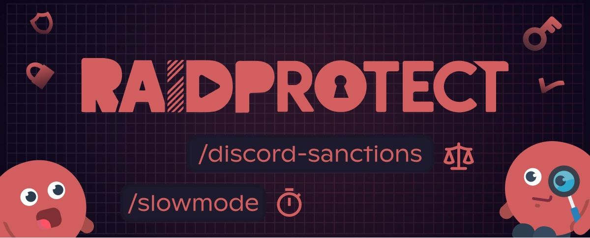

A versão **3.2.1** do RaidProtect foca-se na **moderação do dia a dia** com novos comandos úteis e um sistema anti-spam ainda mais robusto.

<!--truncate-->

## ⚖️ Ver as sanções aplicadas pelo Discord {#new}

A grande novidade desta atualização: o comando [`/ds`](/features/utilities#discord-sanctions). Permite ver diretamente as **sanções oficiais aplicadas pelo Discord** contra um utilizador.

### 📋 O que podes ver

- **Tipo de sanção**: conteúdo removido, conta restringida, suspensa ou eliminada.
- **Data de emissão** e **tipo de conteúdo** em causa.
- **Indicadores associados**: por exemplo, conteúdo ilegal ou deteção automatizada.

---

## 🛡️ Um sistema anti-spam mais inteligente {#antispam}

O sistema anti-spam beneficia de duas melhorias importantes:

- Bloqueio de **spam de comandos slash**, frequentemente usado para perturbar canais.
- Novo acionador dedicado: [**spam de comandos externos**](/features/anti-spam#triggers).

Estas melhorias ajudam a antecipar novas formas de abuso e garantem uma experiência mais fluida para os teus membros.

---

## ⚙️ Mais ferramentas para os teus moderadores {#changelog}

Esta atualização introduz vários comandos muito pedidos para facilitar o trabalho das equipas de moderação:

- **[`/slowmode`](/features/moderation#slowmode)**: ativa ou ajusta o modo lento de um canal com maior precisão num só passo.
- **[`/unban`](/features/moderation#unban)**: desbanir um utilizador mais rapidamente, com um motivo especificado.
- **[`/bypass captcha`](/features/captcha#bypass)**: permite manualmente o acesso a um utilizador legítimo que falha no captcha.

Além disso, os comandos [`/lock`](/features/channel-lock#lock) e [`/unlock`](/features/channel-lock#unlock) podem agora incluir um **motivo**, melhorando a clareza e o acompanhamento da moderação.

---

Para ver a lista completa e detalhada, consulta [o registo de alterações](/changelog#3-2-1).

:::tip 📚 Recursos úteis
- 🔗 [Adiciona o RaidProtect ao teu servidor](https://raidprotect.bot/invite)
- 📘 [Lê a documentação completa](https://docs.raidprotect.bot/)
- 💡 [Envia uma sugestão ou feedback](https://suggestions.raidprotect.bot/)
- 📣 [Segue os anúncios e junta-te à comunidade](https://raidprotect.bot/discord)
:::
