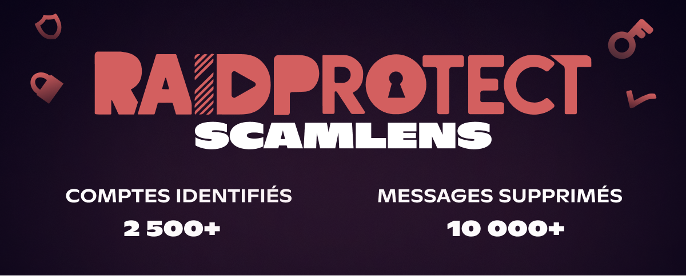
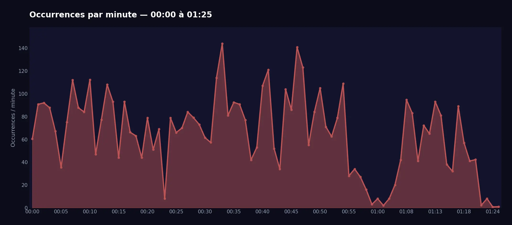
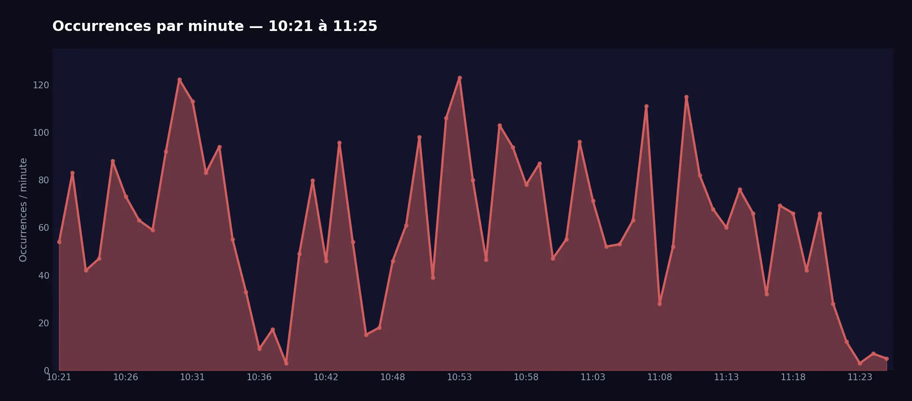

import Timestamp from '@site/src/components/Timestamp';

Uma grande onda de spam ligada ao **golpe das "imagens crypto"** nos levou a ativar antecipadamente o modo `Deletion` do **RaidProtect ScamLens**, nosso módulo de análise de imagens anti-golpe.

{/* truncate */}

## 🛡️ Detalhes do spam {#threat}

Duas ondas massivas de spam ocorreram em <Timestamp value={1771023600} format="D" />, entre <Timestamp value={1771023600} format="T" /> e <Timestamp value={1771068391} format="T" />. Mais de **2 500 contas comprometidas** foram utilizadas para enviar mais de **10 000 mensagens** contendo este tipo de imagem. Esses números representam apenas o que foi observado nos 340 000 servidores protegidos pelo RaidProtect — como o Discord conta com vários milhões de servidores ativos, a real dimensão deste ataque pode ser estimada em **várias centenas de milhares de mensagens** em toda a plataforma.

O golpe, conhecido como "imagens crypto", consiste no envio em massa de **4 imagens** incentivando os utilizadores a comprar criptomoedas fraudulentas, no maior número de canais possível.

  
  
  
  

#### Onda 1 {#wave-1}

#### Onda 2 {#wave-2}

Diante do alto volume de mensagens fraudulentas, ativamos antecipadamente o modo `Deletion` do **ScamLens** — introduzido em modo `Aprendizagem` na [atualização 3.3.1](/blog/3.3.1-jail-and-mute#changelog).
Este módulo analisa as imagens enviadas nos seus servidores e agora elimina automaticamente as identificadas como fraudulentas (nenhuma configuração é necessária).

### E depois? {#next}

O modo `Sanção` será ativado em breve: além de eliminar as imagens fraudulentas, o ScamLens aplicará automaticamente um **timeout de um dia** ao remetente. Optámos por não banir estas contas, pois trata-se quase exclusivamente de **contas hackeadas** — um banimento prejudicaria o verdadeiro proprietário da conta. O timeout neutraliza a ameaça imediatamente, dando tempo ao proprietário para recuperar o controlo da sua conta.

:::info 🔒 Funcionamento deliberadamente opaco
Por razões de segurança, não comunicamos nem comunicaremos os métodos de deteção utilizados pelo ScamLens. Esta abordagem de "caixa negra" visa impedir que os golpistas adaptem as suas técnicas para contornar as nossas proteções.
:::

---

## ❓ FAQ {#faq}

#### Como bloquear spam de imagens no Discord? {#antispam-images}
[Adicione o RaidProtect](https://raidprotect.bot/invite) ao seu servidor. O ScamLens está ativado por padrão e eliminará todas as imagens detetadas como fraudulentas — nenhuma configuração adicional é necessária.

#### Como se proteger do golpe de imagens crypto no Discord? {#arnaque-images-crypto}
Basta [adicionar o RaidProtect](https://raidprotect.bot/invite). O ScamLens detetará e eliminará automaticamente as imagens fraudulentas.

#### Como evitar bots de spam no meu servidor Discord? {#anti-spam-bots}
Além do ScamLens, ative o [captcha](/features/captcha) do RaidProtect para impedir que contas automatizadas entrem no seu servidor.

---

:::tip 📚 Recursos úteis
- 🔗 [Adicionar RaidProtect ao seu servidor](https://raidprotect.bot/invite)
- 📘 [Consultar a documentação completa](https://docs.raidprotect.bot/)
- 💡 [Enviar uma sugestão ou feedback](https://suggestions.raidprotect.bot/)
- 📣 [Seguir os anúncios e juntar-se à comunidade](https://raidprotect.bot/discord)
:::
