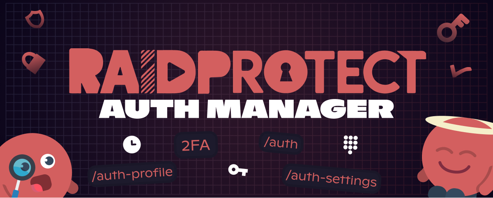

Uma conta admin comprometida, e o seu servidor pode ser destruído em segundos. Verificar a identidade dos membros sempre que precisam aceder a um cargo sensível torna-se indispensável. **Authentication Manager** preenche esta verdadeira lacuna do Discord.

<!--truncate-->

## ❓ O problema {#problem}

Uma conta admin é comprometida. Em segundos: banimentos em massa, canais eliminados, dados expostos. Mesmo com o 2FA do Discord ativado, um token roubado por malware ou uma página de phishing basta para contornar essa proteção: o atacante já está conectado, o 2FA nunca lhe é pedido.

O Discord não oferece nenhum mecanismo para verificar quem está realmente por trás de um cargo com permissões sensíveis. Qualquer pessoa com acesso à conta pode agir com plenos poderes, sem que nada a impeça.

Um único canal eliminado pelo hack de uma conta admin já é demais.

## 🔐 A solução: Authentication Manager {#solution}

Com o [Authentication Manager](/features/authentication-manager) (AM), os cargos com permissões sensíveis já não são atribuídos permanentemente — são atribuídos apenas após uma camada adicional de autenticação. Combinado com sessões temporárias que expiram automaticamente, a janela de exposição é drasticamente reduzida: os cargos são removidos automaticamente no final da sessão.

Mesmo que um atacante roube uma conta Discord, não pode usar as permissões destrutivas do servidor: o cargo simplesmente não está lá, e obtê-lo requer uma autenticação que ele não possui.

---

## ✨ O que inclui {#features}

### 🛡️ [4 métodos de autenticação](/features/authentication-manager#methods)

| **Método** | **Descrição** | **Grau** |
| --- | --- | --- |
| PIN simples | Entrada clássica de 4 a 12 dígitos | E a D |
| PIN anti-espionagem | Teclado numérico com disposição aleatória, de 6 a 12 dígitos | C a B |
| OTP (2FA) | Código temporário de 6 dígitos via Google Authenticator, Authy, 1Password... | A |
| Passkey (WebAuthn) | Impressão digital, reconhecimento facial ou chave física (YubiKey) | S |

### 🔑 [Graus de segurança](/features/authentication-manager#grades)

Cada método corresponde a um grau (E a S). Você escolhe o grau mínimo exigido por cargo: um acesso interno pode se contentar com um PIN, um cargo admin exigirá uma passkey.

### ⏱️ [Sessões temporárias](/features/authentication-manager#sessions)

Os cargos já não são permanentes. Cada autenticação abre uma sessão de duração limitada (configurável até 8 horas). Ao expirar, o cargo é removido automaticamente.

### ⚙️ [Sistema de managers](/features/authentication-manager#users-tab)

Conceda permissões de admin a um membro sem dar-lhe acesso ao sistema de autenticação. Os managers devem autenticar-se eles próprios e só podem gerir cargos inferiores ao seu teto, impedindo a criação de backdoors e a escalada de privilégios.

### 📋 [Logs de auditoria e sessões](/features/authentication-manager#logs-tab)

Cada autenticação, atribuição de cargo e ação é registada diretamente no bot. Ao contrário dos logs do Discord, ninguém pode eliminá-los: mesmo um admin comprometido não pode apagar os seus rastos.

### 🚫 [Proteção anti força bruta](/features/authentication-manager#auth-security)

5 falhas: bloqueio de uma hora. 10 falhas: reinicialização completa da conta.

---

Para a lista completa das novidades da 3.3.2, consulte o [changelog](/changelog#3-3-2).

:::tip Recursos úteis
- [Adicionar RaidProtect ao seu servidor](https://raidprotect.bot/invite)
- [Consultar a documentação completa](https://docs.raidprotect.bot/)
- [Enviar uma sugestão ou feedback](https://suggestions.raidprotect.bot/)
- [Seguir os anúncios e juntar-se à comunidade](https://raidprotect.bot/discord)
:::
