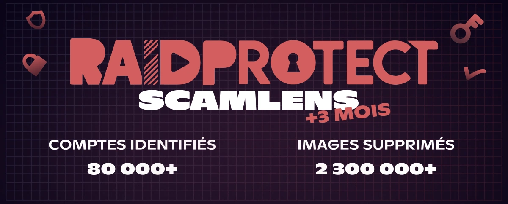

import Timestamp from '@site/src/components/Timestamp';
import Head from '@docusaurus/Head';

Resumo de junho de 2026 nos **375 000 servidores Discord** protegidos pelo RaidProtect (de 1 de junho a 1 de julho de 2026): **4 milhões de imagens de scam removidas** pelo ScamLens e **160 000 contas Discord pirateadas** identificadas. Estes scams **usurpam a imagem de celebridades** como MrBeast, Elon Musk ou Andrew Tate, que obviamente não têm qualquer ligação a estas mensagens. Novidade do mês: o ScamLens **passa a sancionar logo na primeira imagem detetada**, em vez de limpar toda a vaga antes de sancionar, para cortar o acesso de uma conta pirateada antes de poder publicar mais.

{/* truncate */}

## 🛰️ Lembrete: ScamLens, o anti-scam de imagens do RaidProtect {#what-is-scamlens}

Para os servidores que estão agora a descobrir o RaidProtect: o ScamLens é o módulo que trata das **imagens de scam**. Assim que uma imagem é publicada, compara-a com o seu catálogo e **remove** automaticamente as fraudulentas: **scams cripto**, **falsos giveaways de celebridades** (MrBeast, Elon Musk, Andrew Tate, Kick, Stake…), **falsas promoções de casinos online**. Nada para configurar nem manter do teu lado: o ScamLens funciona **por predefinição** assim que [adicionas o RaidProtect](https://raidprotect.bot/pt/invite).

  
  
  
  

## 📊 Balanço do ScamLens desde 14 de fevereiro de 2026 {#stats}

Dados acumulados desde a [ativação antecipada do ScamLens](/pt/blog/scamlens-early-activation) a <Timestamp value={1771023600} format="D" />:

| **Indicador (acumulado desde 14 de fevereiro)** | **1 de junho de 2026** | **1 de julho de 2026** | **Evolução** |
|---|---|---|---|
| Imagens analisadas (únicas) | 1 800 000 | **3 000 000** | **+67 %** |
| Imagens de scam detetadas (únicas) | 141 000 | **275 000** | **+95 %** |
| Imagens fraudulentas removidas | 2 300 000 | **4 000 000** | **+74 %** |
| Contas Discord pirateadas identificadas | 80 000 | **160 000** | **+100 %** |

O número de **contas pirateadas identificadas voltou a duplicar** num mês (80 000 → 160 000) e o volume de imagens removidas atinge agora os **4 milhões**. O catálogo de imagens únicas também sobe bastante (+95 %): continuam a surgir **novos clusters visuais** em massa. Um cluster visual é uma mesma imagem de scam **e todas as suas microvariantes** (recortes, filtros, retoques); quando as únicas crescem tanto, estão a ser lançados **novos visuais**, não apenas derivados dos antigos (ver o [combo «3 imagens»](/pt/blog/threat-weather-may-2026#updates) de maio).

---

## 🆕 Novidade: sanção logo na primeira imagem {#updates}

Até agora, quando uma conta pirateada despejava uma vaga de imagens, o ScamLens **removia primeiro todas as mensagens** e só depois aplicava a sanção (timeout de 24 h). O problema: durante essa limpeza, a conta podia **continuar a publicar** mais alguns segundos.

Agora **invertemos a ordem**: assim que o ScamLens reconhece **a primeira imagem de scam**, **sanciona imediatamente a conta** (timeout de 24 h) e *depois* limpa o resto da vaga. O acesso da conta pirateada é cortado **logo na primeira imagem**, sem lhe dar tempo de enviar mais.

Nos grandes picos (mais de 2 000 imagens em poucos minutos), isto reduz muito o número de imagens que chegam aos canais antes da sanção. Cada imagem continua a ser processada em **~400 ms**, e o proprietário legítimo recupera o controlo quando o timeout expira: lembra-te de que é **quase sempre uma vítima de pirataria**, não um membro malicioso.

---

## ❓ FAQ {#faq}

<Head>
  
</Head>

#### O que é o ScamLens no Discord? {#quest-ce-que-scamlens}
O ScamLens é o **módulo anti-scam de imagens** do RaidProtect, o **bot de proteção para Discord**. Analisa cada imagem publicada em tempo real e **remove automaticamente** as que identifica como fraudulentas (scams cripto, falsos giveaways de celebridades, falsas promoções de casinos online), **sem qualquer configuração**.

#### O ScamLens remove as imagens ou sanciona primeiro a conta? {#suppression-ou-sanction}
Desde junho de 2026, o ScamLens **sanciona a conta logo na primeira** imagem de scam detetada (timeout de 24 h) e *depois* limpa o resto da vaga. Antes removia primeiro todas as mensagens antes de sancionar, o que deixava uma conta pirateada publicar mais algumas imagens.

#### Porque é que a minha conta Discord envia mensagens de scam sozinha? {#compte-discord-envoie-messages-seul}
A tua conta foi muito provavelmente **pirateada**. Os burlões roubam o teu **token de autenticação** (site falso, software infetado, extensão maliciosa) e usam-no para enviar imagens de scam em spam em **todos os servidores onde estás**, sem que saibas.

#### O que fazer se um membro do meu servidor Discord difunde um scam cripto? {#membre-diffuse-scam-crypto}
**Não o banas**: é quase sempre uma **conta pirateada**, não um utilizador malicioso. Contacta-o em privado para que proteja a conta. O ScamLens já remove a imagem à passagem, sem punir o proprietário legítimo.

#### Como reconhecer um falso giveaway ou uma falsa promoção cripto no Discord? {#reconnaitre-fausse-promo-crypto}
Qualquer **«presente» cripto**, **casino online** com logótipo de celebridade (MrBeast, Elon Musk, Andrew Tate, Kick, Stake) ou **investimento «garantido»** é um scam. **Estas personalidades não estão por trás destas mensagens**: os burlões limitam-se a usurpar a sua imagem e a sua notoriedade. O Discord nunca organiza distribuição de criptomoedas, e nenhuma marca séria faz spam multisservidor.

---

:::tip 📚 Recursos úteis
- 🔗 [Adicionar o RaidProtect ao teu servidor](https://raidprotect.bot/pt/invite)
- 📘 [Documentação do HoneyPot](https://docs.raidprotect.bot/pt/features/honeypot)
- 💡 [Enviar uma sugestão](https://suggestions.raidprotect.bot/)
- 📣 [Junta-te ao nosso servidor Discord](https://raidprotect.bot/discord)
:::
