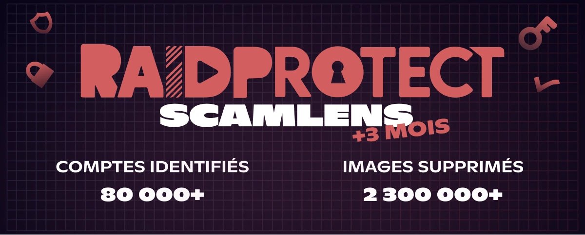

import Timestamp from '@site/src/components/Timestamp';
import Head from '@docusaurus/Head';

Resumo de maio de 2026 nos **365 000 servidores Discord** protegidos pelo RaidProtect (de 1 de maio a 1 de junho de 2026): **2,3 milhões de imagens de scam removidas** pelo ScamLens e **80 000 contas Discord pirateadas** identificadas. Estes scams **usurpam a imagem de celebridades** como MrBeast, Elon Musk ou Andrew Tate, que obviamente não têm qualquer ligação a estas mensagens. Alargamos ainda a cobertura a uma nova variante, o **combo «3 imagens»**, detetado durante um **pico de mais de 2 000 imagens** intercetadas em poucos minutos.

{/* truncate */}

## 🛰️ Recordar: ScamLens, o anti-scam de imagens do RaidProtect {#what-is-scamlens}

Para os servidores que estão a descobrir o RaidProtect: o ScamLens é o módulo que trata das **imagens de scam**. Assim que uma imagem é publicada, compara-a com o seu catálogo e **remove** automaticamente as fraudulentas: **scams de cripto**, **falsos giveaways de celebridades** (MrBeast, Elon Musk, Andrew Tate, Kick, Stake…), **falsas promoções de casinos online**. Nada a configurar nem a manter do teu lado: o ScamLens funciona **por defeito** assim que [adicionas o RaidProtect](https://raidprotect.bot/pt/invite).

  
  
  
  

## 📊 Balanço do ScamLens desde 14 de fevereiro de 2026 {#stats}

Dados acumulados desde a [ativação antecipada do ScamLens](/pt/blog/scamlens-early-activation) a <Timestamp value={1771023600} format="D" />:

| **Indicador (acumulado desde 14 de fevereiro)** | **1 de maio de 2026** | **1 de junho de 2026** | **Evolução** |
|---|---|---|---|
| Imagens analisadas (únicas) | 890 000 | **1 800 000** | **+100 %** |
| Imagens de scam detetadas (únicas) | 82 000 | **141 000** | **+72 %** |
| Imagens fraudulentas removidas | 1 400 000 | **2 300 000** | **+64 %** |
| Contas Discord pirateadas identificadas | 40 000 | **80 000** | **+100 %** |

O número de **contas pirateadas identificadas duplicou** num mês e o volume de imagens removidas ultrapassa agora os **2,3 milhões**. O catálogo de imagens únicas também cresce (+72 %): é sobretudo o sinal de que surgem **novos clusters visuais**. Um cluster visual é uma mesma imagem de scam **e todas as suas microvariantes** (recortes, filtros, retoques); quando o número de únicas sobe tanto, são mesmo **novos visuais** que são lançados, e não apenas variações dos antigos.

---

## 🆕 Novidade: Cobertura do combo «3 imagens» {#updates}

Os burlões declinam o seu visual em vários **formatos combinados** para enganar a deteção: 4 imagens no início, depois 2 imagens no mês passado (ver o [«2 imagens»](/pt/blog/threat-weather-april-2026#stats)), e agora um **combo de 3 imagens**. Observámos este novo formato durante um **pico de mais de 2 000 imagens** intercetadas em poucos minutos.

Este combo de 3 imagens chegou também com um **novo cluster visual**: um visual de scam inédito, ainda não presente no nosso catálogo. Cobrimos ambos de uma só vez, e o ScamLens reconhece agora este combo na íntegra, sem qualquer ação do teu lado. Cada imagem continua a ser processada em **~400 ms**, antes mesmo de a maioria dos membros ter tido tempo de a ver.

---

## ❓ FAQ {#faq}

<Head>
  
</Head>

#### O que é o ScamLens no Discord? {#quest-ce-que-scamlens}
O ScamLens é o **módulo anti-scam de imagens** do RaidProtect, o **bot de proteção para Discord**. Analisa cada imagem publicada em tempo real e **remove automaticamente** as que identifica como fraudulentas (scams de cripto, falsos giveaways de celebridades, falsas promoções de casinos online), **sem qualquer configuração**.

#### Como remover automaticamente as imagens de scam de cripto no Discord? {#supprimer-images-arnaque-crypto}
[Adiciona o RaidProtect](https://raidprotect.bot/pt/invite) ao teu servidor: o **ScamLens está ativo por defeito** e remove as imagens de scam de cripto em **~400 ms**, antes de a maioria dos membros as ver. Sem regras a escrever nem listas negras a manter.

#### Porque é que a minha conta Discord envia mensagens de scam sozinha? {#compte-discord-envoie-messages-seul}
A tua conta foi muito provavelmente **pirateada**. Os burlões roubam o teu **token de autenticação** (site falso, software infetado, extensão maliciosa) e usam-no para enviar spam de imagens de scam em **todos os servidores onde estás**, sem que saibas.

#### O que fazer se um membro do meu servidor Discord difundir um scam de cripto? {#membre-diffuse-scam-crypto}
**Não o banas**: é quase sempre uma **conta pirateada**, não um utilizador malicioso. Contacta-o em privado para que proteja a conta. O ScamLens já remove a imagem na hora, sem punir o proprietário legítimo.

#### Como reconhecer um falso giveaway ou uma falsa promoção de cripto no Discord? {#reconnaitre-fausse-promo-crypto}
Qualquer **«presente» de cripto**, **casino online** com logótipo de celebridade (MrBeast, Elon Musk, Andrew Tate, Kick, Stake) ou **investimento «garantido»** é uma burla. **Estas personalidades não estão por trás destas mensagens**: os burlões limitam-se a usurpar a sua imagem e a sua notoriedade. O Discord nunca organiza distribuições de criptomoedas, e nenhuma marca séria faz spam multi-servidor.

---

:::tip 📚 Recursos úteis
- 🔗 [Adicionar o RaidProtect ao teu servidor](https://raidprotect.bot/pt/invite)
- 📘 [Documentação HoneyPot](https://docs.raidprotect.bot/pt/features/honeypot)
- 💡 [Enviar uma sugestão](https://suggestions.raidprotect.bot/)
- 📣 [Juntar-te ao nosso servidor Discord](https://raidprotect.bot/discord)
:::
