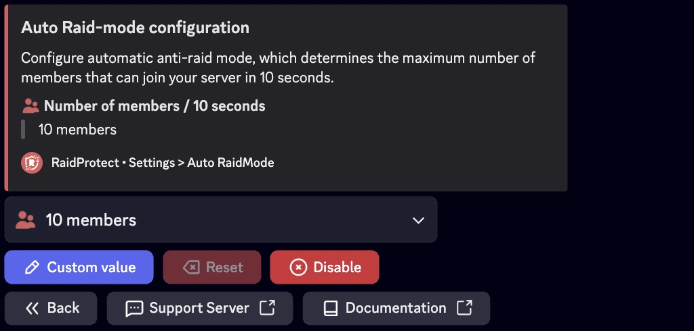

## Modo raid {#raid-mode}

O modo raid é uma funcionalidade de emergência concebida para bloquear instantaneamente todos os novos utilizadores que tentam entrar no seu servidor, com uma duração máxima de 24 horas. Para bloquear permanentemente novos membros, utilize o [comando `/joinlock`](./join-lock.mdx).

### ❓ Como funciona o modo raid {#working}

O RaidProtect ativa automaticamente o modo raid se um grande número de utilizadores entrar no seu servidor num curto período de tempo. Por defeito, o modo raid é ativado se mais de 10 utilizadores entrarem no seu servidor em menos de 10 segundos. Quando o modo raid está ativado, nenhum utilizador pode entrar no servidor. São bloqueados ao nível do convite.

:::warning
As funcionalidades de comunidade do Discord são essenciais para o bom funcionamento do modo raid. [Siga o nosso guia para verificar que a comunidade está ativada no seu servidor.](../guides/community.md)
:::

#### Ativação {#enable}

- Para ativar manualmente este modo, um utilizador com permissões de expulsão deve executar o comando `/raidmode`.
- Uma mensagem será automaticamente publicada no canal de registos para assinalar a ativação.

#### Desativação {#disable}

O modo raid não se desativa automaticamente. Lembre-se de o parar com o mesmo comando assim que a ameaça tenha passado. 😇

:::info
O comando `raidmode` é [utilizável por prefixo](../guides/prefix.md).
:::

### 🚨 Configuração do modo raid automático {#config}

Se o seu servidor recebe frequentemente muitos novos membros em simultâneo, é aconselhável modificar este limiar para evitar falsos positivos.



#### Limiar de membros {#threshold}

1. Execute o [comando `/settings`](../setup.md#settings).
2. Clique no botão "**Auto RaidMode**".
3. Selecione "**Número de membros**".
4. Escolha o número de membros que podem entrar em 10 segundos.

Pode deixar o valor predefinido (10) ou ajustá-lo para o valor desejado clicando no botão "**Valor personalizado**".

:::note
Recomendamos introduzir um valor entre 10 e 20 membros por 10 segundos para uma boa eficácia do sistema.
:::

#### Duração do modo raid {#duration}

1. Execute o [comando `/settings`](../setup.md#settings).
2. Clique no botão "**Auto RaidMode**".
3. Selecione "**Duração**".
4. Escolha a duração do modo raid (máximo 24 horas).

Pode deixar o valor predefinido (5 minutos) ou ajustá-lo para o valor desejado clicando no botão "**Valor personalizado**".

#### Fechar as MP automaticamente {#close-dm}

Pode configurar o **auto raid mode** para que **feche automaticamente as MP do servidor** assim que for ativado. Isto adiciona uma camada de proteção adicional durante um raid: as contas novas deixam de poder contactar os seus membros em privado para fazer phishing ou burlas.

1. Execute o [comando `/settings`](../setup.md#settings).
2. Clique no botão "**Auto RaidMode**".
3. Ative a opção "**Fechar as MP**".

Quando o auto raid mode é desativado (manualmente ou automaticamente após a duração configurada), as MP retomam a sua configuração anterior.

:::info
Esta opção é complementar ao [Fecho Permanente das MP](./dm-lock.mdx): se a ativar sem ter o fecho permanente, as MP só são fechadas durante um raid ativo.
:::

## Idade Mínima {#minage}

Para reforçar a segurança, pode exigir uma idade mínima para as contas Discord dos novos membros.

1. Execute o [comando `/settings`](../setup.md#settings).
2. Clique no botão "**Idade Mínima**".
3. Selecione o valor desejado no menu de seleção ou escolha um valor personalizado expresso em formato de data (m/h/d/y).

### 🎂 Contornar a idade mínima de conta {#bypass-minage}

Utilize o comando: ```/bypass minage [user]```

Substitua `[user]` pelo identificador desejado; essa pessoa terá 10 minutos para entrar no servidor sem ser expulsa devido ao requisito de idade. Pode também utilizar o comando sem especificar um utilizador para ver a lista atual de utilizadores com bypass.
