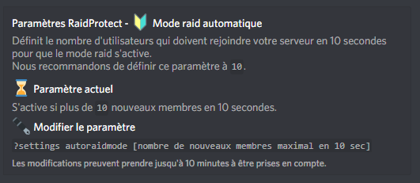

O Modo Raid é uma funcionalidade de emergência concebida para bloquear todos os novos utilizadores que tentem entrar no seu servidor. É uma forma radical mas eficaz de prevenir tentativas de raid. 💣

## ❓ Como funciona o Modo Raid

Uma vez ativado o Modo Raid, todos os novos utilizadores serão **expulsos instantaneamente**, e o RaidProtect notificá-los-á de que o servidor está em Modo Raid.

**Para ativar o Modo Raid,** um utilizador com permissão para expulsar membros deve executar o comando `?raidmode`. Uma mensagem será publicada nos logs para indicar a sua ativação. Tenha em atenção que **o Modo Raid não se desativa automaticamente**, por isso lembre-se de o desligar utilizando o mesmo comando. 😇

## 📡 Modo Raid automático

Se um grande número de utilizadores se juntar ao seu servidor num período muito curto, o RaidProtect pode **ativar automaticamente o Modo Raid**.

### ⛽ Configuração

Por predefinição, o Modo Raid é acionado se **mais de 10 utilizadores se juntarem ao seu servidor em 10 segundos.** Se o seu servidor receber frequentemente uma grande afluência de membros em simultâneo, pode ser prudente ajustar esta definição para evitar falsos positivos.

O parâmetro ajustável é **o número de utilizadores autorizados a entrar** num intervalo de 10 segundos antes de acionar o Modo Raid. Por exemplo, ao executar o comando:
`?settings autoraidmode 20`, o Modo Raid será ativado se mais de 20 utilizadores se juntarem ao seu servidor em 10 segundos. 🍃

:::warning
Não se esqueça de **desativar o Modo Raid** se ele for ativado automaticamente. Lembre-se de que não se desativa sozinho. 😖
:::
