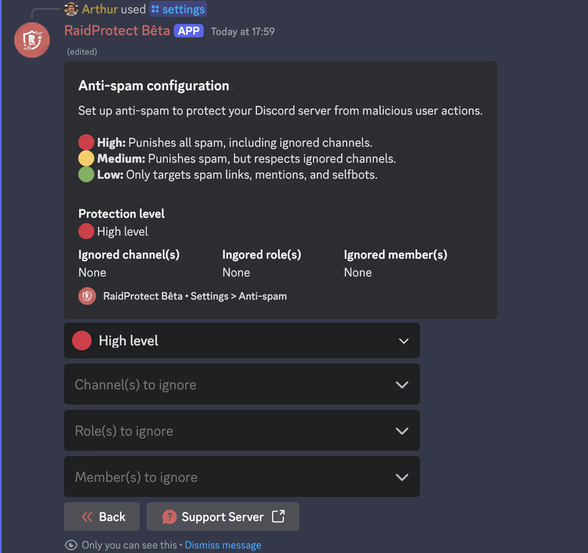

O Anti-spam do RaidProtect e uma ferramenta poderosa para prevenir spam no seu servidor Discord. Gracas ao seu sistema de detecao automatica, trata dos problemas sozinho sem necessitar da sua intervencao.

## ❓ Como funciona o Anti-spam {#working}

O anti-spam do RaidProtect deteta e bloqueia automaticamente comportamentos suspeitos. Distingue entre dois tipos de spam.
- **Spam pesado:** Mensagens que contem links de convite, mencoes em massa ou imagens. Este tipo de spam e frequentemente utilizado durante raids.
- **Spam ligeiro:** Mensagens enviadas frequentemente mas menos intrusivas.

O anti-spam do RaidProtect atua de duas formas.
- **Sancoes:** Expulsao ou banimento automatico de spammers.
- **Notificacoes:** Envia mensagens para o canal de registos para reportar o spam bloqueado com um resumo das acoes detetadas.

## 🛡️ Configurar o Anti-spam {#config}

O RaidProtect oferece tres niveis de seguranca para se adequar as necessidades do seu servidor.
- 🔴 **Alto:** Sanciona todo o spam, incluindo spam pesado em canais ignorados.
- 🟠 **Medio:** Sanciona todo o spam mas respeita os canais ignorados.
- 🟢 **Baixo:** Sanciona apenas o spam pesado.

### Alterar o nivel de seguranca {#level}

1. Utilize o [comando `/settings`](../setup.md#settings).
2. Clique no botao "**Anti-spam**".
3. Selecione o nivel de anti-spam pretendido no primeiro menu pendente.

### Gerir cargos, utilizadores e canais ignorados {#ignore}

Pode excluir determinados canais, cargos ou mesmo utilizadores da monitorizacao do anti-spam para maior flexibilidade. 😉
1. Utilize o [comando `/settings`](../setup.md#settings).
2. Clique no botao "**Anti-spam**".
3. Selecione as diferentes opcoes a ignorar nos menus pendentes:
- Canal(is) a ignorar
- Cargo(s) a ignorar
- Membro(s) a ignorar

:::info
Os canais que contem "**spam**" no seu nome sao automaticamente ignorados. Os utilizadores com permissoes de administrador sao completamente ignorados.
:::
