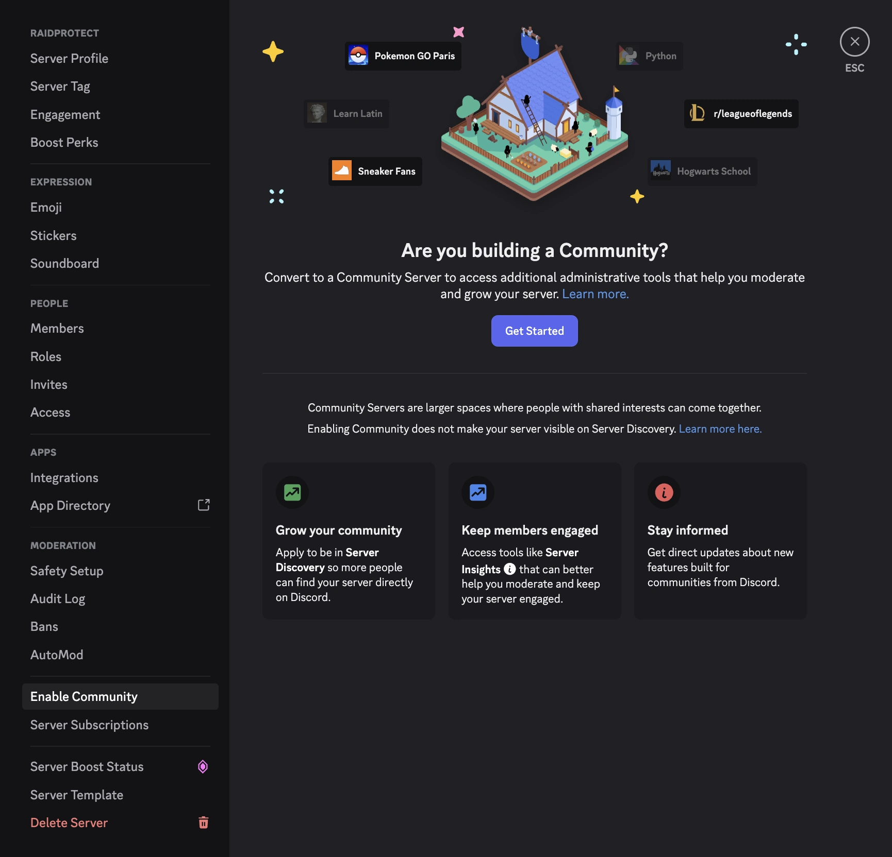

Ativar a funcionalidade de Comunidade desbloqueia diversas definicoes de seguranca avancadas essenciais para o bom funcionamento de algumas funcionalidades do RaidProtect como **DM Lock** ou **Modo Raid**.

## 🚦 Requisitos {#requirement}

- Deve ser administrador do servidor Discord.

## 🚩 Ativar as funcionalidades de Comunidade {#steps}

1. **Abra as definicoes do seu servidor**
   - Clique no nome do servidor no canto superior esquerdo > "Definicoes do servidor".

2. **Va a seccao "Comunidade"**
   - Na barra lateral, navegue ate ao separador **Ativar Comunidade** e clique em **Comecar**.

:::note
Se a Comunidade ja estiver ativada no seu servidor, a seccao chamar-se-a **Vista geral da Comunidade**.
:::

3. **Siga o assistente de configuracao**
   - Ative a verificacao por e-mail para todos os membros.
   - Ative o filtro de conteudo explicito.
   - Configure um canal de regras e um canal de atualizacoes.
   - Aceite as diretrizes do Servidor de Comunidade.

4. **Complete a configuracao**
   - Clique em "Concluir configuracao". O distintivo de "Comunidade" aparecera no seu servidor assim que a ativacao estiver completa.

## 💡 Utilizar os modulos DM Lock e Modo Raid apos a ativacao {#use}

- Execute o comando [`/settings`](../setup.md#settings) para abrir o menu de configuracao do RaidProtect.
- Ative ou desative os modulos pretendidos (DM Lock, Modo Raid, etc.) a partir do menu interativo.
