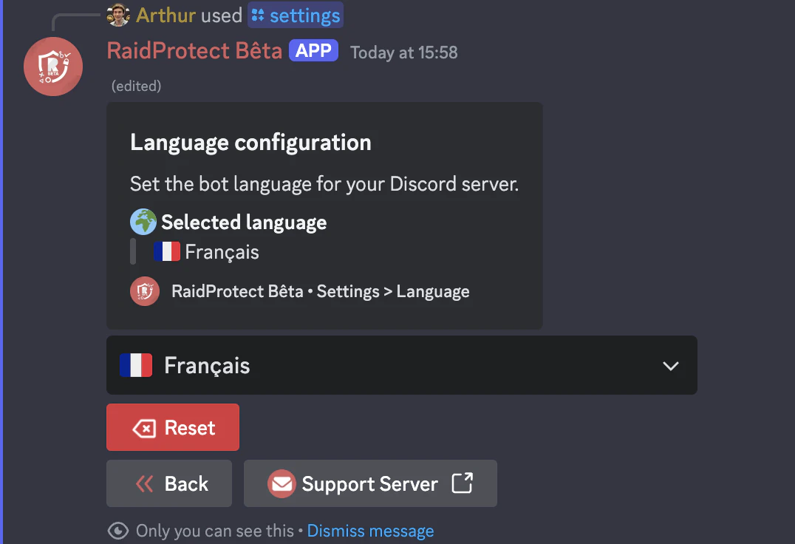

O RaidProtect permite-lhe escolher o idioma utilizado pelo bot para se adequar melhor a sua comunidade Discord.

:::note
Se o seu servidor estiver configurado como servidor de comunidade (definicao do Discord), o RaidProtect utilizara por defeito o idioma configurado nas **definicoes de comunidade** do servidor.
:::

**Mensagens publicas:** O idioma configurado afeta apenas as mensagens publicas enviadas pelo RaidProtect no seu servidor (registos, mensagens de captcha, denuncias, etc.).

**Mensagens efemeras:** Estas mensagens privadas ou temporarias permanecem apresentadas no idioma do utilizador que interage com o bot.

## 🌐 Lista de idiomas suportados {#supported}

- **Frances**
- **Ingles**

## ⚙️ Alterar o idioma do bot {#change}

- Utilize o [comando `/settings`](./setup.md#settings).
- Selecione o botao "**Idioma**".
- Escolha o idioma pretendido.

Apos o idioma ser selecionado, o bot adaptara automaticamente todas as suas mensagens, notificacoes e comandos ao idioma escolhido para o seu servidor.

:::info
O suporte de idiomas do RaidProtect esta em constante evolucao! [Sugira](https://suggestions.raidprotect.bot) idiomas que gostaria de ver no bot ou [vote](https://suggestions.raidprotect.bot) nos idiomas propostos para que sejam adicionados.
:::
