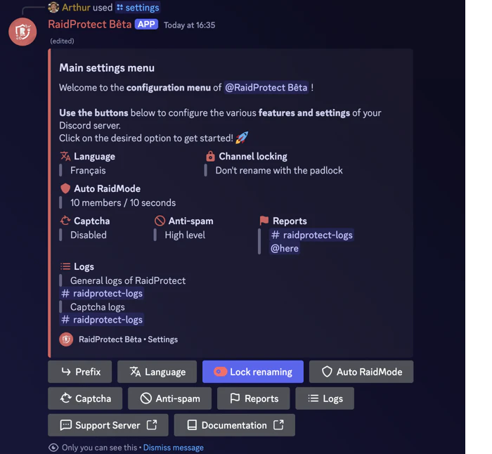

O RaidProtect simplifica a gestao do servidor com duas ferramentas poderosas: o comando [`/setup`](#install) para uma configuracao guiada passo a passo e o comando [`/settings`](#settings) para ajustar as suas definicoes a qualquer momento atraves de um menu centralizado. Este guia de instalacao explica como utiliza-los de forma eficaz.

## Instalacao guiada {#install}

O comando `/setup` foi concebido para o ajudar a configurar o RaidProtect rapidamente ou de forma detalhada, consoante as suas necessidades. Oferece dois modos de configuracao: [recomendada](#recommended) ou [avancada](#advanced).

### 🔧 Configuracao recomendada {#recommended}

Permite-lhe ativar ou desativar as funcionalidades principais de forma rapida atraves de um menu de selecao interativo.

1. Utilize o comando `/setup`.
2. Selecione o botao "**Configuracao recomendada**".
3. Ative ou desative as funcionalidades desejadas atraves do menu de selecao.

O bot enviar-lhe-a um resumo das funcionalidades ativadas e das alteracoes que fara no servidor.

### 🛠️ Configuracao avancada {#advanced}

Se pretender configurar o bot de forma mais completa, opte pela configuracao avancada. O bot guia-o passo a passo com explicacoes claras.

1. Utilize o comando `/setup`.
2. Selecione o botao "**Configuracao avancada**".
3. Cada passo apresenta uma funcionalidade, o seu proposito e uma configuracao minima recomendada.
4. Utilize os botoes "**Anterior**" e "**Seguinte**" para avancar ou retroceder.

No final, e apresentado um resumo das definicoes para confirmar as suas escolhas.

## Modificar a configuracao {#settings}

O comando `/settings` e o comando principal para gerir as suas definicoes apos a instalacao. Permite-lhe visualizar, ajustar ou personalizar as funcionalidades do RaidProtect a qualquer momento, de forma simples e rapida.

### 🔍 Menu de definicoes {#menu}

1. Escreva `/settings` num canal onde o bot esteja ativo.
2. Navegue facilmente entre as diferentes seccoes para encontrar as definicoes que pretende modificar.
3. Ajuste as opcoes: cada categoria apresenta uma lista de opcoes personalizaveis sob a forma de botoes ou menus pendentes.

### 🔄 Repor uma definicao {#reset}

1. Navegue ate a definicao pretendida.
2. Clique em "**Repor**".

O bot confirmara a reposicao antes de aplicar as alteracoes.

:::info Problema de configuracao?
Se encontrar um problema, consulte a seccao [Anomalias](./guides/malfunctions) ou junte-se ao nosso [servidor de suporte](https://raidprotect.bot/discord) para obter ajuda.
:::
