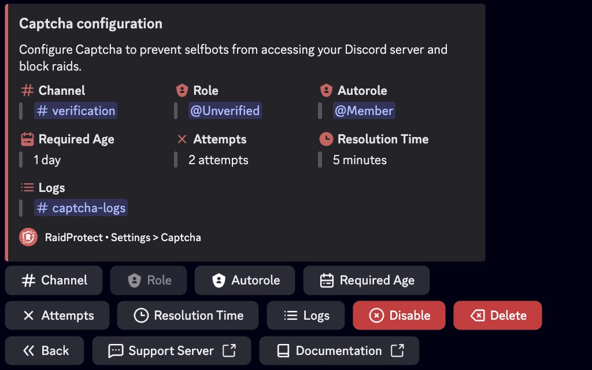

Impede que selfbots acedam ao teu servidor Discord e bloqueia raids com o sistema de captcha do RaidProtect.

O captcha e uma das funcionalidades mais populares do RaidProtect, embora permaneca totalmente opcional. Permite-te exigir a cada novo utilizador que complete um desafio introduzindo um codigo para verificar que nao e um bot (selfbot).

## ❓ Como Funciona o Captcha {#working}

O captcha baseia-se num cargo **@Unverified** e num canal **#verification**. Quando um utilizador se junta ao teu servidor:
- O bot atribui automaticamente o cargo **@Unverified** a este utilizador, limitando o seu acesso apenas ao canal **#verification**.
- Neste canal, o bot envia uma imagem com 6 letras maiusculas. O utilizador deve transcrever as letras no canal para provar que e humano.
- Se a resposta estiver correta, o cargo **@Unverified** e removido e o utilizador obtem acesso normal ao servidor. Caso contrario, e automaticamente expulso.
- Quando o captcha esta ativado, o RaidProtect publica automaticamente uma mensagem no canal de registos indicando a data de criacao da conta de cada novo utilizador.
- O RaidProtect deteta automaticamente problemas de permissoes (canal e cargo) bem como a visibilidade predefinida do canal durante o processo de integracao do Discord.

:::info
**Limite de Tempo e Tentativas:** Os utilizadores tem de **1 a 10 minutos** para completar o captcha (**5 minutos por defeito**) e de **1 a 3 tentativas** (**2 tentativas por defeito**). Se excederem estes limites, sao automaticamente expulsos do servidor.
:::
:::warning
**Gestao de Permissoes:** As permissoes do cargo **@Unverified** sao configuradas automaticamente pelo RaidProtect. Podes renomear o cargo e o canal, mas nao os elimines.
:::

## 🚪 Configuracao do Captcha {#config}

Configurar o captcha e rapido e facil.

1. Executa o [comando `/settings`](../setup.md#settings).
2. Clica no botao "**Captcha**".
3. Escolhe o canal onde os captchas serao realizados ou usa o botao "**Criar um para mim**".
4. O cargo **@Unverified** e automaticamente criado e configurado.
5. Configura o numero de tentativas permitidas (entre **1 e 3**) e o tempo maximo de resolucao (entre **1 e 10 minutos**).

## ✨ Funcionalidades Adicionais {#additional-features}

Para se adaptar as necessidades do teu servidor, o captcha do RaidProtect oferece opcoes personalizaveis.

### Registos Separados {#logs}

Se o teu servidor for popular, os registos relacionados com o captcha podem sobrecarregar o teu canal de registos principal. Podes move-los para outro canal.

1. Executa o [comando `/settings`](../setup.md#settings).
2. Clica no botao "**Registos**".
3. Seleciona "**Captcha**".
4. Escolhe o canal onde os registos do captcha serao armazenados ou usa o botao "**Criar um para mim**".

### Cargo Automatico {#autorole}

Se usas um sistema de cargo automatico (autorole) diferente do RaidProtect, pode interferir com o captcha. Substitui o teu autorole existente pelo do RaidProtect.

1. Executa o [comando `/settings`](../setup.md#settings).
2. Clica no botao "**Captcha**".
3. Seleciona "**Cargo Automatico**".
4. Escolhe o cargo que sera atribuido aos membros que completarem o captcha com sucesso.

### Idade Minima de Conta {#minage}

Para reforcar a seguranca, podes exigir uma idade minima de conta para novos membros do Discord.

1. Executa o [comando `/settings`](../setup.md#settings).
2. Clica no botao "**Captcha**".
3. Pressiona o botao "**Idade Minima**".
4. Seleciona o valor desejado no menu pendente ou escolhe um valor personalizado expresso em formato de data (m/h/d/y).
