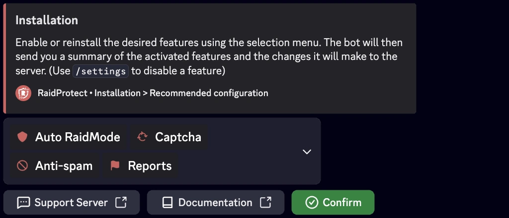
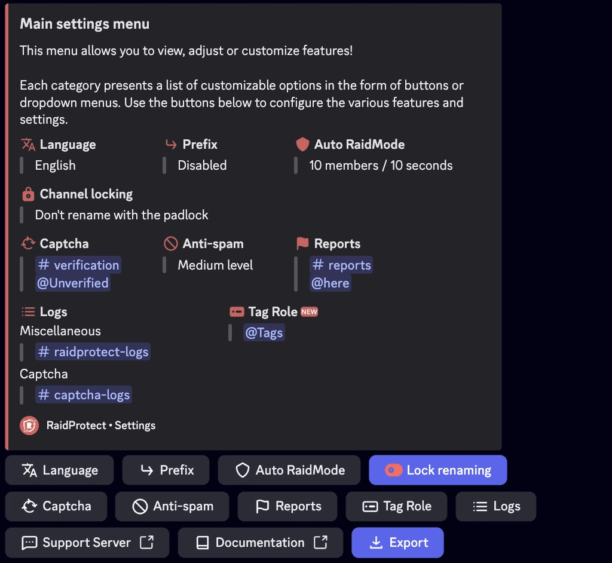

O RaidProtect simplifica a gestao do servidor com duas ferramentas poderosas: o comando [`/setup`](#install) para uma configuracao guiada passo a passo e o comando [`/settings`](#settings) para ajustares as tuas definicoes a qualquer momento atraves de um menu centralizado. Este guia de instalacao explica como utiliza-los de forma eficaz.

## Instalacao Guiada {#install}

O comando `/setup` foi concebido para te ajudar a configurar o RaidProtect rapidamente ou de forma detalhada, conforme as tuas necessidades. Oferece dois modos de configuracao: [recomendada](#recommended) ou [avancada](#advanced).

### 🔧 Configuracao Recomendada {#recommended}

Permite-te ativar ou desativar as funcionalidades principais num relance, usando um menu de selecao interativo.

1. Usa o comando `/setup`.
2. Seleciona o botao "**Configuracao Recomendada**".
3. Ativa ou desativa as funcionalidades desejadas usando o menu de selecao.

O bot enviar-te-a um resumo das funcionalidades ativadas e das alteracoes que fara no servidor.

<!--
### 🛠️ Configuracao Avancada {#advanced}

Se quiseres configurar o bot de forma mais completa, opta pela configuracao avancada. O bot guia-te passo a passo com explicacoes claras.

1. Usa o comando `/setup`.
2. Seleciona o botao "**Configuracao Avancada**".
3. Cada passo apresenta uma funcionalidade, o seu objetivo e uma configuracao minima recomendada.
4. Usa os botoes "**Anterior**" e "**Seguinte**" para avancar ou retroceder.

No final, e apresentado um resumo das definicoes para confirmares as tuas escolhas.
-->
## Modificar a Configuracao {#settings}

O comando `/settings` e o comando principal para gerires as tuas definicoes apos a instalacao. Permite-te ver, ajustar ou personalizar as funcionalidades do RaidProtect a qualquer momento, de forma simples e rapida.

### 🔍 Menu de Definicoes {#menu}

1. Escreve `/settings` num canal onde o bot esteja ativo.
2. Navega facilmente entre as diferentes secoes para encontrares as definicoes que desejas modificar.
3. Ajusta as opcoes: Cada categoria apresenta uma lista de opcoes personalizaveis sob a forma de botoes ou menus pendentes.

### 🔄 Repor uma Definicao {#reset}

1. Navega ate a definicao desejada.
2. Clica em "**Repor**".

O bot confirmara a reposicao antes de aplicar as alteracoes.

:::info Problema de configuracao?
Se encontrares um problema, consulta a secao [Problemas Frequentes](./guides/malfunctions) ou junta-te ao nosso [servidor de suporte](https://raidprotect.bot/discord) para obteres ajuda.
:::
