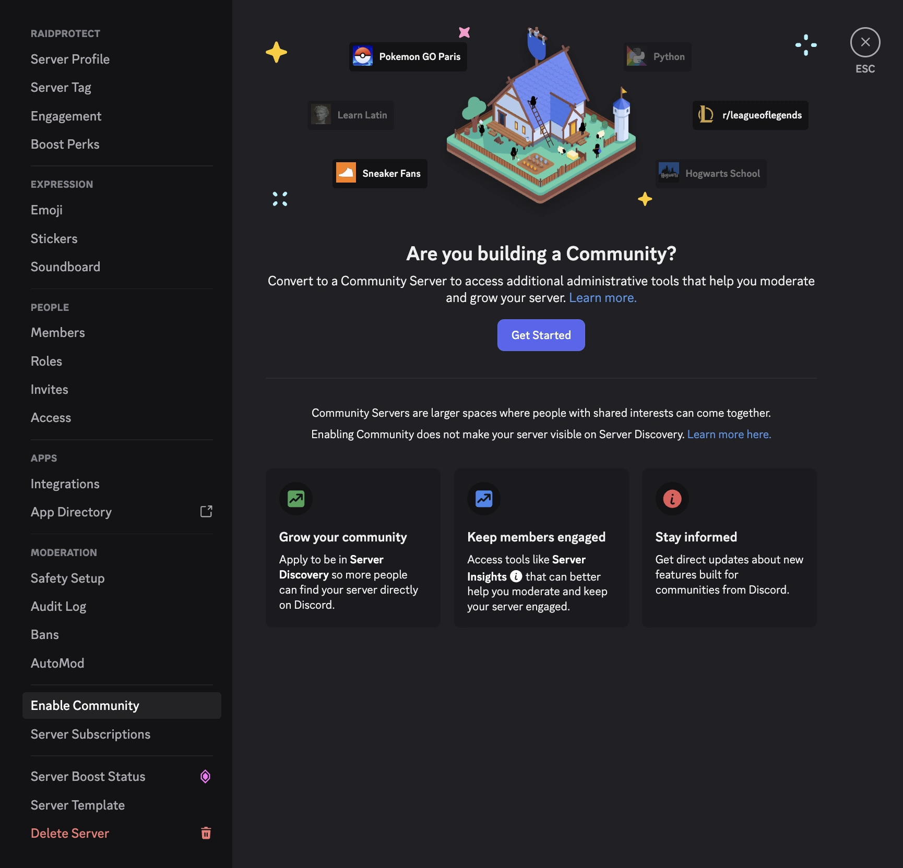

Ativar a funcionalidade de Comunidade desbloqueia varias definicoes de seguranca avancadas essenciais para o correto funcionamento de algumas funcionalidades do RaidProtect como **DM Lock** ou **Modo Raid**.

## 🚦 Requisitos {#requirement}

- Deves ser administrador do servidor Discord.

## 🚩 Ativar as funcionalidades de Comunidade {#steps}

1. **Abre as definicoes do teu servidor**
   - Clica no nome do servidor no canto superior esquerdo > "Definicoes do servidor".

2. **Vai a seccao "Comunidade"**
   - Na barra lateral, navega ate ao separador **Ativar Comunidade** e clica em **Comecar**.

:::note
Se a Comunidade ja estiver ativada no teu servidor, a seccao chamar-se-a **Vista geral da Comunidade**.
:::

3. **Segue o assistente de configuracao**
   - Ativa a verificacao por email para todos os membros.
   - Ativa o filtro de conteudo explicito.
   - Configura um canal de regras e um canal de atualizacoes.
   - Aceita as diretrizes do Servidor de Comunidade.

4. **Completa a configuracao**
   - Clica em "Finalizar configuracao". A insignia de "Comunidade" aparecera no teu servidor assim que a ativacao estiver concluida.

## 💡 Usar os modulos DM Lock e Modo Raid apos a ativacao {#use}

- Executa o comando [`/settings`](../setup.md#settings) para abrir o menu de configuracao do RaidProtect.
- Ativa ou desativa os modulos desejados (DM Lock, Modo Raid, etc.) a partir do menu interativo.
