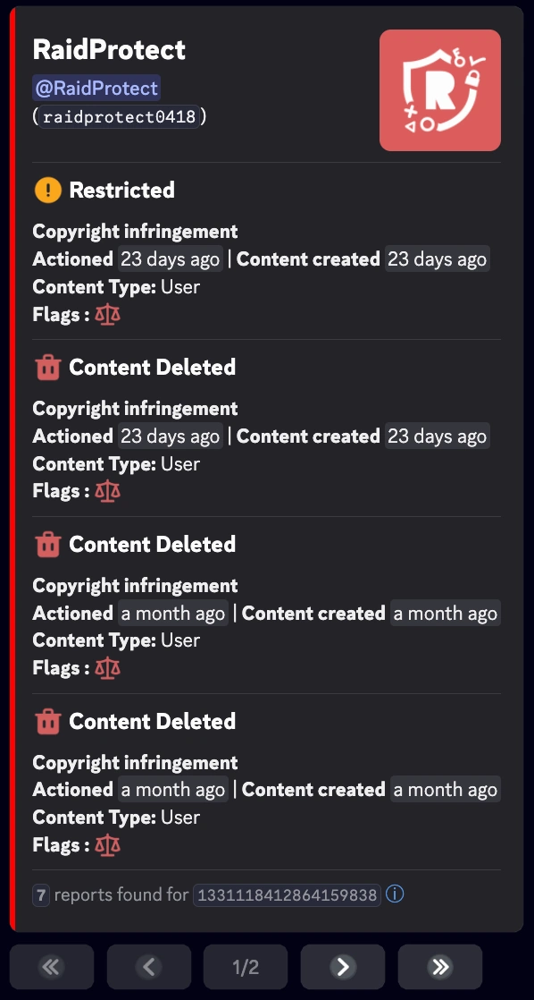
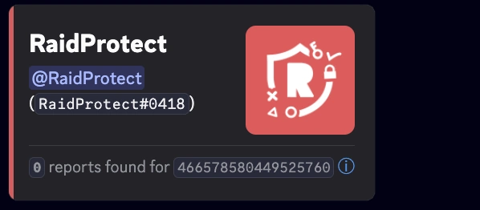

import SeparatedBox from '@site/src/components/SeparatedBox';
import Tabs from '@theme/Tabs';
import TabItem from '@theme/TabItem';
import Icon from "@site/src/components/Icon";

Funcionalidades extra para simplificar a gestão do seu servidor. 🔧

Para além das funcionalidades principais como o sistema de captcha e a proteção anti-raid, o RaidProtect oferece várias ferramentas secundárias que podem tornar a gestão do seu servidor ainda mais fácil.

:::info
Os comandos utilitários são [utilizáveis com prefixo](../guides/prefix.md).
:::

## 👤 Informações do Utilizador {#userinfo}

O comando `/userinfo` permite-lhe obter informações detalhadas sobre um utilizador.

Utilize o comando: ```/userinfo [user]```

Substitua `[user]` pela menção ou ID desejado.

### 📋 Informações Apresentadas {#displayed-userinfo}

- **Data de criação da conta Discord**
- **Foto de perfil** do utilizador
- **Banner de perfil**
- **Distintivos de perfil**
  - Os distintivos Nitro, Booster, Quest e Originally Name não são apresentados.


### 🎭 Informações sobre um membro do servidor {#displayed-memberinfo}

Se o alvo for um membro do servidor, são incluídas informações adicionais:

- **Data de entrada no servidor**
- **Alcunha no servidor**
- **Número de cargos** e **lista dos primeiros 6 cargos**
- **Categoria de permissão** (visível apenas para moderadores):

<SeparatedBox>
<Tabs>
  <TabItem value="animator" label="Animador" default>

    A categoria **Animador** é apresentada se o membro tiver **pelo menos uma** das seguintes permissões:

    - `MANAGE_EXPRESSIONS`
    - `CREATE_GUILD_EXPRESSIONS`
    - `MANAGE_EVENTS`

  </TabItem>
  <TabItem value="moderator" label="Moderador">

    A categoria **Moderador** é apresentada se o membro tiver **pelo menos uma** das seguintes permissões:

    - `KICK_MEMBERS`
    - `BAN_MEMBERS`
    - `MODERATE_MEMBERS`
    - `MANAGE_MESSAGES`
    - `MUTE_MEMBERS`
    - `DEAFEN_MEMBERS`
    - `MOVE_MEMBERS`
    - `MANAGE_THREADS`

  </TabItem>
  <TabItem value="manager" label="Gestor">

    A categoria **Gestor** é apresentada se o membro tiver **pelo menos uma** das seguintes permissões:

    - `MANAGE_GUILD`
    - `MANAGE_ROLES`
    - `MANAGE_CHANNELS`
    - `VIEW_AUDIT_LOG`
    - `MANAGE_WEBHOOKS`
    - `MANAGE_SERVER_EXPRESSIONS`

  </TabItem>
  <TabItem value="admin" label="Administrador">

    A categoria **Administrador** é apresentada em **dois casos possíveis**:

    1️⃣ Tem a permissão:
    - `ADMINISTRATOR`

    2️⃣ Tem **todas as três** seguintes permissões ao mesmo tempo:
    - `MANAGE_GUILD`
    - `MANAGE_ROLES`
    - `MANAGE_CHANNELS`

  </TabItem>
  <TabItem value="owner" label="Proprietário">

    **Condição**: O membro é o **proprietário do servidor**.

  </TabItem>
</Tabs>
</SeparatedBox>

- **Flags do membro** (visíveis apenas para moderadores):

| **Flags**                                | **Emojis**                                                                                                             | **Significados**                                                      |
| ---------------------------------------- | ---------------------------------------------------------------------------------------------------------------------- | ----------------------------------------------------------------- |
| `DID_REJOIN`                             | <Icon src="/img/icons/MemberDidRejoin.svg" alt="icon MemberDidRejoin" title=":MemberDidRejoin:"/>                      | O utilizador saiu e voltou a entrar no servidor.                            |
| `IS_GUEST`                               | <Icon src="/img/icons/MemberIsGuest.svg" alt="icon MemberIsGuest" title=":MemberIsGuest:"/>                            | Membro convidado (convite temporário ou acesso de convidado).                  |
| `COMPLETED_ONBOARDING`                   | <Icon src="/img/icons/OnboardingCompleted.svg" alt="icon OnboardingCompleted" title=":OnboardingCompleted:"/>          | Completou o processo de onboarding do servidor.                          |
| `STARTED_ONBOARDING`                     | <Icon src="/img/icons/OnboardingStarted.svg" alt="icon OnboardingStarted" title=":OnboardingStarted:"/>                | Iniciou o processo de onboarding.                                   |
| `COMPLETED_SERVER_GUIDE`                 | <Icon src="/img/icons/ServerGuideCompleted.svg" alt="icon ServerGuideCompleted" title=":ServerGuideCompleted:"/>       | Completou o guia do servidor, se ativado.                            |
| `STARTED_SERVER_GUIDE`                   | <Icon src="/img/icons/ServerGuideStarted.svg" alt="icon ServerGuideStarted" title=":ServerGuideStarted:"/>             | Iniciou o guia do servidor.                                         |
| `AUTOMOD_QUARANTINED_NAME`               | <Icon src="/img/icons/MemberQuarantined.svg" alt="icon MemberQuarantined" title=":MemberQuarantined:"/>                | Colocado em quarentena pela automoderação devido ao nome de utilizador.                   |
| `AUTOMOD_QUARANTINED_GUILD_TAG`          | <Icon src="/img/icons/MemberQuarantined.svg" alt="icon MemberQuarantined" title=":MemberQuarantined:"/>                | Colocado em quarentena pela automoderação devido à tag ou alcunha.            |
| `BYPASSES_VERIFICATION`                  | <Icon src="/img/icons/BypassVerification.svg" alt="icon BypassVerification" title=":BypassVerification:"/>             | O utilizador pode contornar a verificação do servidor.                              |
| `SPAMMER`                                | <Icon src="/img/icons/UnusualAccountActivity.svg" alt="icon UnusualAccountActivity" title=":UnusualAccountActivity:"/> | Conta marcada como spammer ou atividade invulgar detetada.           |

## ⚖️ Sanções do Discord {#discord-sanctions}

O comando `/ds` permite-lhe ver as **sanções emitidas pelo Discord** contra um utilizador, em conformidade com os [regulamentos europeus](https://transparency.dsa.ec.europa.eu/).

Utilize o comando: ```/ds (user)```

Substitua `(user)` pela menção ou ID desejado.

### 📋 Informações Apresentadas {#displayed-sanctions}

- **Tipo de sanção**:

| **Sanções**                              | **Emojis**                                                                                                             | **Significados**                                                      |
| ---------------------------------------- | ---------------------------------------------------------------------------------------------------------------------- | ----------------------------------------------------------------- |
| `CONTENT_DELETED`                        | <Icon src="/img/icons/ContentDeleted.svg" alt="icon ContentDeleted" title=":iconTrash:"/>                              | Conteúdo publicado pelo utilizador foi eliminado.                      |
| `RESTRICTED`                             | <Icon src="/img/icons/AccountRestricted.svg" alt="icon AccountRestricted" title=":iconRestricted:"/>                   | A conta do utilizador foi restringida.                             |
| `ACCOUNT_SUSPENDED`                      | <Icon src="/img/icons/AccountSuspended.svg" alt="icon AccountSuspended" title=":iconSuspended:"/>                      | A conta do utilizador foi suspensa.                              |
| `ACCOUNT_TERMINATED`                     | <Icon src="/img/icons/AccountTerminated.svg" alt="icon AccountTerminated" title=":iconTerminated:"/>                   | A conta do utilizador foi terminada.                             |

- **Data de emissão**
- **Tipo de conteúdo**
- **Flags da sanção**:

| **Flags**                                | **Emojis**                                                                                                             | **Significados**                                                      |
| ---------------------------------------- | ---------------------------------------------------------------------------------------------------------------------- | ----------------------------------------------------------------- |
| `ILLEGAL_CONTENT`                        | <Icon src="/img/icons/IllegalContent.svg" alt="icon IllegalContent" title=":iconIllegal:"/>                            | Sanção aplicada por conteúdo ilegal.                             |
| `AUTOMATED_DETECTION`                    | <Icon src="/img/icons/AutomatedDetection.svg" alt="icon AutomatedDetection" title=":iconBots:"/>                       | Sanção aplicada por deteção automatizada.                     |

<SeparatedBox>
<Tabs>
  <TabItem value="reports-found" label="Relatórios encontrados" default>



  </TabItem>
  <TabItem value="reports-not-found" label="Nenhum relatório encontrado">



  </TabItem>
</Tabs>
</SeparatedBox>

:::note
O comando permite-lhe ver os relatórios emitidos entre 22 de agosto de 2024 e 14 de agosto de 2025. Estas informações são fornecidas diretamente pelo Discord e **não podem ser modificadas** pelo RaidProtect.
:::
