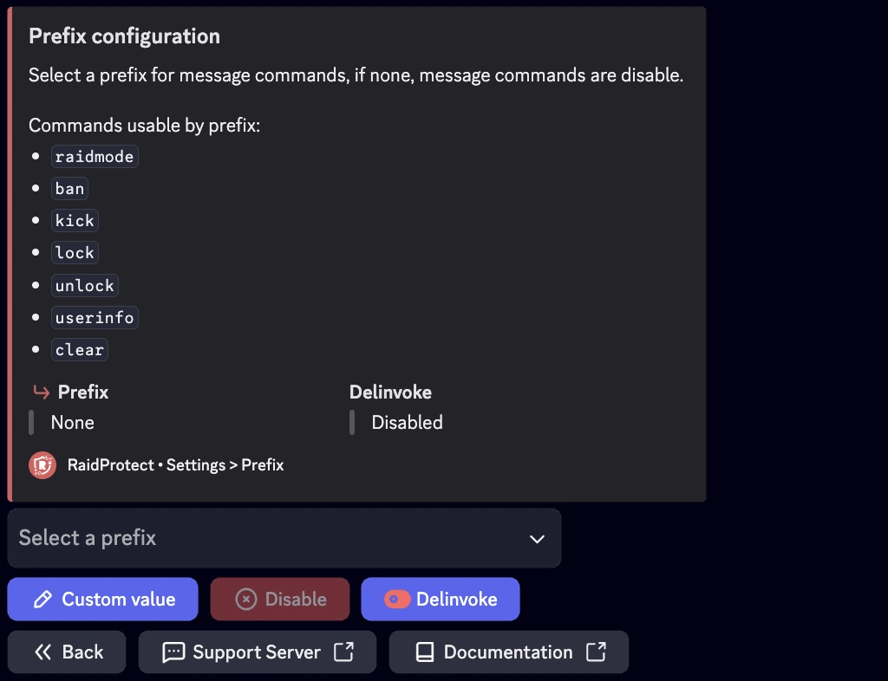

## Prefixo Desativado (Predefinido) {#disabled}

Por defeito, o RaidProtect utiliza apenas Slash commands (`/`) para interagir com o bot. Isto garante uma utilização intuitiva e consistente com as normas do Discord.

## Prefixo Ativado (Opcional) {#activated}

Se preferir utilizar determinados comandos com um prefixo personalizado, pode ativar esta opção. O prefixo predefinido quando ativado é `?`, mas pode ser modificado conforme as suas necessidades. Uma vez ativado, estes comandos podem ser utilizados com o prefixo configurado:
- [`?raidmode`](../features/raid-mode.md)
- [`?ban`](../features/moderation.md#ban)
- [`?kick`](../features/moderation.md#kick)
- [`?lock`](../features/channel-lock.md#lock)
- [`?unlock`](../features/channel-lock.md#unlock)
- [`?userinfo` | `?ui`](../features/utilities#userinfo)
- [`?clear`](../features/moderation#clear)

## 💬 Como Ativar ou Desativar o Prefixo {#config}

1. Abra o menu de configuração escrevendo [`/settings`](../setup.md#settings).
2. Aceda à opção "**Prefixo**" para os comandos.
3. Ative ou desative o prefixo conforme as suas preferências.
Se ativado, personalize o prefixo introduzindo o caractere ou cadeia de caracteres desejado.

:::note
Os Slash commands (`/`) continuam disponíveis mesmo que o prefixo esteja ativado.
Recomenda-se evitar prefixos já utilizados por outros bots para prevenir conflitos de comandos.
:::
