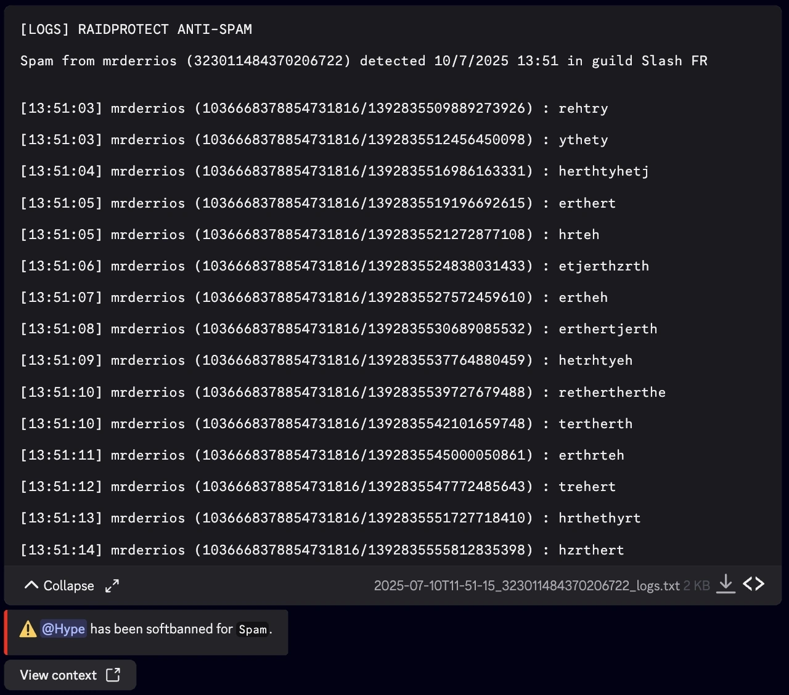

import SeparatedBox from '@site/src/components/SeparatedBox';
import Tabs from '@theme/Tabs';
import TabItem from '@theme/TabItem';

O Anti-spam do RaidProtect e uma ferramenta poderosa para prevenir spam no seu servidor Discord. Gracas ao seu sistema de detecao automatica, trata dos problemas por si so, sem necessidade da sua intervencao.

## ❓ Como funciona o Anti-spam {#working}

O anti-spam do RaidProtect deteta e bloqueia automaticamente comportamentos suspeitos. Distingue dois tipos de spam.
- **Spam pesado:** Mensagens contendo links de convite, mencoes em massa ou imagens. Este tipo de spam e frequentemente utilizado durante raids.
- **Spam ligeiro:** Mensagens enviadas frequentemente, mas menos intrusivas.

O anti-spam do RaidProtect atua de duas formas.
- **Sancoes:** Expulsao ou banimento automatico dos spammers.
- **Notificacoes:** Envia mensagens para o canal de registos para reportar o spam bloqueado com uma visao geral das acoes detetadas.

## 🛡️ Configurar o Anti-spam {#config}

O RaidProtect oferece tres niveis de seguranca para satisfazer as necessidades do seu servidor.
- 🔴 **Alto:** Sanciona todo o spam, incluindo spam pesado em canais ignorados.
- 🟠 **Medio:** Sanciona todo o spam, mas respeita os canais ignorados.
- 🟢 **Baixo:** Sanciona apenas o spam pesado.

### Alterar o Nivel de Seguranca {#level}

1. Utilize o [comando `/settings`](../setup.md#settings).
2. Clique no botao "**Anti-spam**".
3. Selecione o nivel de anti-spam desejado no primeiro menu suspenso.

### Gerir Cargos, Utilizadores e Canais Ignorados {#ignore}

Pode excluir determinados canais, cargos ou mesmo utilizadores da monitorizacao do anti-spam para maior flexibilidade. 😉
1. Utilize o [comando `/settings`](../setup.md#settings).
2. Clique no botao "**Anti-spam**".
3. Selecione as diferentes opcoes a ignorar nos menus suspensos:
- Canal(is) a ignorar
- Cargo(s) a ignorar
- Membro(s) a ignorar

:::info
Os canais que contem "**spam**" no seu nome sao automaticamente ignorados. Os utilizadores com permissoes de administrador sao completamente ignorados.
:::

### Configurar Sancoes por Gatilho {#triggers}

Pode personalizar as sancoes aplicadas consoante o tipo de spam detetado. Isto permite uma resposta adaptada a gravidade da infracao.

1. Utilize o [comando `/settings`](../setup.md#settings).
2. Clique no botao "**Anti-spam**".
3. Va ao separador "**Sanctions**".
4. Para cada gatilho, selecione uma sancao especifica. Pode modificar estes valores utilizando os menus suspensos:
- **Selecionar um gatilho**: escolha o tipo de spam a configurar.
- **Selecionar uma sancao**: escolha a sancao correspondente.

#### Tipos de Sancoes e Gatilhos {#sanctions}

Aqui estao as diferentes **sancoes disponiveis** bem como os **gatilhos** que o RaidProtect pode detetar, juntamente com a **duracao predefinida da exclusao temporaria** se aplicavel:

- **Aviso**: Envia um aviso ao membro.
- **Expulsao**: Remove o membro do servidor.
- **Exclusao temporaria**: Silencia o membro durante um periodo definido.
- **Softban**: Bane e desbane imediatamente o membro, eliminando as suas mensagens.
- **Banimento**: Bane permanentemente o membro.

| Gatilho                                | Descricao                                               | Duracao da Exclusao  |
|----------------------------------------|---------------------------------------------------------|----------------------|
| Spam                                   | Envio repetido de mensagens                             | 1 minuto             |
| Spam com selfbot                       | Utilizacao de selfbots para spam                        | 1 hora               |
| Spam de mencoes                        | Mencoes em massa repetidas                              | 30 minutos           |
| Spam de links                          | Envio em massa de links                                 | 24 horas             |
| Spam de comandos externos              | Utilizacao de comandos externos para spam               | 1 hora               |
| Spam duplicado ou pesado               | Mensagens copiadas ou spam excessivo                    | 24 horas             |

## 📑 Registos do Anti-spam {#logs}

Sao gerados registos detalhados com todas as mensagens eliminadas pelo anti-spam. Pode simplesmente descarregar ou expandir o conteudo.

<SeparatedBox>
<Tabs>
  <TabItem value="animator" label="Recolhido" default>

  </TabItem>
  <TabItem value="moderator" label="Expandido">

  </TabItem>
</Tabs>
</SeparatedBox>
