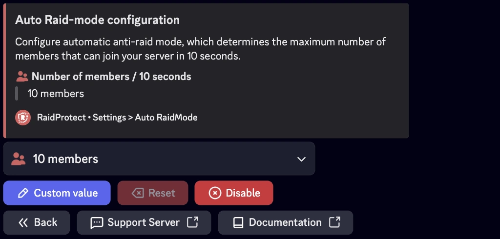

## Modo Raid {#raid-mode}

O modo raid e uma funcionalidade de emergencia concebida para bloquear instantaneamente todos os novos utilizadores que tentam entrar no seu servidor, por uma duracao maxima de 24 horas. Para bloquear permanentemente novos membros, utilize o comando [`/joinlock`](./join-lock.mdx).

### ❓ Como funciona o Modo Raid {#working}

O RaidProtect ativa automaticamente o modo raid se um grande numero de utilizadores entrar no seu servidor num curto espaco de tempo. Por defeito, o modo raid ativa-se se mais de 10 utilizadores entrarem no seu servidor em menos de 10 segundos. Quando o modo raid esta ativado, nenhum utilizador pode entrar no servidor. Sao bloqueados ao nivel do convite.

:::warning
As funcionalidades de Comunidade do Discord sao essenciais para o correto funcionamento do Modo Raid. [Siga o nosso guia para garantir que a Comunidade esta ativada no seu servidor.](../guides/community.md)
:::

#### Ativar {#enable}

- Para ativar manualmente este modo, um utilizador com permissoes de expulsao deve executar o comando `/raidmode`.
- Uma mensagem sera automaticamente publicada no canal de registos para assinalar a ativacao.

#### Desativar {#disable}

O modo raid nao se desativa automaticamente. Lembre-se de o desligar com o mesmo comando assim que a ameaca tiver passado. 😇

:::info
O comando `raidmode` tambem esta [disponivel com prefixo](../guides/prefix.md).
:::

### 🚨 Configuracao do Auto Raid Mode {#config}

Se o seu servidor recebe frequentemente muitos novos membros de uma so vez, e aconselhavel ajustar este limite para evitar falsos positivos.



#### Limite de membros {#threshold}

1. Utilize o [comando `/settings`](../setup.md#settings).
2. Clique no botao "**Auto RaidMode**".
3. Selecione "**Members**".
4. Escolha o numero de membros que podem entrar em 10 segundos.

Pode manter o valor predefinido (10) ou ajusta-lo para o valor desejado clicando no botao "**Custom value**".

:::note
Recomendamos introduzir um valor entre 10 e 20 membros em 10 segundos para uma boa eficiencia do sistema.
:::

#### Duracao do modo raid {#duration}

1. Utilize o [comando `/settings`](../setup.md#settings).
2. Clique no botao "**Auto RaidMode**".
3. Selecione "**Duration**".
4. Escolha a duracao do modo raid (maximo 24h).

Pode manter o valor predefinido (5 minutos) ou ajusta-lo para o valor desejado clicando no botao "**Custom value**".

## Idade Minima da Conta {#minage}

Para melhorar a seguranca, pode exigir uma idade minima da conta Discord para novos membros.

1. Execute o [comando `/settings`](../setup.md#settings).
2. Clique no botao "**Minimum Age**".
3. Selecione o valor desejado no menu suspenso ou escolha um valor personalizado no formato de data (m/h/d/y).

### 🎂 Ignorar a Idade Minima da Conta {#bypass-minage}

Utilize o comando: ```/bypass minage [user]```

Substitua `[user]` pelo ID desejado; tera 10 minutos para entrar no servidor sem ser expulso por nao cumprir o requisito de idade. Tambem pode utilizar o comando sem especificar um utilizador para ver a lista atual de utilizadores com bypass.
