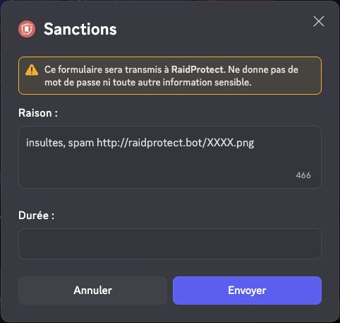

import Icon from "@site/src/components/Icon";

O historico de sancoes do RaidProtect permite-lhe acompanhar e gerir todas as sancoes aplicadas no seu servidor. Este sistema centraliza todas as acoes de moderacao numa base de dados pesquisavel e editavel, facilitando o trabalho da sua equipa de moderacao.

## ❓ Como funciona o historico {#working}

O historico de sancoes regista automaticamente todas as acoes de moderacao realizadas no seu servidor:

- **Sancoes manuais**: Todos os comandos de moderacao (`/ban`, `/tempban`, `/kick`, `/timeout`, `/warn`) sao automaticamente registados no historico.
- **Sancoes automaticas**: As sancoes aplicadas pelo anti-spam sao tambem adicionadas ao historico de sancoes.
- **Banimentos, expulsoes e exclusoes temporarias**: As sancoes aplicadas sem utilizar o RaidProtect sao adicionadas ao historico.
- **Automod do Discord**: As sancoes aplicadas pelo automod do Discord sao tambem adicionadas.
- **Notificacoes de sancao**: Os membros sancionados recebem uma mensagem privada a informa-los da sancao e do seu motivo. O bot tambem envia um aviso de rececao confirmando o envio desta notificacao.

:::info
Todas as sancoes registadas contem: o utilizador sancionado, o moderador responsavel, o motivo (ate 512 caracteres), a data e hora, bem como o tipo de sancao e se o utilizador foi notificado.
:::

## 🔍 Pesquisar sancoes {#search}

O comando `/sanctions search` permite-lhe pesquisar sancoes no historico segundo diferentes criterios.

Utilize o comando: ```/sanctions search [user] [moderator] [type] [date] [status]```

- `[user]`: Pesquisar todas as sancoes de um utilizador especifico.
- `[moderator]`: Pesquisar todas as sancoes aplicadas por um moderador especifico.
- `[type]`: Filtrar por tipo de sancao (Ban, Softban, Unban, Kick, Timeout, Untimeout, Warn).
- `[date]`: Filtrar por data da sancao.
- `[status]`: Filtrar por estado da sancao (Ativa, Expirada, Cancelada).


:::tip
Pode combinar varios criterios para refinar a sua pesquisa. Por exemplo, pesquisar todos os banimentos realizados por um moderador especifico.
:::

## ℹ️ Ver uma sancao {#info}

O comando `/sanctions info` permite-lhe obter informacoes detalhadas sobre uma sancao especifica.

Utilize o comando: ```/sanctions info (id)```

Substitua `(id)` pelo identificador da sancao que deseja ver.


## ✏️ Editar uma sancao {#edit}

O comando `/sanctions edit` permite-lhe modificar o motivo de uma sancao existente, util para corrigir um erro ou adicionar detalhes.

Utilize o comando: ```/sanctions edit (id) (new_reason)```

Substitua `(id)` pelo identificador da sancao a modificar e `(new_reason)` pelo novo motivo (maximo 512 caracteres).



:::warning
Editar uma sancao atualiza o registo no historico, mas nao altera a sancao aplicada no Discord (por exemplo, um utilizador banido permanecera banido).
:::

## 🗑️ Eliminar uma sancao {#delete}

O comando `/sanctions delete` permite-lhe eliminar uma sancao do historico. Esta acao e irreversivel.

Utilize o comando: ```/sanctions delete (id)```

Substitua `(id)` pelo identificador da sancao a eliminar.


## Estado da sancao {#status}

As sancoes podem ter diferentes estados:

| **Estado**    | **Emojis**                                                                                                                  | **Significados**                                              |
| ------------- | ----------------------------------------------------------------------------------------------------------------------------| ------------------------------------------------------------- |
| `Active`      |                                                                                                                             | A sancao esta em curso.                                       |
| `Expired`     | <Icon src="/img/icons/SanctionStatusEXPIRED.svg" alt="icon SanctionStatusEXPIRED" title=":iconSanctionStatusEXPIRED:"/>     | A sancao expirou.                                             |
| `Canceled`    | <Icon src="/img/icons/SanctionStatusCANCELED.svg" alt="icon SanctionStatusCANCELED" title=":iconSanctionStatusCANCELED:"/>  | A sancao foi cancelada por um moderador.                      |
| `Failed`      | <Icon src="/img/icons/SanctionStatusFAILED.svg" alt="icon SanctionStatusFAILED" title=":iconSanctionStatusFAILED:"/>        | A sancao falhou (permissoes insuficientes).                   |

### Gestao de duplicados {#duplicates}

Quando uma sancao ativa e anterior e encontrada, pode:

- **Fundir** as duas sancoes: as duracoes serao somadas se possivel e os motivos serao concatenados.
- **Cancelar** a sancao ativa e criar uma nova sancao.
- **Substituir** a sancao ativa com as informacoes da sancao introduzida.


## 📊 Registos de sancoes {#logs}

Para uma melhor organizacao, pode configurar um canal de registos dedicado especificamente a sancoes, separado dos seus registos gerais.


### Configurar o canal de registos de sancoes {#config-logs}


1. Utilize o [comando `/settings`](../setup.md#settings).
2. Clique no botao "**Logs**".
3. Selecione "**Moderation**".
4. Escolha o canal no qual os registos de sancoes serao enviados ou utilize o botao "**Create one for me**".

:::note
Tambem pode escolher se o RaidProtect regista acoes realizadas por utilizadores sem passar pelo bot.
:::

### Logica de Cores {#logs-color}


