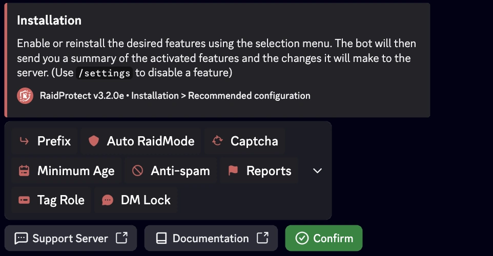

O RaidProtect simplifica a gestao do servidor com duas ferramentas poderosas: o comando [`/setup`](#install) para uma configuracao guiada passo a passo e o comando [`/settings`](#settings) para ajustar as suas definicoes a qualquer momento atraves de um menu centralizado. Este guia de instalacao explica como utiliza-los eficazmente.

## Instalacao Guiada {#install}

O comando `/setup` foi concebido para o ajudar a configurar o RaidProtect rapidamente ou de forma detalhada, conforme as suas necessidades.
<!-- It offers two configuration modes: [recommended](#recommended) or [advanced](#advanced). -->

### 🔧 Configuracao Recomendada {#recommended}

Permite-lhe ativar ou desativar as funcionalidades principais de forma rapida, utilizando um menu de selecao interativo.

1. Utilize o comando `/setup`.
2. Selecione o botao "**Recommended Configuration**".
3. Ative ou desative as funcionalidades desejadas atraves do menu de selecao.

O bot ira entao enviar-lhe um resumo das funcionalidades ativadas e das alteracoes que ira efetuar no servidor.

<!--
### 🛠️ Configuracao Avancada {#advanced}

Se pretende configurar o bot de forma mais aprofundada, opte pela configuracao avancada. O bot guia-o passo a passo com explicacoes claras.

1. Utilize o comando `/setup`.
2. Selecione o botao "**Advanced Configuration**".
3. Cada etapa apresenta uma funcionalidade, o seu proposito e uma configuracao minima recomendada.
4. Utilize os botoes "**Previous**" e "**Next**" para avancar ou recuar.

No final, e apresentado um resumo das definicoes para confirmar as suas escolhas.
-->
## Modificar a Configuracao {#settings}

O comando `/settings` e o comando de referencia para gerir as suas definicoes apos a instalacao. Permite-lhe visualizar, ajustar ou personalizar as funcionalidades do RaidProtect a qualquer momento, de forma simples e rapida.

### 🔍 Menu de Definicoes {#menu}

1. Escreva `/settings` num canal onde o bot esteja ativo.
2. Navegue facilmente entre as diferentes seccoes para encontrar as definicoes que pretende modificar.
3. Ajuste as opcoes: Cada categoria apresenta uma lista de opcoes personalizaveis sob a forma de botoes ou menus suspensos.

### 🔄 Repor uma Definicao {#reset}

1. Navegue ate a definicao desejada.
2. Clique em "**Reset**".

O bot ira confirmar a reposicao antes de aplicar as alteracoes.

:::info Problema de configuracao?
Se encontrar um problema, consulte a seccao [Avarias](./guides/malfunctions) ou entre no nosso [servidor de suporte](https://raidprotect.bot/discord) para obter assistencia.
:::
