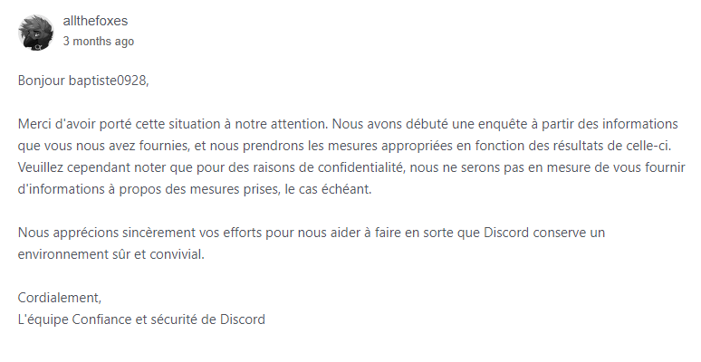

Encontrou um utilizador malicioso no Discord? Denuncie-o para que possa ser sancionado.

No Discord, alguns utilizadores nem sempre têm boas intenções. Se apresentarem um comportamento particularmente prejudicial para a comunidade, é recomendável **denunciá-los à equipa Trust & Safety do Discord**. Se a violação for verificada, o utilizador poderá enfrentar sanções que vão desde um aviso até à eliminação da conta.

## Que tipos de violações devem ser denunciados? {#types-of-violations}

Obviamente, nem todos os tipos de violações são motivo para eliminação de conta. Os comportamentos puníveis estão descritos nas **[Diretrizes da Comunidade](https://discord.com/guidelines) do Discord** (bem como nos [Termos de Serviço](https://discord.com/terms), mas estes são mais jargão legal do que diretrizes claras). A lista de tipos de denúncia na página de denúncias é um muito bom resumo para quem tem relutância em ler.

Como regra geral, comportamentos que são **prejudiciais para a comunidade** (spam, promoção de conteúdo ilegal, etc.) ou que constituem **danos graves a um utilizador** (doxxing, assédio) devem ser denunciados.

Para comportamentos menos extremos, **prefira o banimento** (num servidor) ou o [bloqueio](https://support.discordapp.com/hc/fr/articles/217916488-Blocage-et-param%C3%A8tres-de-confidentialit%C3%A9) (em todo o Discord). Se não for moderador no servidor onde os atos estão a ocorrer, não hesite em reportá-lo à equipa de moderação desse servidor, que deverá tomar medidas.

## Reunir provas {#recover-evidences}

Para apresentar uma denúncia, precisa de provas para fornecer. Antes de mais, note que **capturas de ecrã são inúteis**, pois são muito facilmente falsificáveis. Vai precisar absolutamente de um (ou mais, o que é ainda melhor) link(s) de mensagem.

**Estes links são muito fáceis de obter**. Numa mensagem correspondente à violação que pretende denunciar, clique direito > Copiar Link da Mensagem (no desktop) ou pressione longamente > Partilhar > Copiar para a área de transferência (no telemóvel).

## Denunciar a violação à equipa _Trust & Safety_ {#report-to-tns}

Apresentar uma denúncia é muito fácil e demora apenas alguns minutos. Primeiro, vá ao **formulário dedicado** seguindo o link **https://dis.gd/report**.

Dependendo do tipo de denúncia escolhido, **serão solicitadas diferentes informações**. Introduza o link da mensagem obtido no passo anterior no campo apropriado (e opcionalmente outros na descrição). Não hesite em ser **o mais detalhado possível** e não se esqueça das regras básicas de cortesia.

### Resposta do Discord {#discord-response}

Alguns dias após a sua denúncia - normalmente dentro de uma semana - deverá receber **uma resposta por e-mail** do Discord. Note que não poderá saber que sanções (se alguma) foram tomadas contra o utilizador denunciado.

