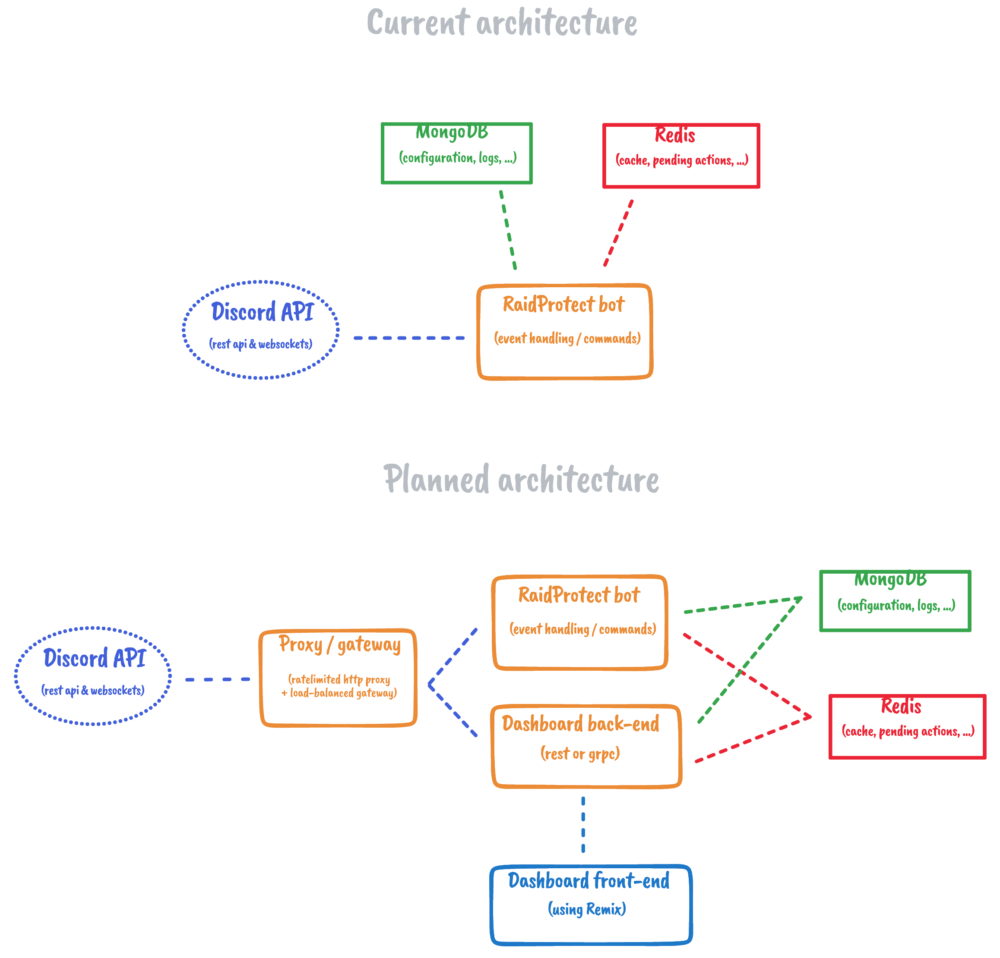

# RaidProtect architecture

The RaidProtect is quite simple and monolithic, built on top of open-source
technologies. The following page explains how the multiple components works
together and where they are located in the codebase.

> The following architecture includes the web dashboard, which is a planned
> feature. It is not yet implemented, so expect the current architecture to
> be a bit different.

*Schema made with [tldraw](https://www.tldraw.com/). [Download source](./images/architecture.tldr)*

## Main services

- **RaidProtect**: The main service,
  who host the bot and handles the communication with the Discord API, such as
  event handling. It is located in the `raidprotect` crate of the
  [`raidprotect/raidprotect`](https://github.com/raidprotect/raidprotect) repo.

### Planned services

The following services haven't been implemented yet, but are planned to be added
in the future. Their architecture is a draft and will probably change.

- **Dashboard Backend**: The web dashboard uses a separate backend to retrieve
  data from the databases or the Discord API.
- **Dashboard Frontend**: Actual plans for the dashboard front-end is to build
  a Remix (React) web application hosted on CloudFlare Workers.
- **Discord proxy/gateway**: To make the bot works in a cluster, we need a
  ratelimited proxy for the Discord REST API, and a load-balancing gateway for
  the Discord WebSocket API.

## Databases

RaidProtect actually relies on two open-source databases:

- **[MongoDB](https://www.mongodb.com/)**: storage of permanent data, such as
  servers configuration and moderation logs.
- **[Redis](https://redis.io/)**: used to cache the Discord objects (guilds,
  channels, roles, ...) and the pending actions of the bot.

## Frameworks and libraries

Here is a non-exhaustive list of the frameworks and libraries used by the
various components of the bot.

- **[Twilight](https://twilight.rs/)**: libraries ecosystem used to interact with
  the Discord API.
- **[Tokio](https://tokio.rs/)**: asynchronous I/O library for Rust.
