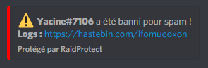

Protégez facilement et efficacement votre serveur Discord avec l'anti-spam de RaidProtect.

## ❓Fonctionnement de l'anti-spam {#working}

**L'anti-spam RaidProtect permet de bannir automatiquement les spammeurs et les raideurs de votre serveur, sans aucune intervention de votre part.** Il détecte ainsi le spam lourd et spam léger, et peut intervenir rapidement afin de le stopper, selon la configuration de votre serveur. 🤚 

:::warning
**Le spam lourd est un spam souvent utilisé lors des raids avec des liens d'invitations, des mentions ou encore des images**. RaidProtect différencie ce spam du spam léger, et applique ainsi des sanctions différentes.
:::

**Si un spam est détecté, RaidProtect expulse son auteur** et vous en informe via le salon de logs. Vous pouvez voir les détails du spam bloqué en cliquant sur le lien affiché.

## 📈 Niveau de sécurité anti-spam {#level}
L'anti-spam RaidProtect propose plusieurs niveaux de sécurité, permettant **d'adapter son comportement, notamment sur les salons ignorés**. 👮 

### Les niveaux de sécurité possibles {#level-list}
🔴 **Élevé (`high`) :** L'anti-spam détecte le spam léger et le spam lourd. Dans les salons ignorés, le spam lourd est quand même bloqué.

🔶 **Moyen (`medium`) :** L'anti-spam détecte le spam léger et le spam lourd. Dans les salons ignorés, tous les types de spam sont autorisés.

💚 **Faible (`low`) :** L'anti-spam ne bloque que le spam lourd. Dans les salons ignorés, tous les types de spam sont autorisés.

### Changer le niveau de sécurité {#level-change}

Pour changer le niveau de sécurité anti-spam, la commande est la suivante : `?settings spamlevel [high/medium/low]`.

## 💤 Ignorer un salon {#ignore-channel}

Il se peut, pour diverses raisons, que vous souhaitez que l'anti-spam ignore certains salons de votre serveur. Heureusement, il est possible d'ignorer très facilement les salons de votre choix. 😝 

Le comportement de l'anti-spam sur les salons ignorés dépend de son niveau de sécurité.

Pour ce faire, il vous suffit de faire la commande `?settings allowspam #salon` (en remplaçant `#salon` par le salon que vous souhaitez ignorer). Pour prendre de nouveau en compte un salon, il vous sera nécessaire de faire la commande `?settings allowspam #salon remove`.

Les salons comportant `spam` dans leur nom sont automatiquement ignorés.