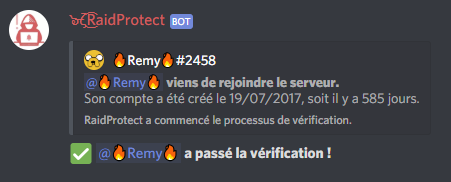

Empêchez les selfbots d'accéder à votre serveur Discord et bloquez les raids avec la vérification du captcha de RaidProtect.

Le captcha est l'une des fonctionnalités les plus prisées de RaidProtect, mais pour autant **totalement optionnelle**. Le captcha permet - si vous en éprouvez le besoin - de demander à chaque utilisateur de remplir un challenge sous forme de code à écrire afin de s'assurer qu'il ne s'agit pas d'un robot (_selfbot_).

Notez bien que si cela améliore la sécurité de votre serveur, **certains utilisateurs risquent de ne pas comprendre le principe**, et cela peut donc à terme vous faire perdre quelques membres. A vous de voir si vous en avez l'utilité ! 😉 

## ❓ Fonctionnement du captcha

**Le captcha fonctionne avec un rôle "Non vérifié" et un salon #verification**. Lorsqu'un utilisateur rejoint, le bot lui donne le rôle "Non vérifié", afin que celui-ci n'ait accès qu'au salon #verification. Dans ce salon, **le bot envoie une image contenant 6 lettres**, et l'utilisateur doit envoyer ce qu'il lit, pour prouver qu'il n'est pas un robot. Si ce qu'il a envoyé est juste - une lettre d'erreur est acceptée -, le bot lui enlève le rôle "Non vérifié" afin qu'il ait accès normalement au serveur. 👾 

Nous accordons un délai de cinq minutes pour compléter le captcha. Passé ce délai, le membre est expulsé du serveur. Cela permet - entre autres - d'éviter de laisser de nombreux messages orphelins dans le salon.

:::warning
**Les permissions du rôle Non vérifié sont gérées automatiquement par RaidProtect**. Si vous le souhaitez, vous pouvez renommer le rôle et le salon du captcha, mais il est nécessaire de ne pas les supprimer.
:::

Lorsqu'un utilisateur rejoint votre serveur et que le captcha est activé, RaidProtect poste automatiquement **un message avec la date de création du compte** de l'utilisateur ayant rejoint dans le salon de logs.

## ⛽ Mise en place du captcha
**La mise en place de captcha est un jeu d'enfant !** Effectuez simplement la commande `?captcha enable`, et tout sera configuré tout seul. 🎩 

Pour le désactiver, effectuez simplement la commande `?captcha disable`. Le rôle et le salon utilisés par le captcha seront supprimés sans intervention de votre part.

## ✨ Fonctionnalités supplémentaires

Pour que le captcha s'adapte à toutes les utilisations, nous y avons ajouté **quelques options supplémentaires**. 🦸‍♂️ 

### Logs séparés
Par défaut, les logs du captcha sont dans le salon de logs de RaidProtect, mais si votre serveur est populaire, ces messages peuvent vite submerger les autres logs. **Déplaçons-les dans un autre salon !**

Une fois le nouveau salon des logs créé, effectuez la commande `?captcha logs #salon-de-logs`. Les logs sont désormais déplacés.

### Rôle automatique {#role-automatique}

:::warning
Si vous utilisez un système de rôle automatique (_autorole_) autre que celui de RaidProtect, **le captcha risque de ne plus fonctionner** ! Remplacez-le par celui de RaidProtect pour résoudre ce problème. 👷 
:::

Par défaut, une fois le captcha passé, l'utilisateur n'a aucun rôle. Vous pouvez, si vous le souhaitez, **lui attribuer un rôle automatiquement**. Pour ce faire, faîtes la commande `?captcha autorole @role`. Le rôle peut être - au choix - une mention ou le nom exact d'un rôle. 

### Âge de compte minimum

Il est possible de définir un **âge de compte minimum pour accéder à votre serveur**. Tout utilisateur ayant un compte plus récent que celui-ci sera expulsé automatiquement. 👶 

Pour activer cette fonctionnalité, faites simplement `?captcha min-age [age minimum]`. L'âge minimum doit être exprimé en jours.