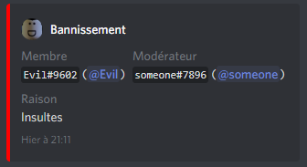
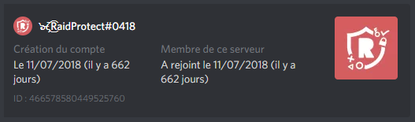

Découvrez toutes les fonctionnalités secondaires de RaidProtect : modération, verrouillage de salons, informations sur les utilisateurs, ...

En plus des fonctionnalités principales présentées précédemment, RaidProtect propose **quelques petites fonctionnalités complémentaires**. Elles sont très simples, mais ont le mérite d'exister ! 😯 

## 🤬 Les commandes de modération

Afin de faciliter la tache de vos modérateurs, RaidProtect propose des commandes pour interagir avec les fonctionnalités natives de modération de Discord : **le bannissement et l'expulsion**. En plus de bannir ou d'expulser un utilisateur (logique, c'est leur but), ces commandes avertissent l'utilisateur en message privé de la raison de sa sanction, et font de même dans le salon de logs de RaidProtect ! 🗣️ 

L'utilisation de ces commandes est **très simple**. Pour le bannissement, il suffit de faire `?ban @utilisateur raison` ;  la commande `?kick` suit la même syntaxe. Par exemple, pour expulser l'utilisateur "Evil" pour la raison "insultes", faîtes `?kick @Evil Insultes`. C'est aussi rapide que cela !

Pour les utilisateurs plus avancés, notez qu'il est possible de bannir un utilisateur même **s’il n'est pas sur votre serveur**, grâce à son identifiant. Pratique.

Exemple de message dans les logs suite à un banissement.

## 🔒 Le verrouillage de salons {#verrouillage-salons}

Il se peut que vous ayez besoin - pour une raison quelconque - de verrouiller un salon pour **empêcher vos membres de parler dedans**. La commande de verrouillage vous permet de faire cela très rapidement : effectuez la commande `?lock` et le salon est verrouillé ! La commande `?unlock` permettra de faire l'opération inverse. 

Concrètement, cette commande va **enlever la permission de parler** au rôle @everyone sur le salon. C'est pour cela que pour qu'elle fonctionne, vous ne devez avoir aucun rôle avec la permission explicite de parler, sinon ces derniers pourront toujours parler.

## 👤 Les infos utilisateur

La dernière fonctionnalité supplémentaire est la commande `?userinfo`.  Cette dernière vous permet d'afficher principalement **la date de création de n'importe quel compte**, ainsi que la date à laquelle il a rejoint votre serveur (si c'est un membre). La commande doit être suivie d'une mention, d'un pseudo avec tag ou d'un identifiant. 👀 

