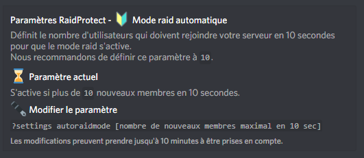

Le mode raid est un mode d'urgence permettant de bloquer tous les nouveaux utilisateurs tentant de rejoindre votre serveur. Cela permet dans certaines situations de bloquer une tentative de raid. Radical mais efficace. 💣 

## ❓ Fonctionnement du mode raid

Une fois le mode raid activé, tous les nouveaux utilisateurs seront **instantanément expulsés** et RaidProtect leur enverra un message les informant que le serveur est en mode raid.

**Pour activer ce mode**, un utilisateur ayant la permission d'expulser les membres doit effectuer la commande ?raidmode. Un message sera posté dans les logs pour informer de son activation. Attention, **le mode raid ne se désactive pas tout seul**, n'oubliez pas de le désactiver à l'aide de la même commande. 😇 

## 📡 Le mode raid automatique

Si un grand nombre d'utilisateurs rejoint votre serveur dans un laps de temps très réduit, RaidProtect est capable d'**activer automatiquement le mode raid**.

### ⛽ Configuration

Par défaut, le mode raid s'active si **plus de 10 utilisateurs rejoignent votre serveur en moins de 10 secondes**. Si votre serveur est susceptible d’accueillir un grand nombre de membres en simultané, il peut être judicieux de changer cela pour éviter les faux-positifs.

Le paramètre modifiable est **le nombre d'utilisateurs pouvant rejoindre** dans un délai de 10 secondes avant de déclencher le mode raid. Par exemple, en effectuant la commande `?settings autoraidmode 20`, le mode raid se déclenchera si plus de 20 utilisateurs rejoignent votre serveur en moins de 10 secondes. 🍃 

:::warning
N'oubliez pas de **désactiver le mode raid** si celui-ci s'active automatiquement. Rappelez vous, il ne se désactive pas tout seul. 😖 
:::
